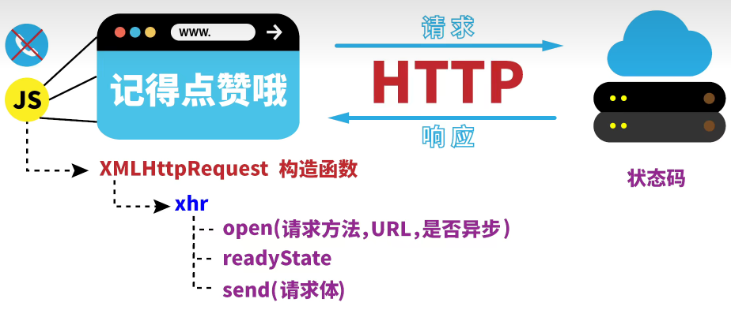
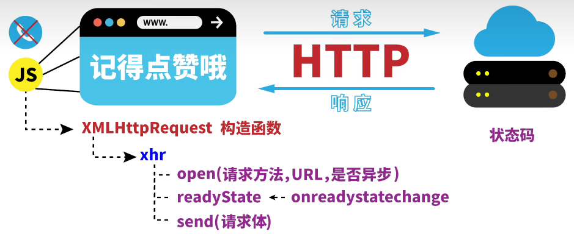
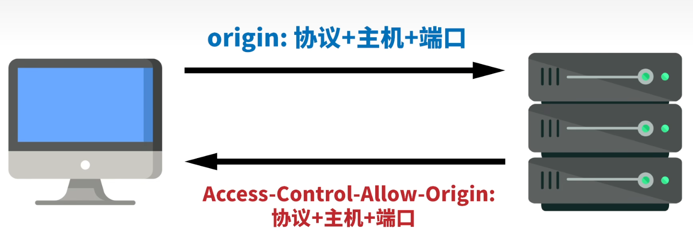

# `Ajax`








### `Web API`

#### `Ajax`

- 从服务器获取数据

- 增量更新，不需刷新整个页面

- 使用`onreadystatechange`监听状态码的变化，通过 `js`对`DOM`实现局部页面刷新

- `XML`
    - 进度支持

    - 超时支持
    - 中止支持
    - 更明显的故障检测
    - 浏览器支持

- `fetch`
    - 标头、请求和响应对象

    - 缓存控制
    - CORS 控制
    - 凭证控制
    - 重定向控制
    - 数据流
    - 服务器端支持

| 响应状态码 |           意义           |
| :--------: | :----------------------: |
|     0      |       未调用`open`       |
|     1      | 调用`open`，未调用`send` |
|     2      |   发送请求，未收到响应   |
|     3      |       收到部分响应       |
|     4      |       收到全部响应       |

---

```js
const xhr = new XMLHttpRequest()
xhr.open('GET', '/service')

// 监听状态变化
xhr.onreadystatechange = () => {
  // 收到全部响应
  if (xhr.readyState !== 4) {
    return
  }

  // 请求成功
  if (xhr.status === 200) {
    console.log(JSON.parse(xhr.responseText))
  }
  else {
    console.log('HTTP error', xhr.status, xhr.statusText)
  }
}

// 发送请求
xhr.send()
```


#### `fetch`

```js
fetch('/service', {method: 'GET'})
  .then((res) => res.json())
  .then((json) => console.log(json))
  .catch((err) => console.error('error:', err))
```


#### 客户端存储

|       类型       |                             描述                             |
| :--------------: | :----------------------------------------------------------: |
|     `cookie`     | 对会话进行跟踪和存储，辨别用户身份，以弥补 `HTTP`协议无状态性的不足 |
|  `Web Storage`   |       用于存储和检索较小的、由名称和相应值组成的数据项       |
|  `localStorage`  |                         一直保存数据                         |
| `sessionStorage` |                    关闭浏览器时数据会丢失                    |
|   `IndexedDB`    |        用于存储从完整的用户记录到甚至是复杂的数据类型        |
|     `Cache`      |                       存储离线网站文件                       |

- `localStorage`和`sessionStorage`

|         方法         |    描述    |
| :------------------: | :--------: |
| `setItem(键名,键值)` | 添加键值对 |
|   `getItem(键名)`    |  获取键值  |
|  `removeItem(键名)`  |    删除    |
|      `clear()`       |    清空    |

- `cookie`

```html

<form action="#">
    <label for="username">用户名</label>
    <input type="text" id="username">
    <label for="password">密码</label>
    <input type="password" id="password">
    <input type="checkbox" id="rememberMe">
    <label for="rememberMe">记住我</label>
    <input type="submit" value="登录">
</form>
```

```js
const username = document.querySelector('#username')
const password = document.querySelector('#password')
const rememberMe = document.querySelector('#rememberMe')
const submit = document.querySelector(`input[type='submit']`)

//将保存的 cookie 转化为数组
let arr = document.cookie.split(';')
  .map(cookie => cookie.split('='))
// 转化为对象
let cookies = {}
for (let i of arr) {
  cookies[i[0]] = decodeURIComponent(i[1])
}

if (document.cookie) {
  username.value = cookies.username
  password.value = cookies.password
  rememberMe.checked = true
}

submit.addEventListener('click', e => {
  // 用户名 cookie
  if (rememberMe.checked && username.value != '') {
    let key = 'username'
    // URI编码
    let value = encodeURIComponent(username.value)
    // 保存1天
    let time = 1 * 24 * 60 * 60
    // 用户名的键值对
    document.cookie = `${key}=${value};max-age=${time}`
  }

  // 密码 cookie
  if (rememberMe.checked && password.value != '') {
    let key = 'password'
    // URI编码
    let value = encodeURIComponent(password.value)
    // 保存1天
    let time = 1 * 24 * 60 * 60
    // 用户名的键值对
    document.cookie = `${key}=${value};max-age=${time}`
  }
  e.preventDefault() // 阻止提交时默认刷新行为
})
```

- `localStorage`

```html
<input type="text">
<section>
    <ul class="history"></ul>
</section>
<button></button>
```

```js
const input = document.querySelector(`input[type='text']`)
const button = document.querySelector(`button`)
const history = document.querySelector('.history')

console.log(localStorage)
if (localStorage.length > 0) {
  for (let i = 0; i < localStorage.length; i++) {
    let key = localStorage.key(i)
    let li = document.createElement('li')
    let liText = document.createTextNode(localStorage.getItem(key))
    li.appendChild(liText)
    history.appendChild(li)

    // 删除记录
    let close = document.createElement('span')
    close.innerHTML = '×'
    li.append(close)
    close.addEventListener('click', () => {
      localStorage.removeItem(key)
      li.parentNode.removeChild(li)
    })
  }
}

button.addEventListener('click', () => {
  if (input.value) {
    let key = new Date().valueOf()
    let value = input.value
    localStorage.setItem(key, value)
    input.value = ''

    // 输入记录
    let li = document.createElement('li')
    let liText = document.createTextNode(localStorage.getItem(key))
    li.appendChild(liText)
    history.appendChild(li)

    // 删除记录
    let close = document.createElement('span')
    close.innerHTML = '×'
    li.append(close)
    close.addEventListener('click', () => {
      localStorage.removeItem(key)
      li.parentNode.removeChild(li)
    })
  }
})
```

---

- 内容分发网络 `CDN`

    - 帮服务器近距离给用户分发网页内容

    - 静态内容：长期固定不变的内容

    - 动态内容：经常发生变更的内容

---

### `JSON`

- `js`对象语法的结构化字符串
    - 字符串与原生`js`对象转换
        - `JSON.parse(JSON字符串)`
        - `JSON.stringify(JSON对象)`
    - 只有属性，没有方法
    - 双引号键名字符串
    - 最后一个键值不能有 `,`
    - 有 `null`

---

### 工作者线程

|        概念         |                             描述                             |
| :-----------------: | :----------------------------------------------------------: |
|        进程         |              程序的运行实例<br />独立的内存空间              |
|        线程         |              进程内独立的执行单元<br />共享数据              |
|       单线程        |                 顺序编程简单易懂<br />效率低                 |
|       多线程        | 提升`CPU`的利用率<br />创建多线程开销<br />线程间切换开销<br />死锁与状态同步问题 |
|    `Web Workers`    | 在单线程模型下，把主线程的工作交于其他线程完成<br />变量彼此独立，只通过消息交互 |
| `dedicated workers` |                         单个脚本完成                         |
|  `shared workers`   |                       多个不同脚本共享                       |
|  `service workers`  |                          离线时工作                          |

#### `js`内核

|         模块         |             描述             |
| :------------------: | :--------------------------: |
|       `js`引擎       |     `js`程序的编译与运行     |
| `html`/`css`文档解析 |        页面文本的解析        |
|      `DOM/CSS`       | 生成`DOM/CSS`在内存中的对象  |
|      布局和渲染      | 将内存中的对象进行布局和渲染 |
|        定时器        |          定时器管理          |
|       事件响应       |           事件管理           |
|       网络请求       |          `ajax`请求          |

- 同步任务
- 异步任务
    - 微任务
        - `Promise.then().catch().finally()`
        - `MutationObserver`
        - `Object.observe`
    - 宏任务
        - 脚本或控制台程序执行
        - 事件的回调函数
        - `setTimeout()`和`setInterval()`
- 脚本 -> 微任务 -> 渲染 -> 宏任务

```js
setTimeout(function () {
  console.log('异步宏任务')
}, 0)

Promise.resolve().then(() => {
  console.log('异步微任务')
})

console.log('同步任务')

// 同步任务
// 异步微任务
// 异步宏任务
```

- 脚本执行方式

|                        | `defer` | `async` |
| :--------------------: | :-----: | :-----: |
|   浏览器是否等待解析   |    1    |    0    |
| 脚本是否按序加载和运行 |    1    |    0    |


### 跨域

- 同源策略
    - 两个`URL`的协议、域名、端口号都相同，则同源
- 跨域技术
    - 不同源的页面进行交互
    - `JSONP`
        - 利用` <script> `允许请求不同源的脚本实现跨域
        - 只支持 `GET`，不支持 `POST`