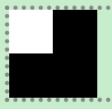
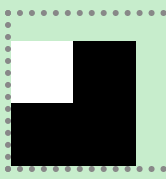
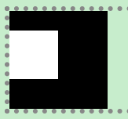
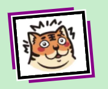
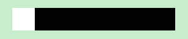
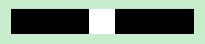
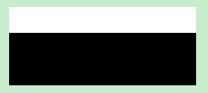
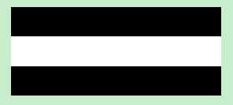
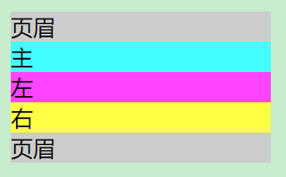
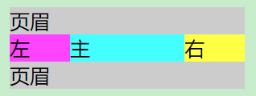

# `CSS`

## 选择器

- 分类
  - [基本选择器](选择器/基本选择器.css)
  - [组合选择器](选择器/组合选择器.css)
  - [伪元素选择器](选择器/伪元素选择器.css)
  - [伪类选择器](选择器/伪类选择器.css)

| 分类 |                           描述                           |
| :--: | :------------------------------------------------------: |
|      |          通配符 `*`  / 类型 / 类 / 属性 / `id`           |
|      | 分组`,`/ 后代 ` ` / 子代 `>`/ 相邻兄弟 `+` / 随后兄弟`~` |
|      |                   `::before`/`::after`                   |
|      |             结构性伪类 / `UI`伪类 / 动态伪类             |

|  特性  |                             描述                             |
| :----: | :----------------------------------------------------------: |
|  层叠  |     属性、权重都相同样式被应用到同个元素，后面的样式生效     |
|  继承  |           继承与外观（字体、文字、颜色）相关的样式           |
| 优先级 | 内嵌 > `id` > 类 / 伪类 / 属性 > 元素 / 伪元素 > 通用 / 组合符 |

---

## 盒子模型

### 外边距

#### 外边距塌陷

```html
<div>
    <p></p>
</div>
```

```scss
div {
  background-color: #000;
  width: 10em;
  height: 10em;
}

p {
  background-color: #fff;
  width: 5em;
  height: 5em;
}
```



- `p`添加如下代码，引起`div`一起塌陷(图2)，图3是想实现的效果

```scss
p {
  margin-top: 2em;
}
```

- 以下方式均能实现
    - `p`绝对定位，脱离标准流
    - `p`相对定位，相对`div`偏移
    - `div`相对定位，`p`绝对定位相对其偏移
    
    - `div`内边距

```scss
p {
  position: absolute;
  margin-top: 2em;
}    
```

  ```scss
p {
  position: relative;
  top: 2em;
}
  ```

  ```scss
div {
  position: relative;
}

p {
  position: absolute;
  top: 2em;
}
  ```

```scss
div {
  padding-top: 2em;
}
```

### 边框

#### 绘制三角形


```scss
div {
  border: 1em solid $background-color;
  width: 1em;
  border-left-color: #000;
}
```

#### 绘制圆形


```scss
div {
  width: 1em;
  height: 1em;
  background-color: #000;
  border-radius: 50%;
}
```

#### 绘制照片图框



```scss
img {
  // x偏移 y 偏移 模糊半径 颜色
  box-shadow : 0 0 0 4px #000,
  0 0 0 6px #fff,
  -10px -10px $border-color,
  10px 10px $border-color;
  // 旋转
  transform  : rotate(-5deg);
}
```

---

### 内容

#### 省略号


```html
<p>这是一段超长的文本。给大伙演示下，如何使用省略号替换超宽文本。</p>
```

- 单行省略号

```scss
p {
  width: 5em; // 限制宽度
  white-space: nowrap; // 不换行
  overflow: hidden; // 溢出隐藏
  text-overflow: ellipsis; // 省略号
}
```

- 多行省略号

```scss
p {
  width: 5em; // 限制宽度
  overflow: hidden; // 溢出隐藏
  display: -webkit-box; // 弹性伸缩盒子
  -webkit-box-orient: vertical; // 垂直排列
  -webkit-line-clamp: 2; // 限制行数
}
```

---

## 布局

### 浮动

- 文字环绕
    - 浮动元素会压住 `p`元素，但不会压到文字
    - 浮动元素完全脱离文档流，不再占据文档流中的位置

#### 清除浮动


```html
<div>
    <p>1</p>
</div>
```

```scss
div {
  border: 5px dotted $border-color;

  p {
    background-color: $title-color;
    color: #fff;
  }
}
```

- 给 `p`加上浮动属性会影响父元素的布局


```scss
p {
  float: left;
}
```

- 以下方式均能清除浮动的影响
    - 对`div`进行溢出处理
    - `div`末尾添加内容为空的块级伪元素用于清除浮动
    - 给`div`设置能够脱离标准流的定位
    - 更改`div`的盒类型

```scss
div {
  overflow: hidden;
  // overflow: auto;
  // overflow: scroll;
}
```

```scss
div::after {
  content: '';
  display: block;
  clear: both;
}
```

```scss
div {
  position: absolute;
  // position: fixed;
}
```

```scss
div {
  display: flow-root;
  // display: -webkit-box;
  // display: grid;
  // display: flex;
  // display: inline-block;
}
```

---

### 定位

| 定位 |                   描述                   |
| :--: | :--------------------------------------: |
| 相对 |          原来位置占用标准流空间          |
| 绝对 |        相对于有定位属性的祖先元素        |
| 固定 |                相对于视口                |
| 粘性 | 先随页面滚动而滚动，到指定视口位置后固定 |

- 绝对或固定定位
    - 使得元素脱离标准流
    - 元素的宽度默认由内容撑开，可设置宽高

#### 居中

- 水平居中

```html
<div>
    <p></p>
</div>
```

```scss
div {
  background-color: #000;
  height: 1em;
}

p {
  background-color: #fff;
  height: 1em;
  width: 1em;
}
```



- 以下方式均能实现`p`水平居中
    - 设置自动调整的左右外边距
    - 使用相对定位偏移和位移

```scss
p {
  margin: 0 auto;
}
```

```scss
p {
  position: relative;
  left: 50%;
  transform: translateX(-50%);
}
```

- 垂直居中

```html
<div>
    <p></p>
</div>
```

```scss
div {
  background-color: #000;
  height: 3em;
}

p {
  background-color: #fff;
  height: 1em;
}
```



- 以下方式均能实现`p`垂直居中
    - 弹性布局
    - 网格布局
    - 使用相对定位偏移和位移

```scss
div {
  display: flex;
  align-items: center;
}
p{
  width: 100%;
}
```

```scss
div {
  display: grid;
  align-items: center;
}
```

```scss
p {
  position: relative;
  top: 50%;
  transform: translateY(-50%);
}
```

#### 圣杯布局

```html
<header>页眉</header>

<section>
    <div>主</div>
    <div>左</div>
    <div>右</div>
</section>

<footer>页眉</footer>
```

```scss
header, footer {
  background-color: #ccc;
}

div {
  &:nth-child(1) {
    background-color: #4ff;
  }

  &:nth-child(2) {
    background-color: #f4f;
  }

  &:nth-child(3) {
    background-color: #ff4;
  }
}
```



```scss
section {
  display: flex;
}

div {
  &:nth-child(1) {
    flex: 1;
  }

  &:nth-child(2) {
    flex: 0 0 3em;
    order: -1;
  }

  &:nth-child(3) {
    flex: 0 0 3em;
  }
}
```

### 动画

#### 下拉菜单

```html
<ul class="menu clearfix">
    <li>JS
        <ul>
            <li>上</li>
            <li>下</li>
        </ul>
    </li>
    <li>Vue
        <ul>
            <li>上</li>
            <li>下</li>
        </ul>
    </li>

</ul>
```

```scss
.menu > li {
  float : left;

  li {
    height     : 0;
    overflow   : hidden;
    transition : height 0.5s;
  }

  &:hover li {
    height : 1.5em;
  }
}
```

#### 滚动菜单

```html
<ul class="clearfix">
    <li>
        <div>JS</div>
        <div>JS</div>
    </li>
    <li>
        <div>Vue</div>
        <div>Vue</div>
    </li>
</ul>
```

```scss
ul {
  li {
    float    : left;
    overflow : hidden;
    height   : 1.5em;

    div {
      height : 1.5em;

      &:first-child {
        background-color : red;
        transition       : margin-top 0.5s;

        &:hover {
          margin-top : -1.5em;
        }
      }
    }
  }
}
```

#### 唱片旋转

```html
<div></div>
```

```scss
div {
  border-radius : 50%;
  overflow      : hidden;
  // 动画名称 完成时间 速度曲线 延迟 次数
  animation     : demo 5s linear 1s infinite;
  // 悬浮暂停
  &:hover {
    animation-play-state : paused;
  }
}

img {
  width : 100%;
}

@keyframes demo {
  0% {
    transform : rotate(0deg);
  }
  100% {
    transform : rotate(360deg);
  }
}
```

#### 媒体查询

```html
<div class="container">
    <div>1</div>
    <div>2</div>
    <div>3</div>
</div>
```

```scss
.container {
  display         : flex;
  width           : 30em;
  justify-content : center;
  margin          : 0 auto;

  div {
    flex       : 1;
    border     : 1px solid blue;
    text-align : center;
  }
}

@media screen and (max-width : 600px) {
  .container {
    flex-direction : column;
    width          : 100%;

    div { width : 100%; }
  }
}
```

## `SCSS`

```scss
/* 嵌套 / 父选择器占位 */

// p {font-size : 1em;font-weight : bold}
p {
  font     : {
    size   : 1em;
    weight : bold;
  };

  // p:hover {color : blue}
  &:hover {
    color : blue;
  }
}
```

```scss
/* 变量 / 插值语句 / 导入 / 继承 / 混合 */
@import 'style';

// div, p {width : 1em;height : 1em}
@mixin length($width,$height) {
  width  : $width;
  height : #{$height};
}

div {
  @include length(1em, 1em)
}

p {@extend div}
```


