# `CSS`

## 选择器

|     类别     |              内容               |
| :----------: | :-----------------------------: |
|  基本选择器  |      通用、元素、类、`id`       |
|  组合选择器  | 相邻兄弟、随后兄弟、子代、后代  |
|  伪类选择器  | 结构性伪类、`UI` 伪类、动态伪类 |
| 伪元素选择器 |      `before`/`after`/...       |

| | 伪类选择器 | 伪元素选择器 | | :--: | :--------: | :----------: | | 作用 | 修饰属性 | 创建对象 | |
数量 | 多个 | 1个 | | 位置 | 不固定 | 必须在最后 |

```html
<input type="checkbox">
```

```scss
input:checked:hover::after {
  content: '已勾选';
  display: block;
  margin-left: 1em;
  width: 3em;
}
```

---

### 三大特性

- 层叠

    - 相同属性并且权重相同的样式应用到同个元素时，后面的样式覆盖前面的

    - 样式冲突时，遵循就近原则
- 继承

    - 子元素继承父元素与外观相关的样式
        - 字体

        - 文字

        - 颜色

    - 与布局相关的样式不会被继承
        - `inherit`
            - 强制继承

- 优先级
    - 内嵌样式
        - 元素

        - 文档

    - 外部样式
        - `id`
        - 类、伪类、属性
        - 元素、伪元素
        - 通用、组合符、否定伪类

    - 用户样式
    - 浏览器默认样式
    - `!important`
        - 优先考虑

---

## 盒模型

### 外边距

- 外边距使用细节

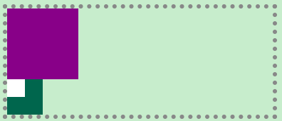

```html

<div></div>
<div>
    <p></p>
</div>    
```

```scss
body {
  margin: 1em;
  border: 5px dotted #888;
}

div {
  &:nth-child(1) {
    background-color: $border-color;
    width: 8em;
    height: 8em;
  }

  &:nth-child(2) {
    background-color: $title-color;
    width: 4em;
    height: 4em;
  }

  p {
    background-color: #fff;
    width: 2em;
    height: 2em;
  }
}
```

- 顶端对齐

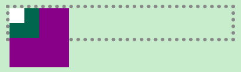

```scss
 div:nth-child(1) {
  margin-bottom: -8em;
}
```

- 父容器大小由第二个盒子的下外边距决定

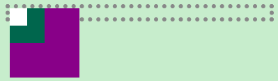

```scss
div:nth-child(2) {
  margin-bottom: -3em;
}
```

- 如何通过添加样式，实现 第二个盒子与子元素底边贴合

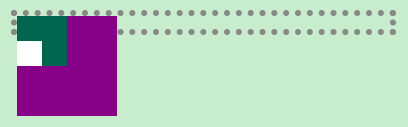

- 外边距塌陷
    - 给子元素添加外边距
    - 外元素随子元素一起下沉

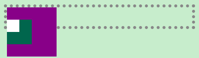

  ```scss
  p {
  margin-top: 2em;
}
  ```

- 以下方式能实现预期效果
    - 定位
        - 子元素绝对定位，脱离标准流，不影响父元素
        - 子元素相对定位偏移
        - 父元素相对定位，子元素绝对定位发生偏移
    - 内边距

```scss
p {
  position: absolute;
  margin-top: 2em;
}    
```

  ```scss
  p {
  position: relative;
  top: 2em;
}
  ```

  ```scss
  div:nth-child(2) {
  position: relative;
}

p {
  position: absolute;
  top: 2em;
}
  ```

```scss
div:nth-child(2) {
  padding-top: 2em;
}
```

---

### 样式

#### 相对长度

|   单位   |                         作用                         |
| :------: | :--------------------------------------------------: |
|   `em`   |                     相对元素字号                     |
|  `rem`   |                    相对根元素字号                    |
|   `%`    | `font-szie`，继承的大小；`width`，包含元素的块的宽度 |
|   `vw`   |                       视口宽度                       |
|   `vh`   |                       视口高度                       |
|   `vm`   |                视口宽度和高度的较小值                |
| `calc()` |                     混合单位计算                     |

---

#### 省略号

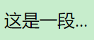

```html
<p>这是一段超长的文本。给大伙演示下，如何使用省略号替换超宽文本。</p>
```

- 单行省略号

```scss
p {
  width: 5em; // 限制宽度
  white-space: nowrap; // 不换行
  overflow: hidden; // 溢出隐藏
  text-overflow: ellipsis; // 省略号
}
```

- 多行省略号

- 伸缩盒子

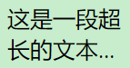

```scss
p {
  width: 5em; // 限制宽度
  overflow: hidden; // 溢出隐藏
  display: -webkit-box; // 弹性伸缩盒子
  -webkit-box-orient: vertical; // 垂直排列
  -webkit-line-clamp: 2; // 限制行数
}
```

- 伪元素

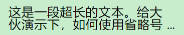

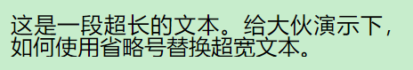

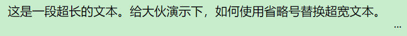

```scss
p {
  line-height: 1em;
  height: 2em;
  overflow: hidden;
  padding-right: 1em; // 省略号的位置
  text-align: justify; // 两端对齐
  position: relative;

  // 固定在右下角的省略号
  &::before {
    content: '...';
    position: absolute;
    right: 0;
    bottom: 0;
  }

  // 用底色盖住不需要时的省略号
  // 文本只剩一行会盖不住
  &::after {
    display: inline-block;
    content: '';
    width: 1em;
    height: 1em;
    background-color: $background-color;
    position: absolute;
    right: 0;
  }
}
```

---

## 布局

---

### 浮动

- 文字环绕
    - 浮动元素会压住 `p`元素，但不会压到文字
    - 浮动元素完全脱离文档流，不再占据文档流中的位置

- 清除浮动

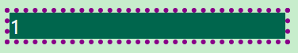

```html

<div>
    <p>1</p>
</div>
```

```scss
div {
  border: 5px dotted $border-color;

  p {
    background-color: $title-color;
    color: #fff;
  }
}
```

- 给 `p`加上浮动属性会影响父元素的布局

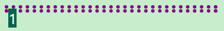

```scss
p {
  float: left;
}
```

- 以下方式均能清除浮动的影响
    - 对父元素进行溢出处理
    - 添加内容为空的块级伪元素用于清除浮动
    - 给父元素设置能够脱离标准流的定位
    - 更改父元素的显示类型

```scss
div {
  overflow: hidden;
  //overflow: auto;
  //overflow: scroll;
}
```

```scss
div::after {
  content: '';
  display: block;
  clear: both;
}
```

```scss
div {
  position: absolute;
  //position: fixed;
}
```

```scss
div {
  display: flow-root;
  //display: -webkit-box;
  //display: grid;
  //display: flex;
  //display: inline-block;
}
```

---

### 定位

- 相对
    - 原来位置占用标准流空间
    - 偏移位置
- 绝对
    - 相对于有定位的祖先元素
    - 子元素绝对定位，父元素相对定位
- 固定
    - 相对于视口
    - 绝对或固定定位
        - 使得元素脱离标准流；
        - 元素的宽度默认由内容撑开，可设置宽高；


- 粘性
    - 随页面滚动而滚动到指定视口位置后固定

---

- 绝对定位和固定定位对不同显示类型元素的影响
    - 默认宽高由内容撑开，可设置宽高

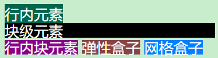

```html

<div>行内元素</div>
<div>块级元素</div>
<div>行内块元素</div>
<div>弹性盒子</div>
<div>网格盒子</div>
```

```scss
div {
  line-height: 1;
  color: #fff;

  &:nth-child(1) {
    display: inline;
    background-color: $title-color;
  }

  &:nth-child(2) {
    display: block;
    background-color: #000;
  }

  &:nth-child(3) {
    display: inline-block;
    background-color: $border-color;
  }

  &:nth-child(4) {
    display: inline-block;
    background-color: #884444;
  }

  &:nth-child(5) {
    display: inline-block;
    background-color: #0080ff;
  }
}
```

- 添加定位属性

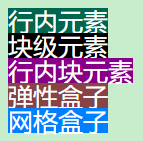

```scss
div {
  position: absolute;

  &:nth-child(1) {
    top: 1em;
  }

  &:nth-child(2) {
    top: 2em;
  }

  &:nth-child(3) {
    top: 3em;
  }

  &:nth-child(4) {
    top: 4em;
  }

  &:nth-child(5) {
    top: 5em;
  }
}
```

- 设置宽度

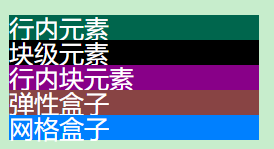

```scss
div {
  width: 10em;
}
```

---

#### 水平居中

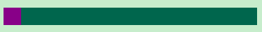

```html

<div>
    <p></p>
</div>
```

```scss
div {
  background-color: $title-color;
  height: 1em;

  p {
    background-color: $border-color;
    height: 100%;
    width: 1em;
  }
}
```

- 以下方式均能实现子元素水平居中
    - 设置自动调整的左右外边距
    - 使用相对定位偏移和位移

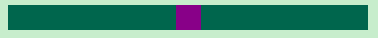

```scss
p {
  margin: 0 auto;
}
```

```scss
p {
  position: relative;
  left: 50%;
  transform: translateX(-50%);
}
```

---

#### 垂直居中


```html

<div>
    <p></p>
</div>
```

```scss
div {
  background-color: $title-color;
  height: 3em;

  p {
    background-color: $border-color;
    height: 1em;
  }
}
```

- 以下方式均能实现子元素垂直居中
    - 弹性布局
    - 网格布局
    - 使用相对定位偏移和位移
    - 行内块元素垂直对齐

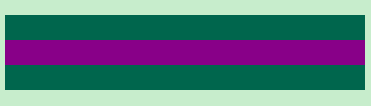

```scss
p {
  width: 100%;
}

div {
  display: flex;
  align-items: center;
}
```

```scss
div {
  display: grid;
  align-items: center;
}
```

```scss
p {
  position: relative;
  top: 50%;
  transform: translateY(-50%);
}
```

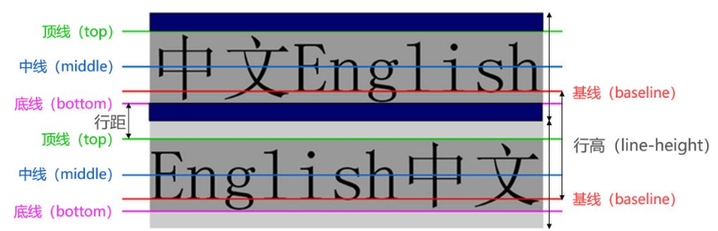

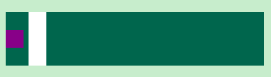

```scss
div {
  p {
    display: inline-block;
    vertical-align: middle;
    width: 1em;
  }

  &::after {
    display: inline-block;
    content: '';
    vertical-align: middle;
    height: 100%;
    width: 1em;
    background-color: #fff;
  }
}
```

---

#### 圣杯布局

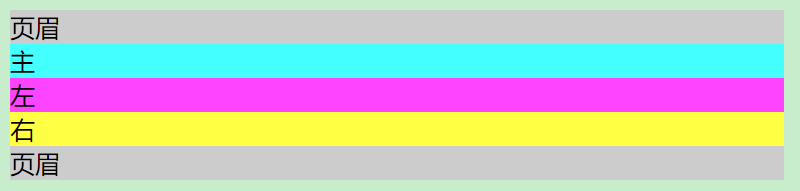

```html

<header>页眉</header>

<section>
    <div>主</div>
    <div>左</div>
    <div>右</div>
</section>

<footer>页眉</footer>
```

```scss
header, footer {
  background-color: #ccc;
}

div {
  &:nth-child(1) {
    background-color: #4ff;
  }

  &:nth-child(2) {
    background-color: #f4f;
  }

  &:nth-child(3) {
    background-color: #ff4;
  }
}
```

- 以下方式均能实现主体内容按左、主、右排列，左、右固定宽度，主自适应
    - 浮动
        - 调整外边距和位移
    - 弹性盒子
        - 更改排列顺序

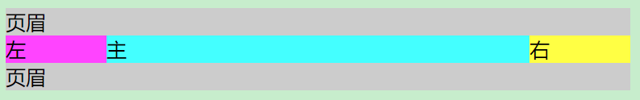

```scss
section {
  // 清除浮动
  &::after {
    content: '';
    display: block;
    clear: both;
  }

  // 腾出左右区域的空间
  padding: 0 5em;
}

div {
  float: left;

  &:nth-child(1) {
    width: 100%;
  }

  &:nth-child(2) {
    width: 5em;
    // 父元素的宽度
    margin-left: -100%;
    // 自己的宽度
    transform: translateX(-100%);
  }

  &:nth-child(3) {
    width: 5em;
    margin-left: -5em;
    transform: translateX(100%);
  }
}
```

```scss
section {
  display: flex;
}

div {
  &:nth-child(1) {
    flex: 1;
  }

  &:nth-child(2) {
    flex: 0 0 5em;
    // 顺序提前
    order: -1;
  }

  &:nth-child(3) {
    flex: 0 0 5em;
  }
}
```

---

## 边框

- 绘制三角形

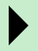

```html

<div></div>
```

```scss
div {
  border: 1em solid $background-color;
  width: 1em;
  border-left-color: #000;
}
```

- 绘制圆形

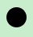

```html

<div></div>
```

```scss
div {
  width: 1em;
  height: 1em;
  background-color: #000;
  border-radius: 50%;
}
```

- 绘制照片图框

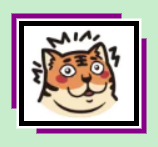

```scss
img {
  box-shadow: 0 0 0 4px #000,
  0 0 0 6px #fff,
  -10px -10px $border-color,
  10px 10px $border-color;
}
```

---

## 背景

---

## 过渡

---

## 动画

---

## 变换

