# `CSS`

## 选择器

### 基本选择器

| 描述 |         示例         |
| :--: | :------------------: |
| 通用 |         `*`          |
| 元素 |         `p`          |
|  类  |       `.menu`        |
| 属性 | `input[type='text']` |
| `id` |        `#app`        |

### 组合选择器

|   描述   |   示例    |
| :------: | :-------: |
|   并集   |  `h1, p`  |
|   后代   |  `div p`  |
|   子代   | `div > p` |
| 相邻兄弟 | `h1 + p`  |
| 随后兄弟 | `h1 ~ p`  |

### 伪元素选择器

|      描述      |       示例        |
| :------------: | :---------------: |
| 元素内部最前面 |   `div::before`   |
| 元素内部最后面 |   `div::after`    |
|    首个字母    | `p::first-letter` |
|    首行文字    |  `p::first-line`  |

### 伪类选择器

#### 结构性伪类

|                   描述                   |            示例             |
| :--------------------------------------: | :-------------------------: |
|            首个指定类型的元素            |    `ul > li:first-child`    |
|          最后一个指定类型的元素          |    `ul > li:last-child`     |
|   列表内偶数子节点，且类型为表项的元素   |   `ul > li:nth-child(2n)`   |
|   列表内奇数子节点，且类型为表项的元素   |  `ul > li:nth-child(2n+1)`  |
| 列表内类型为表项的节点中，且为偶数的元素 |  `ul > li:nth-of-type(2n)`  |
| 列表内类型为表项的节点中，且为奇数的元素 | `ul > li:nth-of-type(2n+1)` |

#### 状态伪类 

|       示例       |        描述        |
| :--------------: | :----------------: |
| `input:disabled` |    被禁用的表单    |
| `input:enabled`  |     可用的表单     |
| `input:checked`  |    被选中的表单    |
| `input:required` |     必选的表单     |
|  `input:focus`   |     聚焦的表单     |
|  `p:selection`   |    被选中的段落    |
|     `a:link`     |    未访问的链接    |
|    `a:hover`     |  鼠标悬停于链接上  |
|    `a:active`    | 鼠标点击链接未松开 |
|   `a:visited`    |    已访问的链接    |

|               |            伪元素选择器            |        伪类选择器        |
| :-----------: | :--------------------------------: | :----------------------: |
|     描述      | 通过元素内部特殊位置为元素添加效果 | 对符合状态的元素添加效果 |
| 是否存在`DOM` |                 0                  |            1             |
|   位置限制    |                最后                |            0             |
|   个数限制    |                1个                 |            0             |

|  特性  |                             描述                             |
| :----: | :----------------------------------------------------------: |
|  层叠  |     属性、权重都相同样式被应用到同个元素，后面的样式生效     |
|  继承  |           继承与外观（字体、文字、颜色）相关的样式           |
| 优先级 | 内嵌 > `id` > 类 / 伪类 / 属性 > 元素 / 伪元素 > 通用 / 组合符 |

## 盒子模型

### 显示类型

|                              | 块级元素 | 行内元素 | 行内块元素 |
| :--------------------------: | :------: | :------: | :--------: |
|           一行多个           |    0     |    1     |     1      |
|           默认宽度           | 占满容器 | 内容宽度 |  内容宽度  |
|           设置高宽           |    1     |    0     |     1      |
| 上下外边距/边框/内边距占空间 |    1     |    0     |     1      |
|         容纳块级元素         |    1     |    0     |     1      |

- `p`/ `h1`为块级元素，但不能容纳块级元素

### 外边距

#### [外边距塌陷](外边距塌陷.html)


- 想让内部盒子垂直居中（图2），添加上外边距，实际效果，为外部盒子一起塌陷(图3)

```css
p {
    margin-top : 2em;
}
```

- 正确的做法如下

```css
/* 内部盒子添加绝对定位脱离标准流，不再引起塌陷 */
p {
    position   : absolute;
    margin-top : 2em;
}
```

  ```css
/* 内部盒子添加相对定位偏移 */
p {
    position : relative;
    top      : 2em;
}
  ```

  ```css
/* 外部盒子添加相对定位，内部盒子添加绝对定位
 内部盒子相对外部盒子偏移 */
div {
    position : relative;
}

p {
    position : absolute;
    top      : 2em;
}
  ```

```css
/* 外部盒子添加上内边距 */
div {
    padding-top : 2em;
}
```

#### [外边距计算](外边距计算.html)


- 内部第二个盒子的下外边距位置决定外部盒子的下边框

```css
/* 两个正值，取较大者（图2） */
div {
    margin-bottom : 2em;
}

p {
    margin-top : 4em;
}
```

```css
/* 两个负值，取绝对值较大者（图3） */
div {
    margin-bottom : -2em;
}

p {
    margin-top : -4em;
}
```

```css
/* 一正一负，叠加（图4） */
div {
    margin-bottom : -8em;
}

p {
    margin-top : 2em;
}
```

### 边框

#### [绘制三角形](绘制三角形.html)

```css
div {
    border            : 1em solid #fff;
    border-left-color : #000;
}
```

#### [绘制圆形](绘制圆形.html)

```css
/* 边框圆角半径大于 50% 的正方形则为圆形 */
div {
    width            : 1em;
    height           : 1em;
    background-color : #000;
    border-radius    : 50%;
}
```

#### [绘制照片图框](绘制照片图框.html)


```css
img {
    /* x偏移 y偏移 模糊半径 扩张半径 颜色 */
    /*  边框 留白 左上 右下 */
    box-shadow : 0 0 4px 4px #880088,
    0 0 0 8px #fff,
    -12px -12px skyblue,
    12px 12px skyblue;
    /* 旋转 */
    transform  : rotate(-5deg);
}
```

### 内容

#### [省略号](省略号.html)


```css
/* 单行省略号 */
/* 限制宽度，不换行，溢出隐藏，文本溢出显示省略号 */
p {
    width         : 5em;
    white-space   : nowrap;
    overflow      : hidden;
    text-overflow : ellipsis;
}
```

```css
/* 多行省略号 */
/* 设置盒子类型，限制宽度，溢出隐藏，设置内容垂直排列，设置行数 */
p {
    display            : -webkit-box;
    width              : 5em;
    overflow           : hidden;
    -webkit-box-orient : vertical;
    -webkit-line-clamp : 2;
}
```

## 布局

### 浮动

- 文字环绕
    - 浮动元素会压住 `p`元素，但不会压到文字
    - 浮动元素完全脱离文档流，不再占据文档流中的位置
    - 浮动元素具有行内块特性

#### [清除浮动](清除浮动.html)


- 为内部盒子添加浮动属性，外部盒子不再包裹内部盒子（图2）


```css
p {
  float: left;
}
```

- 清除浮动影响的做法如下

```css
/* 外部盒子设置溢出隐藏 */
div {
    overflow : hidden;
}
```

```css
/* 在外部盒子末尾添加内容为空的块级伪元素，用于清除浮动 */
div::after {
    content : '';
    display : block;
    clear   : both;
}
```

```css
/* 外部盒子设置能够脱离标准流的定位 */
div {
    position : absolute;
}
```

```css
/* 外部盒子设置显示类型 */
div {
    display : flow-root;
}
```

### [弹性布局](弹性布局.html)

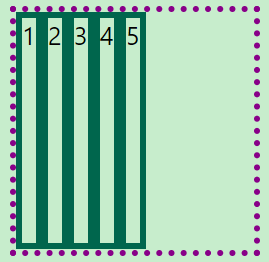

```css
/* 默认水平为主轴，垂直为交叉轴
每行为独立的弹性容器 */
section {
    display : flex;
    width   : 20em;
    height  : 20em;
    /* 默认的 align-items : stretch;
     对容器内的项目进行交叉轴方向拉伸 */
}
```

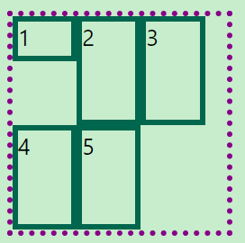

```css
/* 设置允许换行 */
section {
    /* flex-direction flex-wrap 简写 */
    flex-flow : row wrap;
}

div {
    width : 30%;
}

/* 设置高度的项目不会进行延伸 */
div:first-child {
    height : 2em;
}
```

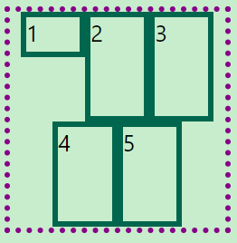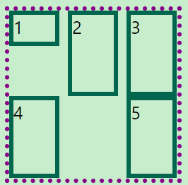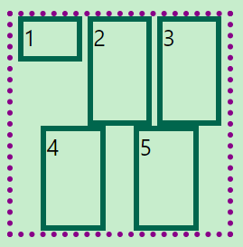

```css
/* 设置容器内项目在主轴方向的对齐方式，默认向左边线靠拢 */
section {
    /* 向中线靠拢 */
    justify-content : center;
    /* 两侧贴着边线，项目间等距 */
    justify-content : space-between;
    /* 边线与项目间等距 */
    justify-content : space-evenly;
}
```

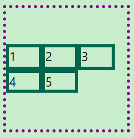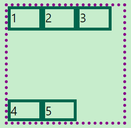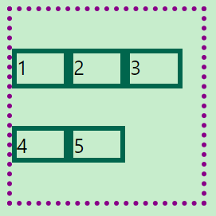

```css
/* 设置弹性盒子间的对齐方式，默认为延伸 */
section {
    /* 向中线靠拢 */
    align-content : center;
    /* 两侧贴着边线，容器间等距 */
    align-content : space-between;
    /* 边线与容器间等距 */
    align-content : space-evenly;
}
```

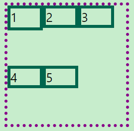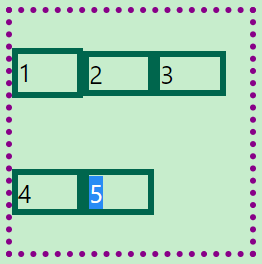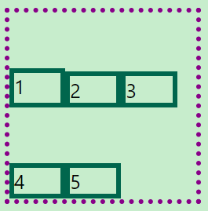

```css
/* 容器内项目在交叉轴方向的对齐方式，默认向上边线靠拢 */
section {
    align-items : start;
    align-items : center;
    align-items : end;
}
```

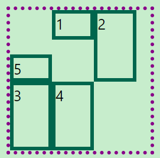

```css
/* 设置项目自身的对齐方式，默认为继承容器设置
  优先级高于容器设置 */
div:last-child {
    /* 交叉轴方向底部对齐 */
    align-self : end;
    /* 项目的排列顺序 */
    order      : -1;
}
```

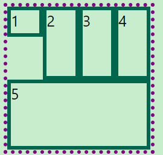

```css
div {
  /* flow-grow flow-shrink flex-basis 的简写
  放大比例 收缩比例 基本尺寸 */
  flex : 1 1 2em;
}
```

### [网格布局](网格布局.html)


```css
section {
    display               : grid;
    grid-template-columns :repeat(3, 1fr);
    grid-template-rows    : 1fr 2fr 1fr;
    gap                   : 1em;
}

div:nth-child(1) {
    grid-column : 1/4;
}

div:nth-child(2) {
    grid-column : 1;
    grid-row    : 2/4;
}

div:nth-child(3) {
    grid-column : 2/4;
    grid-row    : 2/4;
}

div:nth-child(4) {
    grid-column : 1/4;
}
```


```css
section {
    display               : grid;
    grid-template-columns : 2em 3em;
    grid-template-rows    : minmax(1em, auto);
    height                : 8em;
}
```


```css
/* 设置容器的对齐方式 */
section {
    justify-content : center;
    align-content   : end;
}
```


```css
/* 设置项目在网格内的对齐方式 */
section {
    justify-items : start;
    align-items   : end;
}

div:nth-child(2) {
    justify-self : stretch;
    align-self   : stretch;
}
```

### 定位

| 定位 |                   描述                   |
| :--: | :--------------------------------------: |
| 相对 |          原来位置占用标准流空间          |
| 绝对 |        相对于有定位属性的祖先元素        |
| 固定 |                相对于视口                |
| 粘性 | 先随页面滚动而滚动，到指定视口位置后固定 |

- 绝对定位/固定定位
    - 使得元素脱离标准流
    - 元素的默认宽度为内容宽度，可设置宽高

#### 居中

- [水平居中](水平居中.html)


```css
/* 使用位移和左外边距或相对定位偏移 */
span {
    display     : inline-block;
    margin-left : 50%;
    /* position  : relative;
    left      : 50%; */
    transform   : translateX(-50%);
}
```

```css
/* 父元素设置为弹性盒子 */
div {
    display         : flex;
    justify-content : center;
}
```

- [垂直居中](垂直居中.html)


```css
/* 使用位移和相对定位偏移 */
span {
    display   : inline-block;
    position  : relative;
    top       : 50%;
    transform : translateY(-50%);
}
```

```css
/* 父元素设置为弹性盒子 */
div {
    display     : flex;
    align-items : center;
}
```

#### [圣杯布局](圣杯布局.html)


```css
/* 使用弹性盒子 */
section {
  display : flex;
}

div {
  &:nth-child(1) {
    flex : 1;
  }

  &:nth-child(2) {
    flex  : 0 0 3em;
    order : -1;
  }

  &:nth-child(3) {
    flex : 0 0 3em;
  }
}
```

## 过渡与动画

### [下拉菜单](下拉菜单.html)


```css
.menu {
    display : flow-root
}

.menu > li {
    float            : left;
    text-align       : center;
    box-shadow       : 2px 2px #888;
    background-color : coral;
    width            : 3em
}

.menu > li:hover li {
    height : 1.5em
}

.item li {
    height           : 0;
    overflow         : hidden;
    transition       : height 0.5s;
    background-color : #000000;
    color            : #fff;
}
```

### [滚动菜单](滚动菜单.html)

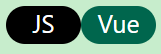

```css
ul {
    display : flow-root
}

ul > li {
    float      : left;
    width      : 3em;
    text-align : center;
    height     : 1.5em;
    overflow   : hidden
}

ul > li div {
    height        : 100%;
    border-radius : 1em
}

ul li div:nth-child(1) {
    background-color : #00664d;
    color            : #fff;
    transition       : margin-top 0.5s;
}

ul li div:nth-child(1):hover {
    margin-top : -1.5em
}

ul li div:nth-child(2) {
    background-color : #000;
    color            : #fff
}
```

### [旋转唱片](旋转唱片.html)


```css
div {
    width         : 10em;
    border-radius : 50%;
    overflow      : hidden;
    animation     : demo 5s linear 1s infinite
}

/* 鼠标悬浮暂停 */
div:hover {
    animation-play-state : paused
}

img {
    width : 100%
}

@keyframes demo {
    0% {
        transform : rotate(0deg)
    }
    100% {
        transform : rotate(360deg)
    }
}
```

## 媒体查询

### [响应式页面](响应式页面.html)


```css
section {
    display : flex;
    gap     : 1em;
    width   : 100%;
    border  : 5px dotted #880088;
    margin  : 0 auto
}

section div {
    flex       : 1;
    border     : 5px solid #00664d;
    text-align : center
}

@media screen and (max-width : 300px) {
    section {
        flex-direction : column;
        width          : 100%
    }
}
```

## `Scss`

```css
/* 嵌套 / 父选择器占位 */

// p {font-size : 1em;font-weight : bold}
p {
  font     : {
    size   : 1em;
    weight : bold;
  };

  // p:hover {color : blue}
  &:hover {
    color : blue;
  }
}
```

```css
/* 变量 / 插值语句 / 导入 / 继承 / 混合 */
@import 'style';

// div, p {width : 1em;height : 1em}
@mixin length($width,$height) {
  width  : $width;
  height : #{$height};
}

div {
  @include length(1em, 1em)
}

p {@extend div}
```
