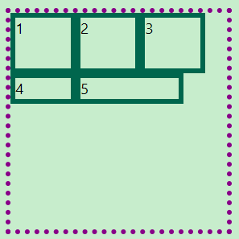

# CSS

## 选择器

### 基本选择器

| 描述 | 示例 |
| :--: | :------------------: |
| 通用 | * |
| 元素 | p |
| 类 | . |
| 属性 | [] |
| id | # |

### 组合选择器

| 描述 | 示例 |
| :------: | :--: |
| 并集 | , |
| 后 | |
| 子代 |  >   |
| 相邻兄弟 | + |
| 随后兄弟 |  ~   |

### 伪元素选择器

|      描述      |      示例      |
| :------------: | :------------: |
| 元素内部最前面 |    ::before    |
| 元素内部最后面 |    ::after     |
|    首个字母    | ::first-letter |
|    首行文字    |  ::first-line  |

### 伪类选择器

#### 结构性伪类

|                  描述                  |        示例        |
| :------------------------------------: | :----------------: |
|   位于同级元素的首个，并且为指定类型   |    :first-child    |
|   位于同级元素的尾个，并且为指定类型   |    :last-child     |
| 位于同级元素的第偶数个，并且为指定类型 |   :nth-child(2n)   |
| 位于同级元素的第奇数个，并且为指定类型 |  :nth-child(2n+1)  |
|    同级指定类型元素中，位于第偶数个    |  :nth-of-type(2n)  |
|    同级指定类型元素中，位于第奇数个    | :nth-of-type(2n+1) |

#### 状态伪类

|        描述        |      示例      |
| :----------------: | :------------: |
|       被禁用       |   :disabled    |
|        可用        |    :enabled    |
|    被勾选的表单    | input:checked  |
|     必选的表单     | input:required |
|        聚焦        |     :focus     |
|       被选中       |   :selection   |
|        悬浮        |     :hover     |
|    未访问的链接    |     a:link     |
| 鼠标点击链接未松开 |    a:active    |
|    已访问的链接    |   a:visited    |

|               |            伪元素选择器            |        伪类选择器        |
| :-----------: | :--------------------------------: | :----------------------: |
|     描述      | 通过元素内部特殊位置为元素添加效果 | 对符合状态的元素添加效果 |
| 是否存在DOM |                 0                  |            1             |
|   位置限制    |                最后                |            0             |
|   个数限制    |                1个                 |            0             |

|  特性  |                             描述                             |
| :----: | :----------------------------------------------------------: |
|  层叠  |     属性、权重都相同样式被应用到同个元素，后面的样式生效     |
|  继承  |           继承与外观（字体、文字、颜色）相关的样式           |
| 优先级 | 内嵌 > id > 类 / 伪类 / 属性 > 元素 / 伪元素 > 通用 / 组合符 |

## 盒子模型

### 显示类型

|                              | 块级元素 | 行内元素 | 行内块元素 |
| :--------------------------: | :------: | :------: | :--------: |
|           一行多个           |    0     |    1     |     1      |
|           默认宽度           | 占满容器 | 内容宽度 |  内容宽度  |
|           设置高宽           |    1     |    0     |     1      |
| 上下外边距/边框/内边距占空间 |    1     |    0     |     1      |
|         容纳块级元素         |    1     |    0     |     1      |

- p / h1为块级元素，但不能容纳块级元素

### BFC

- 块级元素的布局环境
    - 独立容器，内部元素不会影响外部元素的布局
    - 垂直方向从上到下紧挨放置
        - 外边距重叠
    - 水平方向从左到右紧挨放置

| 触发BFC  |       示例        |
| :------: | :---------------: |
|   浮动   |    float:left     |
|   定位   | absolute / fixed  |
| 显示类型 | display:flow-root |
|   溢出   |  overflow:hidden  |

### 外边距

#### [外边距塌陷](示例/外边距塌陷.html)


- 想让子元素垂直居中（图2）添加上外边距，实际效果，为父元素一起塌陷（图3）

```css
p {
    margin-top : 2em;
}
```

- 补充属性

```css
/* 父元素触发 BFC */
div {
    overflow : hidden;
}
```

```css
/* 子元素脱离标准流 */
p {
    /* float : left; */
    /* position : absolute; */
    position : fixed;
}
```

- 替换做法

```css
/* 子元素添加相对定位偏移 */
p {
  position : relative;
  top      : 2em;
  }
```

```css
/* 子绝父相，子元素相对父元素偏移 */
  div {
    position : relative;
  }
  p {
      position : absolute;
      top      : 2em;
}
```

```css
/* 父元素添加上内边距 */
div {
    padding-top : 2em;
}
```

#### [外边距计算](示例/外边距计算.html)


- 内部第二个盒子的下外边距位置决定父元素的下边框

```css
/* 两个正值，取较大者（图2） */
div {
    margin-bottom : 2em;
}

p {
    margin-top : 4em;
}
```

```css
/* 两个负值，取绝对值较大者（图3） */
div {
    margin-bottom : -2em;
}

p {
    margin-top : -4em;
}
```

```css
/* 一正一负，叠加（图4） */
div {
    margin-bottom : -8em;
}

p {
    margin-top : 2em;
}
```

### 边框

#### [绘制三角形](示例/绘制三角形.html)

```css
div {
    border            : 1em solid #fff;
    border-left-color : #000;
}
```

#### [绘制圆形](示例/绘制圆形.html)

```css
/* 边框圆角半径大于 50% 的正方形则为圆形 */
div {
    width            : 1em;
    height           : 1em;
    background-color : #000;
    border-radius    : 50%;
}
```

#### [绘制照片图框](示例/绘制照片图框.html)


```css
img {
    /* x偏移 y偏移 模糊半径 扩张半径 颜色 */
    /*  边框 留白 左上 右下 */
    box-shadow : 0 0 4px 4px #880088,
    0 0 0 8px #fff,
    -12px -12px skyblue,
    12px 12px skyblue;
    /* 旋转 */
    transform  : rotate(-5deg);
}
```

### 内容

#### [省略号](示例/省略号.html)

```css
/* 单行省略号 */
/* 限制宽度，不换行，溢出隐藏，文本溢出显示省略号 */
p {
    width         : 5em;
    white-space   : nowrap;
    overflow      : hidden;
    text-overflow : ellipsis;
}
```

```css
/* 多行省略号 */
/* 设置盒子类型，限制宽度，溢出隐藏，设置内容垂直排列，设置行数 */
p {
    display            : -webkit-box;
    width              : 5em;
    overflow           : hidden;
    -webkit-box-orient : vertical;
    -webkit-line-clamp : 2;
}
```

## 布局

### 浮动

- 文字环绕
    - 浮动元素会压住 p元素，但不会压到文字
    - 浮动元素完全脱离文档流，不再占据文档流中的位置
    - 浮动元素具有行内块特性

#### [清除浮动](示例/清除浮动.html)


- 为子元素添加浮动属性，父元素不再包裹子元素（图2）

```css
p {
    float : left;
}
```

- 触发父元素 BFC

```css
/* 溢出隐藏 */
div {
    overflow : hidden;
}
```

```css
/* 脱离标准流的定位 */
div {
    position : absolute;
}
```

```css
/* 显示类型 */
div {
    display : flow-root;
}
```

- 清除浮动

```css
/* 在父元素末尾添加内容为空的块级伪元素，用于清除浮动 */
div::after {
    content : '';
    display : block;
    clear   : both;
}
```

### [弹性布局](示例/弹性布局.html)

#### 默认设置

|       描述       |         示例          |
| :--------------: | :-------------------: |
|   主轴方向为行   |  flex-direction:row   |
|     只有一行     |   flex-wrap:nowrap    |
|   行内容左对齐   | justify-content:left  |
|     行高拉满     | align-content:stretch |
| 行内项目高度拉满 |  align-items:stretch  |


```css
/* 设置允许换行 */
section {
    flex-flow : row wrap;
}

/* 不拉伸设置行内高度的项目 */
div {
    width : 30%;
}

div:first-child {
    height : 4em;
}

div:last-child {
    width : 50%;
}
```


```css
section {
    /* 居中 */
    justify-content : center;
    /* 右对齐 */
    justify-content : right;
    /* 两端对齐，分散等距 */
    justify-content : space-between;
}
```




```css
/* 不拉伸设置对齐方式的行高 */
section {
    /* 上对齐 */
    align-content : start;
    /* 居中 */
    align-content : center;
    /* 下对齐 */
    align-content : end;
    /* 两端对齐，分散等距 */
    align-content : space-between;
}
```


```css
/* 不拉伸设置行内对齐方式的项目高度 */
section {
    /* 上对齐 */
    align-items : start;
    /* 居中 */
    align-items : center;
    /* 下对齐 */
    align-items : end;
}
```

#### 其他属性

```css
div {
    /* flow-grow flow-shrink flex-basis 简写
    放大比例 收缩比例 基本尺寸 */
    flex : 1 1 2em;
}

div:last-child {
    /* 单独项目的行内对齐方式 */
    align-self : end;
    /* 项目的排列顺序 */
    order      : -1;
}
```

#### [圣杯布局](示例/圣杯布局.html)


```css
section {
    display : flex;
}

div:nth-child(1) {
    flex : 1;
}

div:nth-child(2) {
    flex  : 0 0 3em;
    order : -1;
}

div:nth-child(3) {
    flex : 0 0 3em;
}
```

### [网格布局](示例/网格布局.html)

- 网格线布局


```css
section {
    display               : grid;
    grid-template-columns :repeat(3, 1fr);
    grid-template-rows    : 1fr 2fr 1fr;
    gap                   : 1em;
}

div:nth-child(1) {
    grid-column : 1/4;
}

div:nth-child(2) {
    grid-column : 1;
    grid-row    : 2/4;
}

div:nth-child(3) {
    grid-column : 2/4;
    grid-row    : 2/4;
}

div:nth-child(4) {
    grid-column : 1/4;
}
```

- 对齐方式


```css
section {
    display               : grid;
    grid-template-columns : 2em 3em;
    grid-template-rows    : minmax(1em, auto);
    height                : 8em;
}
```


```css
/* 设置行列的对齐方式 */
section {
    justify-content : center;
    align-content   : end;
}
```


```css
/* 设置行列内项目的对齐方式 */
section {
    justify-items : start;
    align-items   : end;
}

/* 项目行内列内高度拉满 */
div:nth-child(2) {
    justify-self : stretch;
    align-self   : stretch;
}
```

### 定位

| 定位 | 描述 |
| :--: | :--------------------------------------: |
| 相对 | 原来位置占用标准流空间 |
| 绝对 | 相对于有定位属性的祖先元素 |
| 固定 | 相对于视口 |
| 粘性 | 先随页面滚动而滚动，到指定视口位置后固定 |

#### 居中

- [水平居中](示例/水平居中.html)


```css
/* 使用位移和左外边距或相对定位偏移 */
span {
    display     : inline-block;
    margin-left : 50%;
    /* position  : relative;
    left      : 50%; */
    transform   : translateX(-50%);
}
```

```css
/* 父元素设置为弹性盒子 */
div {
    display         : flex;
    justify-content : center;
}
```

- [垂直居中](示例/垂直居中.html)


```css
/* 使用位移和相对定位偏移 */
span {
    display   : inline-block;
    position  : relative;
    top       : 50%;
    transform : translateY(-50%);
}
```

```css
/* 父元素设置为弹性盒子 */
div {
    display     : flex;
    align-items : center;
}
```

## 过渡与动画

### [下拉菜单](示例/下拉菜单.html)


```css
/* 下拉菜单高度设置为 0
 文字内容溢出隐藏
 鼠标悬浮，恢复高度 */
.menu {
    display : flow-root
}

.menu > li {
    float            : left;
    text-align       : center;
    box-shadow       : 2px 2px #888;
    background-color : coral;
    width            : 3em
}

.menu > li:hover li {
    height : 1.5em
}

.item li {
    height           : 0;
    overflow         : hidden;
    transition       : height 0.5s;
    background-color : #000000;
    color            : #fff;
}
```

### [旋转唱片](示例/旋转唱片.html)


```css
div {
    width         : 10em;
    border-radius : 50%;
    overflow      : hidden;
    animation     : demo 5s linear 1s infinite
}

/* 鼠标悬浮暂停 */
div:hover {
    animation-play-state : paused
}

img {
    width : 100%
}

@keyframes demo {
    0% {
        transform : rotate(0deg)
    }
    100% {
        transform : rotate(360deg)
    }
}
```

## 媒体查询

### [响应式页面](示例/响应式页面.html)


```css
section {
    display : flex;
    gap     : 1em;
    width   : 100%;
    border  : 5px dotted #880088;
    margin  : 0 auto
}

section div {
    flex       : 1;
    border     : 5px solid #00664d;
    text-align : center
}

@media screen and (max-width : 300px) {
    section {
        flex-direction : column;
        width          : 100%
    }
}
```

