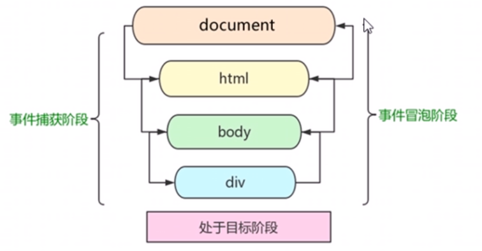

# `DOM`

## 元素

|          描述          |                示例                |
| :--------------------: | :--------------------------------: |
|      获取单个元素      |   `document.querySelector('ul')`   |
|      获取全部元素      | ` document.querySelectorAll('li')` |
|      获取 `html`       |     `document.documentElement`     |
|      获取 `body`       |          `document.body`           |
|       获取父节点       |          `li.parentNode`           |
|     获取所有子元素     |           `ul.children`            |
|     获取首个子元素     |       `ul.firstElementChild`       |
|   获取最后1个子元素    |       `ul.lastElementChild`        |
|    获取下个兄弟元素    |      `li.nextElementSibling`       |
|    获取上个兄弟元素    |    `li.previousElementSibling`     |
|        创建元素        |  ` document.createElement('li')`   |
| 添加子节点到父节点末尾 |        `ul.appendChild(li)`        |
| 在指定节点前插入子节点 |   `ul.insertBefore(li, lis[0])`    |
|        删除节点        |           `li.remove()`            |
|       删除子节点       |        `ul.removeChild(li)`        |
|     赋值节点及内容     |        `li.cloneNode(true)`        |
|     获取节点的内容     |           `li.innerHTML`           |
|      设置内联样式      |          `li.style.color`          |
|       获取属性值       |      `li.getAttribute('id')`       |
|       设置属性值       |    `li.setAttribute('id', 'l')`    |
|        移除属性        |     `li.removeAttribute('id')`     |

## 事件



|   描述   |                 示例                 |
| :------: | :----------------------------------: |
| 添加事件 |  `li.addEventListener('click', f)`   |
| 删除事件 | `li.removeEventListener('click', f)` |

### 事件类型

|          描述          |     示例     |
| :--------------------: | :----------: |
|      全部加载完成      |    `load`    |
|        卸载完成        |   `unload`   |
|      窗口改变大小      |   `resize`   |
|       滚动条滚动       |   `scroll`   |
|        获得焦点        |   `focus`    |
|        失去焦点        |    `blur`    |
|          单击          |   `click`    |
|          双击          |  `dblclick`  |
|        鼠标按下        | `mousedown`  |
|        鼠标弹起        |  `mouseup`   |
| 鼠标穿过元素或其子元素 | `mouseover`  |
| 鼠标离开元素或其子元素 |  `mouseout`  |
|      鼠标穿过元素      | `mouseenter` |
|      鼠标离开元素      | `mouseleave` |
|        鼠标移动        | `mousemove`  |
|        按下键盘        |  `keydown`   |
|    按下键盘产生字符    |  `keypress`  |
|        弹起键盘        |   `keyup`    |

### 事件对象

|      描述      |         示例          |
| :------------: | :-------------------: |
| 触发事件的对象 |      `e.target`       |
|    事件类型    |       `e.type`        |
|  阻止默认行为  | `e.preventDefault()`  |
|    阻止冒泡    | `e.stopPropagation()` |

### 示例

#### [鼠标跟随](鼠标跟随.html)

```js
let img = document.querySelector('img')
/* 将鼠标的在页面的坐标赋值给相对页面绝对定位图片的坐标 */
document.addEventListener('mousemove', function (e) {
  img.style.left = e.pageX + 'px'
  img.style.top = e.pageY + 'px'
})
```

#### [放大输入框](放大输入框.html)

```js
const span = document.querySelector('span')
const input = document.querySelector('input')
// 键盘弹起触发才能将此次输入更新
input.addEventListener('keyup', function () {
  if (this.value === '') {
    span.style.display = 'none'
  }
  else {
    span.style.display = 'inline-block'
    span.innerText = this.value
  }
})
// 添加获取焦点和失去焦点事件
input.addEventListener('blur', function () {
  span.style.display = 'none'
})
input.addEventListener('focus', function () {
  span.style.display = 'inline-block'
})
```

#### [排他](排他.html)

```js
/* 设置当前项前，清空所有 */
const bs = document.querySelectorAll('button')
bs.forEach(b => {
  b.addEventListener('click', function () {
    bs.forEach(b => b.className = '')
    this.className = 'now'
  })
})
```

#### [全选](全选.html)

```js
const h  = document.querySelector('.h'),
      ds = document.querySelectorAll('.d')
h.addEventListener('click', function () {
  ds.forEach(d => {
    d.checked = this.checked
  })
})
/* 先将结果置为 true
 * 如果有子项没被选中，将结果置为 false，退出遍历
 * 将结果赋给全选框 */
ds.forEach(d => {
  d.addEventListener('click', function () {
    let res = true
    let l = ds.length
    for (let i = 0; i < l; i++) {
      if (!ds[i].checked) {
        res = false
        break
      }
    }
    h.checked = res
  })
})
```

#### [动态生成表格](动态生成表格.html)

```js
const table = document.querySelector('table')
const tbody = table.querySelector('tbody')

for (let i of data) {
  let tr = document.createElement('tr')
  for (let j in i) {
    let td = document.createElement('td')
    td.innerHTML = i[j]
    tr.appendChild(td)
  }
  let del = document.createElement('td')
  // 点击不跳转
  del.innerHTML = '<a href="javascript:;">删除</a>'
  tr.appendChild(del)
  tbody.appendChild(tr)
}

// 添加删除事件
let as = tbody.querySelectorAll('a')
as.forEach(a => {
  a.addEventListener('click', function () {
    tbody.removeChild(this.parentNode.parentNode)
  })
})
```
#### [鼠标拖拽](鼠标拖拽.html)

```js
const section = document.querySelector('section')
const div = section.querySelector('div')
div.addEventListener('mousedown', function (e) {
  // 鼠标在盒子里的坐标
  let x = e.pageX - section.offsetLeft
  let y = e.pageY - section.offsetTop

  // 设置盒子的坐标,转化成样式要加 px
  function f (e) {
    section.style.left = e.pageX - x + 'px'
    section.style.top = e.pageY - y + 'px'
  }

  // 鼠标按下后的移动事件
  document.addEventListener('mousemove', f)
  // 鼠标弹起，解绑移动事件
  document.addEventListener('mouseup', function (e) {
    document.removeEventListener('mousemove', f)
  })
})
```

#### [局部放大](局部放大/index.html)

```js
const small  = document.querySelector('.small'),
      big    = document.querySelector('.big'),
      bigImg = big.querySelector('img'),
      mask   = small.querySelector('.mask')
/* 鼠标进入
 * 显示大图和放大镜
 * 鼠标移动
 * 放大镜左上角的移动距离
 * 会将放大镜移除边界，则不移动
 * 大图按照比例反向移动 */
small.addEventListener('mouseenter', function () {
  mask.style.display = 'block'
  big.style.display = 'block'
  small.addEventListener('mousemove', function (e) {
    let x = e.pageX - small.offsetLeft - mask.offsetWidth / 2
    let y = e.pageY - small.offsetTop - mask.offsetHeight / 2
    if (x < 0) {
      x = 0
    }
    else if (x > small.offsetWidth - mask.offsetWidth) {
      x = small.offsetWidth - mask.offsetWidth
    }
    if (y < 0) {
      y = 0
    }
    else if (y > small.offsetHeight - mask.offsetHeight) {
      y = small.offsetHeight - mask.offsetHeight
    }
    mask.style.left = x + 'px'
    mask.style.top = y + 'px'
    bigImg.style.left = -x * 2 + 'px'
    bigImg.style.top = -y * 2 + 'px'
  })
})

/* 鼠标离开
 * 隐藏大图和放大镜 */
small.addEventListener('mouseleave', function () {
  mask.style.display = 'none'
  big.style.display = 'none'
})
```

## `BOM`

### 定时器

#### [倒计时](倒计时.html)

```js
const divs = document.querySelectorAll('div')
const deadTime = new Date('2023-1-1')
f()
setInterval(f, 1000)

function f () {
  let now = new Date()
  let time = deadTime - now
  let h = parseInt(time / 1000 / 60 / 60 % 24)
  let m = parseInt(time / 1000 / 60 % 60)
  let s = parseInt(time / 1000 % 60)
  divs[0].innerHTML = g(h)
  divs[1].innerHTML = g(m)
  divs[2].innerHTML = g(s)
}

// 补足十位
function g (n) {
  return n = n < 10
             ? '0' + n
             : n
}
```

#### [冷却发送](冷却发送.html)

```js
const btn = document.querySelector('button')
btn.addEventListener('click', function () {
  this.disabled = true
  let t = 3
  let timer = setInterval(() => {
    if (t) {
      this.innerHTML = `还剩${ t-- }秒`
    }
    else {
      clearInterval(timer)
      this.disabled = false
      this.innerHTML = '重新发送'
    }
  }, 1000)
})
```

#### [移动盒子](移动盒子.html)

```js
const div = document.querySelector('div')
const r = document.querySelector('.right')
const l = document.querySelector('.left')

/* 传入对象和结束位置
* 将定时器作为对象的属性
* 步长逐渐缩小，并往大整 */
function f (o, end) {
  clearInterval(o.timer);
  o.timer = setInterval(function () {
    let step = (end - o.offsetLeft) / 10
    step = step > 0
           ? Math.ceil(step)
           : Math.floor(step)
    if (o.offsetLeft === end) {
      clearInterval(o.timer)
    }
    else {
      o.style.left = o.offsetLeft + step + 'px'
    }
  }, 10)
}
r.addEventListener('click', function () {
return f(div, 600)
})
l.addEventListener('click', function () {
return f(div, 100)
})
```

#### [滑动提示](滑动提示.html)

```js
const slider = document.querySelector('.slider')
const tip = slider.querySelector('.tip')
const arrow = slider.querySelector('.arrow')

// 鼠标进入
slider.addEventListener('mouseenter', function () {
  slide(tip, -128, function () {
    arrow.innerHTML = '→'
  })
})
// 鼠标离开
slider.addEventListener('mouseleave', function () {
  slide(tip, 0, function () {
    arrow.innerHTML = '←'
  })
})

// 滑动动画
function slide (o, end, callback) {
  clearInterval(o.timer);
  o.timer = setInterval(function () {
    let step = (end - o.offsetLeft) / 10
    step = step > 0
           ? Math.ceil(step)
           : Math.floor(step)
    if (o.offsetLeft === end) {
      clearInterval(o.timer)
      if (callback) {
        callback()
      }
    }
    else {
      o.style.left = o.offsetLeft + step + 'px'
    }
  }, 10)
}
```

### `location`

#### 属性

|  描述  |    示例    |
| :----: | :--------: |
| `URL`  |   `href`   |
|  域名  |   `host`   |
| 端口号 |   `port`   |
|  路径  | `pathname` |
|  参数  |  `search`  |
|  片段  |   `hash`   |
|  协议  | `protocol` |

#### 方法

|         描述         |    示例     |
| :------------------: | :---------: |
|  跳转页面，记录历史  | `assign()`  |
| 跳转页面，不记录历史 | `replace()` |
|       刷新页面       | `reload()`  |

### `history

|   描述   |    示例     |
| :------: | :---------: |
|   后退   |  `back()`   |
|   前进   | `forward()` |
| 后退一步 |  `go(-1)`   |

|            描述            |      示例      |   用法   |
| :------------------------: | :------------: | :------: |
|       包括边框的高度       | `offsetHeight` | 元素位置 |
|      不包括边框的高度      | `clientHeight` | 元素大小 |
| 不包括边框包括滚动条的高度 | `scrollHeight` | 滚动距离 |

