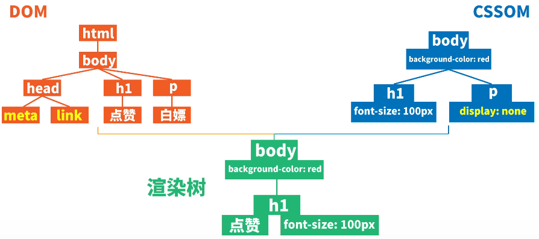
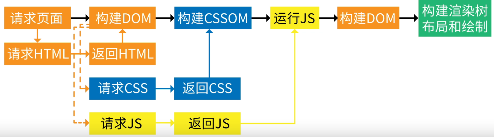
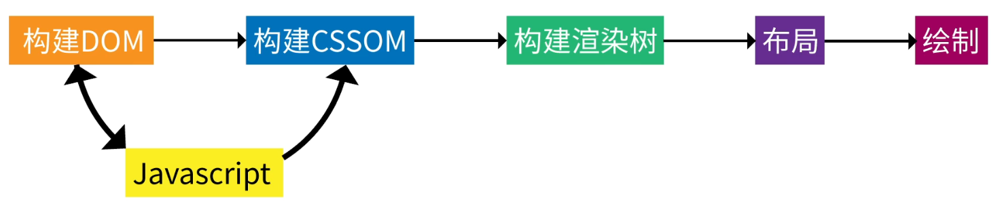

# `DOM`

## 

### `DOM`

- 事件流
    - 捕获
        - 进去时触发
    - 目标
    - 冒泡
        - 出来时触发
        - `stopPropagation()`
            - 多个触发事件时，可阻止冒泡
        - 事件委托
            - 把原本需要绑定在每个子元素的事件，绑定在共同的父元素上，利用冒泡机制触发监听器

- 网页渲染

---

|                  方法                   |                  作用                  |
| :-------------------------------------: | :------------------------------------: |
|    `document.querySelector(选择器)`     | 获取文档中选择器选中的第一个元素的引用 |
|   `document.querySelectorAll(选择器)`   |  获取文档中选择器选中的所有元素的引用  |
|          `creatElement(元素)`           |                创建元素                |
|          `creatTextNode(文本)`          |              创建文本节点              |
|      `父元素.appendChild(子元素)`       |         添加子元素到父元素末尾         |
|             `元素.remove()`             |              删除当前元素              |
| `元素.parentNode.removeChild(当前元素)` |              删除当前元素              |
|            `元素.style.属性`            |              设置内联样式              |
|      `元素.setAttribute(属性，值)`      |                设置样式                |
|           `document.write()`            |               在脚本写入               |
|            `元素.innerHTML`             |             重写元素的内容             |

---