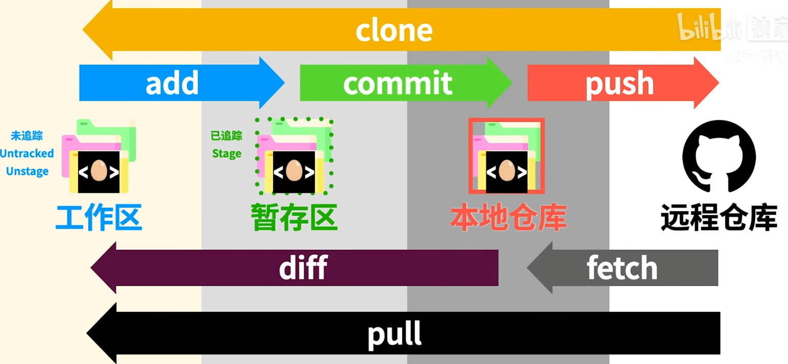

# `Git`

## 命令行

|        描述        |     命令     |
| :----------------: | :----------: |
|      移动目录      |     `cd`     |
| 列出所在目录的内容 |     `ls`     |
|      查看文件      |    `dir`     |
|      创建目录      |   `mkdir`    |
|      删除目录      | `rmdir` `-r` |
|      创建文件      |   `touch`    |
|      删除文件      |     `rm`     |
| 移动文件到指定位置 |     `mv`     |
| 复制文件到指定位置 |     `cp`     |

|                 描述                 |   指令   |
| :----------------------------------: | :------: |
|         初始化，跟踪现有目录         |  `init`  |
|        创建远程项目的本地副本        | `clone`  |
|             代码更改跟踪             |  `add`   |
|          保存到项目历史记录          | `commit` |
|       从本地仓库推送到远程仓库       |  `push`  |
|         从远程拉取到本地仓库         | `fetch`  |
|       比较暂存区和工作区的差异       |  `diff`  |
|    从远程仓库拉取并合并到本地仓库    |  `pull`  |
|        显示正在本地处理的分支        | `branch` |
|         合并在同分支上的更改         | `merge`  |
| 上次提交之后是否有对文件进行再次修改 | `status` |

