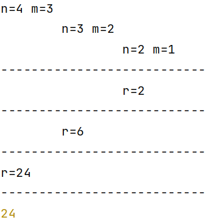
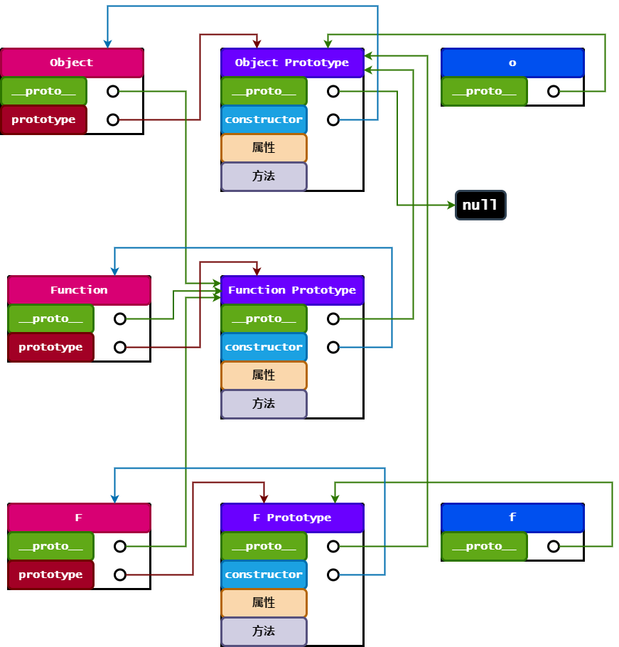
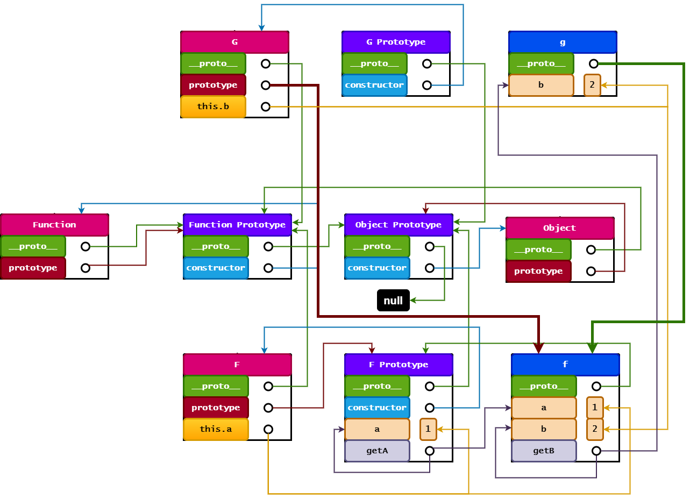

# `JavaScript`

## 关键字

### `var`/`let`/`const`

- `var`
    - 声明的变量会添加到最近的上下文
        - 在函数内部时，提升到函数作用域的顶部
        - 在全局作用域时，会成为 `window` 的属性
    - 可重复声明

```js
function f () {
  console.log(a) // undefined
  if (1) {
    var a
    var a = 1
  }
  console.log(a) // 1
}

f()
// console.log(a) 报错
var b = 2
console.log(window.b) // 2
```

- `let`
    - 先声明再使用
    - 受块级作用域限制

```js
if (1) {
  // console.log(a) 报错
  let a = 1
}
// console.log(a) 报错
```

- `const`
    - 声明的变量无法修改栈内存的值
        - 基本数据类型无法修改字面量
        - 引用数据类型无法修改所引用对象，但可以修改引用对象的内部属性

```js
const a = 1
// a = 0 报错

const x = [1]
// x = [0] 报错
x[0] = 0
console.log(x) // [ 0 ]
```

### `typeof`/`instanceof`

- `typeof`
    - 检测数据类型

|       示例       |    结果     |
| :--------------: | :---------: |
|   `undefined`    | `undefined` |
|      `true`      |  `boolean`  |
| `function () {}` | `function`  |
|    `Infinity`    |  `number`   |
|      `NaN`       |  `number`   |
|      `null`      |  `object`   |
|      `[1]`       |  `object`   |
|     `{a: 1}`     |  `object`   |
|   `new Date()`   |  `object`   |

- `instanceof`
    - 检测构造函数的原型对象是否在实例对象的原型链上
    - `Object` 的原型对象位于原型链的最顶端

    * `Function` 的原型对象为所有构造函数的原型对象
- 以下结果均为 `true`

```js
function F () {}

const f = new F()
```

|   实例对象    |  构造函数  |
| :-----------: | :--------: |
|      `f`      |    `F`     |
| `F.prototype` |  `Object`  |
|   `Object`    |  `Object`  |
|  `Function`   | `Function` |

## 数据类型

|    分类     |           描述            |
| :---------: | :-----------------------: |
|   `Null`    |  `null`<br />空对象指针   |
| `Undefined` | `undefined`<br />未初始化 |
|  `Boolean`  |      `true`/`false`       |
|  `Number`   |   数值/`NaN`/`Infinity`   |
|  `String`   |          字符串           |
|  `Object`   |     属性和方法的集合      |
|  `Symbol`   |      对象的唯一标识       |

### 转型函数

#### `Boolean()`

- 以下结果均为 `false`

| `0`  | `NaN` | `''` | `null` | `undefined` |
| :--: | :---: | :--: | :----: | :---------: |

#### `Number()`

|    示例     | 结果  |
| :---------: | :---: |
|   `true`    |  `1`  |
|    `''`     |  `0`  |
|   `null`    |  `0`  |
| `undefined` | `NaN` |
|   `'1a'`    | `NaN` |

#### `String()`

- `null` / `undefined` 没有 `toString()`方法
- 模板字面量
    - 用于创建复杂字符串
    - 支持多行字符串

```js
const s = '插值'
const ul =
  `<ul>
    <li>${s}</li>
</ul>`
```

### `Number`/`String`

- 进制
    - 默认十进制
    - 进制可选 2~36
- `parseInt` /`parseFloat` 会忽略末尾的非法字符

|            示例             | 结果  |
| :-------------------------: | :---: |
| `const n = 7;n.toString(2)` | `111` |
|       `Number('1a')`        | `NaN` |
|     `parseInt('1a', 2)`     |  `1`  |
|    `parseFloat('0.1.1')`    | `0.1` |

### `Object`

- `Object`的原型携带的属性和方法

```js
const o = new Object({a: 1})
```

|             描述             |                示例                 |       结果        |
| :--------------------------: | :---------------------------------: | :---------------: |
|           构造函数           |           `o.constructor`           |    `Object()`     |
|     判断实例是否存在属性     |       `o.hasOwnProperty('a')`       |      `true`       |
|   判断是否为实例的原型对象   | `Object.prototype.isPrototypeOf(o)` |      `true`       |
| 判断实例的某个属性是否可枚举 |    `o.propertyIsEnumerable('a')`    |      `true`       |
|     返回对象的字符串表示     |           `o.toString()`            | `[object Object]` |
|     返回对象的原始值表示     |            `o.valueOf()`            |    `{ a: 1 }`     |

## 操作符

### `+`

|          示例          |    结果    |
| :--------------------: | :--------: |
| `Infinity + Infinity`  | `Infinity` |
| `Infinity + -Infinity` |   `NaN`    |
|       `true + 0`       |    `1`     |
|  `1 + 2 + '3' + 4.0`   |   `334`    |

### `==`

- 会自动进行数据类型转换

- 以下组内成员用 `==`判断，结果均为 `true`

| `Infinity`/`null`/`undefined` | `0`/ `false`/ `''`/ `[]` |
| :---------------------------: | :----------------------: |

### 解构赋值

- 数组

```js
const x = [1, 2, 3]
const [, ...y] = x
console.log(y) // [ 2, 3 ]
```

- 对象

```js
const o = {
  a : 1,
  b : 2,
}
const {
        a : x,
        c : y,
      } = o
console.log(x, y) // 1 undefined
```

- 函数

```js
const o = {
  a : 1,
  b : 2,
}

/* 不使用结构赋值 */

/* function f (o) {
 console.log(o.a, o.b)
 } */

function f ({b, a}) {
  console.log(a, b) // 1 2
}

f(o)
```

#### 交换变量的值

```js
let a = 1,
    b = 2
```

- 临时变量

```js
let c = a
a = b
b = c
```

- 解构赋值

```js
;[a, b] = [b, a]
```

- 加减法

```js
a = a + b
b = a - b
a = a - b
```

- 按位异或

```js
a = a ^ b
b = a ^ b
a = a ^ b
```

```js
console.log(a, b) // 2 1
```

### 拷贝

|             浅拷贝             |   深拷贝   |
| :----------------------------: | :--------: |
| 只拷贝一层，嵌套对象只拷贝地址 | 每层都拷贝 |

```js
const x = [
  1,
  {b : 2},
]
```

- 扩展运算符 / `assign` 均为浅拷贝

```js
const y = [...x]
y[0] = 0
y[1].b = 0
console.log(x) // [ 1, { b: 0 } ]
```

- `JSON`
    - `JS` 对象的字符串表示
    - `stringify`
        - 对象转字符串
    - `parse`
        - 字符串转对象
- 借助 `JSON` 实现深拷贝

```js
const y = JSON.(JSON.stringify(x))
y[0] = 0
y[1].b = 0
console.log(x) // [ 1, { b: 2 } ]
```

- `JSON` 实现深拷贝带来的问题

|                 示例                  |  结果  |
| :-----------------------------------: | :----: |
|           `NaN`/ `Infinity`           | `null` |
| `undefined`/`Symbol()`/`function(){}` | 被忽略 |
|             `new Date()`              | 字符串 |
|                `/\d/`                 |  `{}`  |

- 手写深拷贝

```js
const o = {
  a : {aa : 11},
  b : [22, {bbb : 222}],
  c : '3',
  d : NaN,
  e : Infinity,
  f : undefined,
  g : function () {},
  h : Symbol(),
  i : /\d/,
  j : new Date(),
  k : null,
}

const res = {}

function f (res, o) {
  for (let i in o) {
    let v = o[i]
    // 先判断是否为数组，因为 Object的原型也是数组的原型
    if (v instanceof Array) {
      res[i] = []
      f(res[i], v)
    }
      // 确定不是数组的情况下，再判断是否为对象
    // 是对象时，判断其是否为 Object 的实例而非其他构造函数
    else if (v instanceof Object && v.constructor === Object) {
      res[i] = {}
      f(res[i], v)
    }
      // 既不是数组，也不是 Object 的实例
    // 只能是基本数据类型或其他构造函数的实例
    else {
      res[i] = o[i]
    }
  }
}

f(res, o)
console.log(res)
```

### `??`/`?.`

- `??`
    - 左侧的值为`null`或 `undefined`时，使用右侧的值
- `?.`
    - 左侧的值存在，访问右侧的属性

```js
const o = {
  a : {b : 2},
}
```

|     示例      |    结果     |
| :-----------: | :---------: |
|   `o.a?.b`    |     `2`     |
|   `o.a?.c`    | `undefined` |
| `o.a?.c ?? 3` |     `3`     |

## 作用域

- 原始值
    - 实际值
- 引用值
    - 引用对象的地址
- 函数在传入参数时，会将值复制给局部变量
    - 原始值不会被修改，引用值的内部属性会被函数通过局部变量修改

```js
let a = 1,
    x = [1]

function f (a, x) {
  a = 0
  x[0] = 0
}

f(a, x)
console.log(a, x) // 1 [ 0 ]
```

|    概念    |                             描述                             |
| :--------: | :----------------------------------------------------------: |
| 执行上下文 |         函数调用时，在执行栈中生成当前函数的执行环境         |
|  变量对象  | 保存上下文定义的变量和函数声明<br />位于作用域链的最前端<br />变量对象无法被访问，但供后台使用 |
|  活动对象  | 进入到函数的执行上下文后，变量对象被激活为活动对象<br />活动对象可被访问 |
|  作用域链  |     上下文的代码在访问变量和函数时沿作用域链逐级向上搜索     |
|  垃圾回收  |                离开作用域的值被自动标记和回收                |
|  标记清理  |                 给当前不使用的值加标记再回收                 |

```js
const obj = {
  f () {
    // 函数内部的执行上下文不存在 f
    console.log(f)
  },
}
// 全局上下文也不存在 f
obj.f() // 报错
```

```js
const obj = {
  f () {
    // this 指向调用者 obj 在其上下文找到 f
    console.log(this.f)
  },
}
obj.f() // f()
```

## 基本引用类型

### `Date`

```js
const t = new Date()
```

|    描述    |           示例           |
| :--------: | :----------------------: |
| `年/月/日` | `t.toLocaleDateString()` |
| `时:分:秒` | `t.toLocaleTimeString()` |
|  设置时间  |    `t.setTime(1000)`     |
|  获取时间  |      `t.getTime()`       |

### 正则表达式

| 修饰符 |        作用         |
| :----: | :-----------------: |
|  `i`   |    不区分大小写     |
|  `g`   |      匹配所有       |
|  `m`   |      多行匹配       |
|  `s`   | `.`能匹配回车和换行 |

- 匹配首个

```js
const r = /1/
const s = '01a11'
```

|                描述                 |           示例           |                          结果                          |
| :---------------------------------: | :----------------------: | :----------------------------------------------------: |
|     判断字符串是否有匹配的子串      |       `r.test(s)`        |                         `true`                         |
|       返回匹配子串的起始位置        |      `s.search(r)`       |                          `1`                           |
| 返回[匹配子串,起始位置,字符串,分组] | `r.exec(s)`/`s.match(r)` | `[ '1', index: 1, input: '01a11', groups: undefined ]` |
|       替换字符串中匹配的子串        |    `s.replace(r, '')`    |                         `0a11`                         |

- 匹配所有

```js
/* 正则表达式 */
const r = /1/g
const s = '01a11'

// 所有匹配子串的起始位置
for (let i of s.matchAll(r)) {
  console.log(i['index']) // 1 3 4
}

// 替换字符串中所有匹配的子串
console.log(s.replaceAll(r, '')) // 0a
```

### `String`

| 描述 | 示例 | 结果 |
| :------------------------: | :------------------: | :--: |
| 删除字符串前后的所有空格符 |   `' 1  '.trim()`    | `1`  |
| 字符串的所有字母转为大写 | `'Hi'.toUpperCase()` | `HI` |
| 字符串的所有字母转为小写 | `'Hi'.toLowerCase()` | `hi` |

```js
const s = '121'
```

|                描述                |               示例               |      结果      |
| :--------------------------------: | :------------------------------: | :------------: |
|           获取字符串长度           |            `s.length`            |      `3`       |
|         字符串是否包含子串         |        `s.includes('1')`         |     `true`     |
| 获取子串在字符串首次出现的起始位置 |         `s.indexOf('1')`         |      `0`       |
| 获取子串在字符串最后出现的起始位置 |       `s.lastIndexOf('1')`       |      `2`       |
|        在字符串后面拼接子串        |         `s.concat(3, 4)`         |    `12134`     |
|  获取 [开始索引,结束索引) 的子串   | `s.slice(0, 2)`/`s.slice(0, -1)` |      `12`      |
|          按子串分隔成数组          |          `s.split('2')`          | `[ '1', '3' ]` |
|             按次数复制             |          `s.repeat(2)`           |    `121121`    |
|            替换首个子串            |        `s.replace(1, 0)`         |     `021`      |
|            替换所有子串            |       `s.replaceAll(1, 0)`       |     `020`      |

## 集合引用类型

### 迭代器

- 自定义迭代器

```js
const o = {
  x : [1, 2],
  // 迭代器函数
  [Symbol.iterator] () {
    let i = 0,
        l = this.x.length
    return {
      next : () => i < l
                   ? {value : this.x[i++], done : false}
                   : {value : undefined, done : true},
    }
  },
}
for (let i of o) {
  console.log(i) // 1 2
}
```

### 生成器

- 处理异步函数回调嵌套

- `yield`
    - 暂停执行
    - 返回迭代器对象
- `next()`
    - 恢复执行

```js
function * f () {
  yield setTimeout(() => {
    console.log(1)
    iter.next()
  }, 1000)
  yield setTimeout(() => {
    console.log(2)
    iter.next()
  }, 1000)
}

const iter = f()
iter.next()
```

### `Array`

- 改变原数组的7个方法

```js
const x = [1, 2]
```

|                             描述                             |           示例            |     结果      |
| :----------------------------------------------------------: | :-----------------------: | :-----------: |
|                      在数组末尾添加元素                      |        `x.push(3)`        | `[ 1, 2, 3 ]` |
|                   移除数组末尾的元素并返回                   |          `x.pop`          |  `[ 1, 2 ]`   |
|                      在数组开头添加元素                      |      `x.unshift(0)`       | `[ 0, 1, 2 ]` |
|                   移除数组开头的元素并返回                   |        `x.shift()`        |    `[ 2 ]`    |
|                           反转数组                           |       `x.reverse()`       |  `[ 2, 1 ]`   |
|                        对数组进行排序                        | `x.sort((a, b) => b - a)` |  `[ 2, 1 ]`   |
| 从索引位置移除指定个数的元素，随后插入元素，并返回移除的子数组 |  `x.splice(0, 2, 3, 4)`   |  `[ 3, 4 ]`   |

- 基本用法

```js
const x = [1, 2]
```

|              描述               |         示例          |        结果         |
| :-----------------------------: | :-------------------: | :-----------------: |
|          获取元素个数           |      `x.length`       |         `2`         |
|      判断数组是否存在元素       |    `x.includes(1)`    |       `true`        |
| 获取元素在数组中首次出现的索引  |    `x.indexOf(1)`     |         `0`         |
| 获取元素在数组中最后出现的索引  |  `x.lastIndexOf(1)`   |         `0`         |
|    拼接元素或数组到数组末尾     | `x.concat(3, [4, 5])` | `[ 1, 2, 3, 4, 5 ]` |
| 获取[开始索引,结束索引)的子数组 |   `x.slice(0, -1)`    |       `[ 1 ]`       |
|   用字符拼接数组元素成字符串    |     `x.join('-')`     |        `1-2`        |

- 迭代器的回调函数通常可接收3个参数(元素，索引，数组)

```js
const x = [1, 2]
```

|                       描述                        |                 示例                  |    结果    |
| :-----------------------------------------------: | :-----------------------------------: | :--------: |
|        用数值填充[开始索引,结束索引)的元素        |        `new Array(2).fill(0)`         | `[ 0, 0 ]` |
|               数组元素迭代执行函数                |   `x.forEach(v => console.log(v))`    |   `1 2`    |
| 数组元素迭代执行回调函数,并返回每个结果形成的数组 |       `x.map((v, i) => v + i)`        | `[ 1, 3 ]` |
|        保留使回调函数结果为 `true` 的元素         |        `x.filter(v => v % 2)`         |  `[ 1 ]`   |
|        判断所有元素是否使函数结果为 `true`        |         `x.every(v => v % 2)`         |  `false`   |
|        判断是否存在元素使函数结果为 `true`        |         `x.some(v => v % 2)`          |   `true`   |
| 初始化结果，然后元素迭代执行函数,返回最终迭代结果 | `x.reduce((r, v, i, x) => r += v, 0)` |    `3`     |

- 数组结构转换

|             描述             |                   示例                    |     结果      |
| :--------------------------: | :---------------------------------------: | :-----------: |
|   将迭代数组结构转化为数组   | `Array.from('12', i => parseInt(i) ** 2)` |  `[ 1, 4 ]`   |
| 将高维数组按深度转为低维数组 |     `[1, [2], [[3]]].flat(Infinity)`      | `[ 1, 2, 3 ]` |

### `Set`

```js
const s = new Set([1, 1])
```

|           描述            |     示例      |    结果    |
| :-----------------------: | :-----------: | :--------: |
|       获取元素个数        |   `s.size`    |    `1`     |
|         添加元素          |  `s.add(2)`   | `{ 1, 2 }` |
|   判断集合是否存在元素    |  `s.has(1)`   |   `true`   |
| 删除元素，成功返回 `true` | `s.delete(1)` |   `true`   |
|         清空元素          |  `s.clear()`  |            |

### `Map`

```js
// 二维数组初始化
const m = new Map([['a', 1]])
```

|            描述             |      示例       |           结果            |
| :-------------------------: | :-------------: | :-----------------------: |
|         添加键值对          | `m.set('b', 2)` | ` { 'a' => 1, 'b' => 2 }` |
|       获取键值对个数        |    `m.size`     |            `1`            |
|       判断是否存在键        |  `m.has('a')`   |          `true`           |
|       获取键对应的值        |  `m.get('a')`   |            `1`            |
| 删除键值对，成功返回 `true` | `m.delete('a')` |          `true`           |
|         清空键值对          |   `m.clear()`   |                           |

## 函数

### 函数声明

- 命名函数

```js
// 函数声明会提升，顺利执行
f() 
function f () {}
```

- 函数表达式赋值给变量

```js
// 变量未对函数表达式进行引用，报错
f()
let f = function () {}
```

### 匿名函数

```js
+function () {}()
```

- 匿名函数自运行
    - 在函数声明前加上运算符成为表达式，随后通过 `()`调用
    - 其内部形成封闭的作用域，内部变量不会对外部造成命名污染

|                              |   `function(){}`   |    `()=>{}`    |
| :--------------------------: | :----------------: | :------------: |
|          有原型对象          |         1          |       0        |
|        可作为构造函数        |         1          |       0        |
|      有`arguments`对象       |         1          |       0        |
| 支持 `call`、`apply`、`bind` |         1          |       0        |
|            `this`            | 调用时的上下文对象 | 定义时的上下文 |

### [递归函数](递归函数.js)

- 将执行上下文的信息打印

- 从函数的回归过程，思考代码的书写

    - 递进终止条件

    - 状态转移
        - 由下层结果推出本层结果
        - 返回本层结果



```js
function f (n) {
  if (n === 1) {
    return 1
  }
  return f(n - 1) * n
}

console.log(f(4)) // 24
```

### 回调函数

- 同步函数
    - 按照代码编写顺序执行
- 异步函数
    - 针对不会马上完成的任务，提供暂停和恢复执行的功能

- 同步函数先于异步函数执行

```js
let a = 1

function f () {
  setTimeout(function () {
    a = 0
  }, 1000)
}

function g () {
  console.log(a) // 1
}

f()
g()
```

- 在异步函数内部调用同步函数，使用异步函数的执行结果

```js
let a = 1

function f () {
  setTimeout(function () {
    a = 0
    g()
  }, 1000)
}

function g () {
  console.log(a) // 0
}

f()
```

- 将函数作为参数，即回调函数传入异步函数，可提高代码复用率

```js
let a = 1

function f (g) {
  setTimeout(function () {
    a = 0
    g()
  }, 1000)
}

function g () {
  console.log(a) // 0
}

f(g)
```

### `this`

#### `arguments`

- 普通函数被调用时传入的全部参数形成的类数组对象

- 改变 `this`指向
    - `call`
        - 接收多个参数
    - `apply`
        - 接收参数数组
    - `bind`
        - 不会执行

```js
let o = {
  a : 1,
}

function f (b, c) {
  return {
    a : this.a,
    b,
    c,
  }
}
```

#### [`call`](call.js)

```js
/* 在对象内添加调用函数并执行，再删除 */
Function.prototype.myCall = function () {
  // 获取绑定对象，null 时为全局调用
  let o           = arguments[0] || window,
      // 获取除绑定对象外的所有参数
      [, ...args] = arguments
  // 添加方法，this 指向调用者 f
  o.g = this
  // 接收执行结果
  let res = o.g(...args)
  // 删除方法
  delete o.g
  return res
}

// { a: 1, b: 2, c: 3 }
console.log(f.call(o, 2, 3))
// { a: 1, b: 2, c: 3 }
console.log(f.myCall(o, 2, 3))
```

#### [`apply`](app.js)

```js
// 仅在这里与 call 有所不同
[, [...args]] = arguments
```

#### [`bind`](bind.js)

```js
Function.prototype.myBind = function () {
  let o           = arguments[0] || window,
      [, ...args] = arguments
  o.g = this

  // 闭包
  return function () {
    let res = o.g(...args)
    delete o.g
    return res
  }
}

// { a: 1, b: 2, c: 3 }
console.log(f.bind(o, 2, 3)())
// { a: 1, b: 2, c: 3 }
console.log(f.myBind(o, 2, 3)())
```

#### [定时器](定时器.html)

```js
/* 延迟时间将任务加入任务队列 */
T.addEventListener('click', function () {
  setTimeout(() => {
    ul.innerHTML += `<li>${ new Date().toLocaleTimeString() }</li>`
  }, 1000)
})

/* 每间隔时间将任务加入任务队列 */
I.addEventListener('click', function () {
  let n = 3
  const timer = setInterval(() => {
    // 3次后取消定时器
    if (!--n) {
      clearInterval(timer)
    }
    ul.innerHTML += `<li>${ new Date().toLocaleTimeString() }</li>`
  }, 1000)
})
```

- `setInterval`

```js
function mySetInterval (f, s) {
  setTimeout(g, s)

  // 同步函数 f 需放入异步函数 g 中
  function g () {
    f()
    setTimeout(g, s)
  }
}

let i = 0

function f () {
  console.log(i++)
}

mySetInterval(f, 1000)
```

#### [防抖](防抖.html)

```js
const B = document.querySelector('button')
let i = 0

function f () {
  console.log(i++)
}
```

- 高频触发事件只执行最后间隔足够长的一次

```js
/* 点击事件共享定时器
 * 每次点击先取消定时器，再添加定时器 */
function g (f, s) {
  let timer
  return function () {
    clearTimeout(timer)
    timer = setTimeout(() => f(), s)
  }
}

B.addEventListener('click', g(f, 500))
```

#### [节流](节流.html)

- 高频触发事件，按照时间间隔执行

```js
/* 点击事件共享定时器
 * 没有任务时，添加定时器，任务执行完，定时器置空 */
function g (f, s) {
  let timer
  return function () {
    if (timer) {
      return
    }
    timer = setTimeout(() => {
      f()
      timer = null
    }, s)
  }
}
B.addEventListener('click', g(f, 500))
```

#### [图片懒加载](图片懒加载.html)

- 滚动到页面才加载图片
- `IntersectionObserver(回调函数)`
    - 目标元素和可视窗口产生交叉区域

```js
const imgs = document.querySelectorAll('img')
/* 每个观察元素设置进入可视区域的回调函数
 * 先获取进入区域的目标，再将寄存的图源赋值激活，随后取消观察 */
const obs = new IntersectionObserver(entries => {
  entries.forEach(entry => {
    // 目标元素和可视窗口产生交叉区域
    if (entry.isIntersecting) {
      const tgt = entry.target
      const mySrc = tgt.getAttribute('mySrc')
      tgt.setAttribute('src', mySrc)
      obs.unobserve(tgt)
    }
  })
})

/* 为每张图片设置观察 */
imgs.forEach(function (i) {
  obs.observe(i)
})
```

### `Promise`

```js
/* Promise 对象内部为执行器函数
 * 创建 Promise 对象为同步函数，处理函数都为异步函数
 * Promise 对象存在三种状态 pending / resolved / rejected 三种状态
 * 执行器函数接收两个函数，将状态从 pending 单向切换为 resolved / rejected
 * Promise 对象通过链式，避免回调深度嵌套调用
 * then 接收 resolved / rejected 两种状态的函数
 * 非函数参数传入 then 会被忽略
 * resolved 状态时，将 value 传给 onResolved 函数
 * rejected 状态时，将 reason 传给 onRejected 函数
 * catch 接收 rejected 状态的函数
 * 为 then 中 resolved 状态的函数为 null 的语法糖
 * finally 接收无论 resolved / rejected 状态都会执行的函数
 * 用于添加两种都会执行的冗余代码  */
new Promise((resolve, reject) => {
  if (1) {
    resolve()
  }
  reject()
}).then(value => {}, reason => {})
  .then(null, reason => {})
  .catch(reason => {})
  .finally(() => {})
```

- 抛出异常会返回拒绝的期约
- 返回错误值会将错误对象包装在解决的期约
    - 返回错误值被视为拒绝处理函数成功捕获错误

```js
let p = Promise.resolve().then(() => {throw '0'})
// Uncaught (in promise) 0
// Promise {<rejected>: '0'}
setTimeout(console.log, 0, p)
```

|       描述       |                             示例                             |            结果            |
| :--------------: | :----------------------------------------------------------: | :------------------------: |
| 实例化解决的期约 |                     `Promise.resolve(1)`                     | `Promise {<fulfilled>: 1}` |
| 实例化拒绝的期约 |                     `Promise.reject(0)`                      | `Promise {<rejected>: 0}`  |
|  所有期约都解决  |    `Promise.all([Promise.resolve(1), Promise.reject(0)])`    | `Promise {<rejected>: 0}`  |
|   任一期约解决   |    `Promise.any([Promise.resolve(1), Promise.reject(0)])`    | `Promise {<fulfilled>: 1}` |
|   任一期约确定   | `Promise.race([new Promise(l => setTimeout(l)), Promise.reject(0)]))` | `Promise {<rejected>: 0}`  |

#### `async`/`await`

```js
/* async 仅是异步函数的标识，和普通函数没有区别
 * await 只能在异步函数内部使用
 * 暂停执行异步函数后面的代码，把给 await 提供值的任务添加到消息队列
 * 退出异步函数，执行同步代码
 * 从消息队列取出任务，恢复执行
 * async await 均会将接收或返回的数值封装成期约对象 */
async function f () {
  console.log(1)
  console.log(await new Promise((resolve, reject) => {
    setTimeout(resolve, 1000, 3)
  }))
}

f()
console.log(2)
// 1 2 3
```

#### 手写`Promise`

```js
/* Promise 对象的 constructor 接收执行器函数 executor
 * executor 接收切换状态函数 resolve / reject 并尝试绑定到实例，失败切换为拒绝
 * constructor 初始化状态为 pending ，上次处理结果为 null
 * 处于 pending 状态时，保存可能的多个处理函数 onResolved / onRejected 的数组
 * resolve / reject / onResolved / onRejected 通过定时器实现异步
 * 处理程序 then 返回 Promise 对象实现链式
 * 接收处理函数 onResolved / onRejected
 * 如果传入的并非函数，用空函数代替
 * pending 状态下，将传入的处理函数存入数组
 * resolved / rejected 状态下，分别调用响应的处理函数处理上次处理结果
 * 在切换状态函数 resolve / reject 中，实现状态切换，结果赋值
 * 并遍历处理函数数组对结果进行处理 */
class Promise {
  constructor (executor) {
    this.status = 'pending'
    this.result = null
    this.onResolved = []
    this.onRejected = []

    try {
      executor(this.resolve.bind(this), this.reject.bind(this))
    }
    catch (error) {
      this.reject(error)
    }
  }

  then (onResolved, onRejected) {
    return new Promise((resolve, reject) => {
      onResolved = typeof onResolved === 'function'
                   ? onResolved
                   : () => {}
      onRejected = typeof onRejected === 'function'
                   ? onRejected
                   : () => {}

      if (this.status === 'pending') {
        this.onResolved.push(onResolved)
        this.onRejected.push(onRejected)
      }

      if (this.status === 'resolved') {
        setTimeout(() => {
          onResolved(this.result)
        })
      }

      if (this.status === 'rejected') {
        setTimeout(() => {
          onRejected(this.result)
        })
      }
    })
  }

  resolve (value) {
    setTimeout(() => {
      if (this.status === 'pending') {
        this.status = 'resolved'
        this.result = value

        this.onResolved.forEach(f => {
          f(value)
        })
      }
    })
  }

  reject (reason) {
    setTimeout(() => {
      if (this.status === 'pending') {
        this.status = 'rejected'
        this.result = reason

        this.onRejected.forEach(f => {
          f(reason)
        })
      }
    })
  }
}
```

### 闭包

- 产生条件
    - 内部函数引用外部函数变量
    - 外部函数被调用，内部函数被定义
- 生成内部函数对象时，在其内部生成存储外部函数引用变量的闭包对象

- 将变量封装，不让外部直接访问，只能通过内部函数进行使用
- 闭包使得内部变量无法被及时垃圾回收

```js
/* 在全局环境下，实现变量自增 */
let n = 0

function f () {
  console.log(n++)
}

f() // 0
f() // 1
```

```js
/* 用函数 g 将变量封装 */
function g () {
  let n = 0
  return function f () {
    console.log(n++)
  }
}

// 外部函数被调用两次，生成两个独立的闭包
g()() // 0
g()() // 0
```

```js
function g () {
  let n = 0
  return function f () {
    console.log(n++)
  }
}

// 外部函数被调用，内部函数 f 携带的闭包对象保存了 n
let f = g()
f() // 0
f() // 1
f = null // 闭包消失
```

```js
/* 回调函数 this 的指向 */
const o = {
  f () {
    return function () {
      return this
    }
  },
}

/* o.f()执行完得到 function () {return this}
 * 随后是匿名函数的自运行，在全局环境下，由 window 调用执行 */
console.log(o.f()() === window) // true
```

### 函数柯里化

```js
/* 闭包实现函数柯里化 */
function url (protocol) {
  return function (hostName) {
    return function (pathName) {
      return `${ protocol }${ hostName }${ pathName }`
    }
  }
}

const web = url('https://')('www.a.com')
const html = web('/动态生成表格.html')
const css = web('/style.css')
const js = web('/main.js')

console.log(html) // https://www.a.com/index.html
console.log(css) // https://www.a.com/style.css
console.log(js) // https://www.a.com/main.js
```

#### `add`

```js
/* 返回函数时，会调用 toString，对其进行重写 */
function add () {
  let args = [...arguments]
  let f = function () {
    args.push(...arguments)
    return f
  }

  f.toString = function () {
    return args.reduce((s, v) => s + v)
  }

  return f
}

console.log(Number(add(1, 2, 3)(4, 5)(6))) // 21
```

## 面向对象

### 对象方法

```js
const o = {a : 1}
```

|                     描述                      |                             示例                             |                             结果                             |
| :-------------------------------------------: | :----------------------------------------------------------: | :----------------------------------------------------------: |
|              读取单个属性的描述               |          `Object.getOwnPropertyDescriptor(o, 'a')`           | `{ value: 1, writable: true, enumerable: true, configurable: true }` |
|              读取多个属性的描述               |            `Object.getOwnPropertyDescriptors(o)`             | `{a: { value: 1, writable: true, enumerable: true, configurable: true }}` |
|            实例对象上是否存在属性             |                   `o.hasOwnProperty('a')`                    |                            `true`                            |
|                属性是否可枚举                 |                `o.propertyIsEnumerable('a')`                 |                            `true`                            |
| 添加单个属性及其描述(值/可修改/可删除/可枚举) | `Object.defineProperty(o, 'b', {value : 2, enumerable : true})` |                       `{ a: 1, b: 2 }`                       |
| 添加多个属性及其描述(值/可修改/可删除/可枚举) | `Object.defineProperties(o, {b : {value : 2, enumerable : true}, c : {value : 3, enumerable : true}})` |                    `{ a: 1, b: 2, c: 3 }`                    |
|              获取实例的原型对象               |                  `Object.getPrototypeOf(o)`                  |                      `Object.prototype`                      |
|              设置实例的原型对象               |        `Object.setPrototypeOf(o, Function.prototype)`        |                     `Function { a: 1 }`                      |
|         判断原型对象是否为实例的原型          |             `Object.prototype.isPrototypeOf(o)`              |                            `true`                            |
|                 删除对象属性                  |                         `delete o.a`                         |                             `{}`                             |
|              冻结对象，不让修改               |                      `Object.freeze(o)`                      |                                                              |
|             浅拷贝对象可枚举属性              |               `Object.assign({}, o, {b : 2})`                |                       `{ a: 1, b: 2 }`                       |
|     创建以对象为原型对象并添加属性的实例      |  `Object.create(o, {'b' : {value : 2, enumerable : true}})`  |                          `{ b: 2 }`                          |
|             将对象转换为二维数组              |                     `Object.entries(o)`                      |                       `[ [ 'a', 1 ] ]`                       |
|             将二维数组转换为对象              |             `Object.fromEntries([ [ 'a', 1 ] ])`             |                          `{ a: 1 }`                          |

### 创建对象

#### 工厂模式

```js
/* 无法标识对象类型 */
function F (a) {
  const o = {}
  o.a = a
  o.A = function () {
    return this.a
  }
  return o
}

const o = F(1)
console.log(o.A()) // 1
console.log(Object.getPrototypeOf(o) === F.prototype) // false
```

#### 构造函数

```js
/* new 调用的函数为构造函数 */
function F (a) {
  this.a = a
  this.A = function () {
    return this.a
  }
}

const o = new F(1)
console.log(o.A()) // 1
console.log(Object.getPrototypeOf(o) === F.prototype) // true
```

#### 手写 `new`

```js
/* 以构造函数的原型对象为原型对象创建实例
 * 构造函数 this 绑定到实例并执行，为实例添加属性
 * new 当构造函数返回对象，会返回构造函数返回的对象，而不是新创建的对象 */
function myNew (constructor, ...args) {
  const o   = Object.create(constructor.prototype),
        res = constructor.apply(o, args)
  return res instanceof Object
         ? res
         : o
}

function F (a) {
  this.a = a
  this.A = function () {
    return this.a
  }
  // 返回对象
  return {
    a : 0,
    A () {
      return this.a
    },
  }
}

const o = myNew(F, 1)
const p = new F(1)
o.A() // 0
p.A() // 0

/* 不是同个实例 */
o.a = 1
console.log(p.A()) // 0
console.log(o.A === p.A) // false
```

#### 原型对象

```js
/* 原型对象包含特定引用类型实例共享的属性和方法
 * 函数自动添加 prototype 属性指向原型对象
 * 原型对象自动添加 constructor 属性指向构造函数
 * 每个实例内部有 __proto__ 属性指向构造函数的原型对象 */
function F (a) {
  F.prototype.a = a
  F.prototype.A = function () {
    return this.a
  }
}

const o = new F(1)
const p = new F(2)
// 共享原型对象上的属性和方法
console.log(o.a) // 2
console.log(o.A === p.A) // true
```

#### 原型链



- 实例对象沿着原型链向上查找或添加属性和方法
    - 实例添加与原型的同名属性和方法，会在实例上创建自有属性和方法
- `Object` 的原型对象的 `__proto__` 指向 `null`
- 所有原型对象的 `__proto__` 指向 `Object` 的原型对象
- 所有构造函数的 `__proto__` 指向 `Function` 的原型对象
- 构造函数的 `prototype` 属性与 原型对象的 `constructor` 属性互指
- `instanceof`
- 构造函数的原型对象是否在实例对象的原型链上
- 判断属性是否为原型属性
    - `in`
        - 实例能访问到属性
    - `hasOwnProperty`
        - 属性不属于实例

```js
// 原型上的属性
function t (o, a) {
  return a in o && !o.hasOwnProperty(a)
}

function F () {}

F.prototype.a = 1
F.prototype.A = function () {
  return this.a
}

// 实例添加与原型的同名属性和方法，会在实例上创建自有属性和方法
const o = new F()
const p = new F()
console.log(t(o, 'a')) // true

o.a = 0
o.A = function () {
  return 0
}
console.log(t(o, 'a')) // false
console.log(p.a) // 1
console.log(p.A()) // 1
```

```js
/* 修改构造函数的原型属性，已创建实例的 __proto__ 不会改变 */
function F () {}

const o = new F()
// 构造函数的原型属性指向新的原型对象
F.prototype = {
  a : 1,
}
console.log(o.a) // undefined
```

### 继承



#### 基于原型链的继承

```js
/* 属性定义在构造函数上，每个实例自有
 * 方法定义在原型对象上，被共享
 * 子类实例化时无法给父类构造函数传参 */
function F (a) {
  this.a = a
}

F.prototype.A = function () {
  return this.a
}

function G (b) {
  this.b = b
}

G.prototype.B = function () {
  return this.b
}

G.prototype = new F(1)
// 子类无法传参
const g = new G(2)
const g0 = new G()
console.log(g.constructor === F) // true

// 同名属性，在实例内部生成新的属性
g.constructor = G
console.log(g0.constructor === F) // true

// 重写父类原型上的方法
F.prototype.A = function () {return 0}
console.log(g.A()) // 0
```

#### 盗用构造函数

```js
/* 属性和方法都定义在构造函数上，每个实例自有
 * 在子类构造函数调用父类构造函数
 * 通过 call 以子类对象为上下文执行父类构造函数
 * 可向父类传递参数 */
function F (a) {
  this.a = a
  this.A = function () {
    return this.a
  }.bind(this)
}

function G (a, b) {
  F.call(this, a)
  this.b = b
}

// 可向父类传递参数
const g = new G(1, 2)
console.log(g.A()) // 1
// 方法不能共享
console.log(g.A === new G().A) // false
```

#### 组合继承

```js
/* 基于原型链继承原型上的属性和方法
 * 盗用构造函数实现向父类传参 */
function F (a) {
  this.a = a
}

F.prototype.A = function () {
  return this.a
}

function G (a, b) {
  F.call(this, a)
  this.b = b
}

G.prototype = new F()
G.prototype.constructor = G
G.prototype.B = function () {
  return this.b
}

const g = new G(1, 2)
```

#### 寄生式组合继承

```js
/* 将调用父类构造函数给子类原型赋值，改为拷贝父类原型副本 */
function F (a) {
  this.a = a
}

function G (b) {
  this.b = b
}

const proto = Object(F.prototype)
proto.constructor = G
G.prototype = proto
const g = new G(2)
```

### 类

#### 类的成员

```js
/* 类构造函数中定义的属性为实例自有，不在原型共享
 * 类中定义的方法在原型上共享
 * 静态成员 this 指向类自身 */
class F {
  constructor (a) {
    this.a = a
  }

  A () {
    return this.a
  }

  static creat () {
    return new F(1)
  }
}

const o = F.creat()
console.log(o.A())
```

#### 类的继承

```js
class F {
  constructor (a) {
    this.a = a
  }

  A () {
    return this.a
  }
}

class G extends F {
  constructor (a, b) {
    super(a)
    this.b = b
  }

  A () {
    return super.A();
  }
}

const g = new G(1, 2)
console.log(g.A()) // 1
```