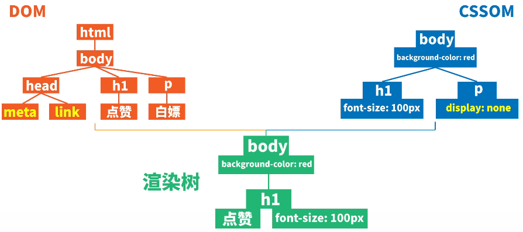
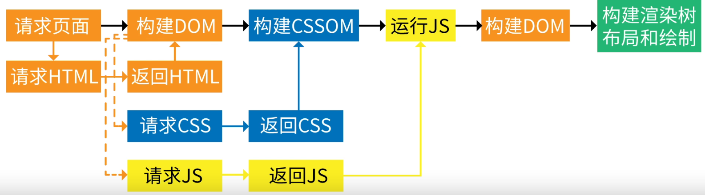
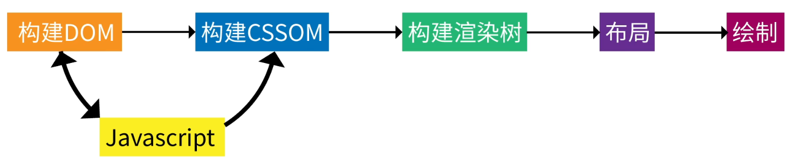
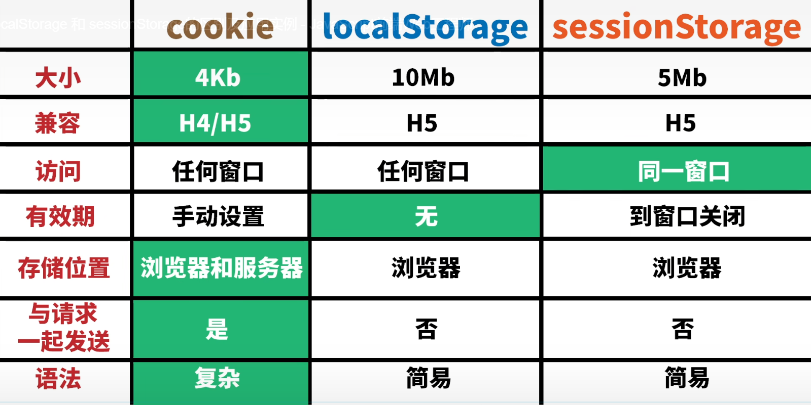
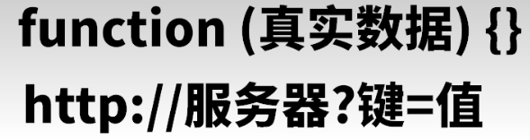
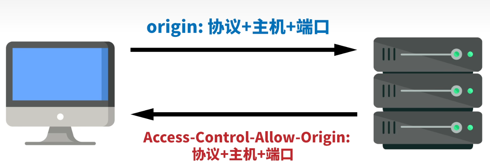

# `JavaScript`

## 关键字

### `var`/`let`/`const`

```js
/* var 声明的变量会添加到最接近的上下文
 * 即在函数内部时，提升到函数作用域的顶部
 * 全局作用域下，会成为 window 的属性
 * 可重复声明 */
function f () {
  console.log(a) // undefined
  if (1) {
    var a
    var a = 1
  }
  console.log(a) // 1
}

f()
// console.log(a) 报错
var b = 2
console.log(window.b) // 2
```

```js
/* let 先声明再使用
 * 受块级作用域限制 */
if (1) {
  // console.log(a) 报错
  let a = 1
}
// console.log(a) 报错
```

```js
/* const 声明的变量无法修改栈上的值
 * 基本数据类型无法修改字面量
 * 引用数据类型无法修改所引用对象，但可修改引用对象的内部属性 */
const a = 1
// a = 2 报错
const arr = [1]
// arr = [2] 报错
arr[0] = 2
console.log(arr) // [ 2 ]
```

### `typeof`/`instanceof`

```js
/* typeof 检测数据类型 */
console.log(typeof undefined) // undefined
console.log(typeof true) // boolean
console.log(typeof '1') // string
console.log(typeof function () {}) // function
console.log(typeof Symbol(1)) // symbol
// number
console.log(typeof 1)
console.log(typeof Infinity)
console.log(typeof NaN)
// object
console.log(typeof null)
console.log(typeof [1])
console.log(typeof {1: 1})
console.log(typeof new Number(1))
```

```js
/* 实例对象 instanceof 构造函数
 * 构造函数的原型对象是否在实例对象的原型链上*/
function F () {}

const f = new F()
// true
// console.log(f.__proto__ === F.prototype)
console.log(f instanceof F)
// console.log(F.prototype.__proto__ === Object.prototype)
console.log(F.prototype instanceof Object)
// console.log(Function.__proto__ === Function.prototype)
console.log(Function instanceof Function)
// console.log(Object.__proto__.__proto__ === Object.prototype)
console.log(Object instanceof Object)
```

---

## 数据类型

|  数据类型   |                       描述                       |
| :---------: | :----------------------------------------------: |
|   `Null`    | `null`<br />空对象指针<br />用于初始化或垃圾回收 |
| `Undefined` |            `undefined`<br />未初始化             |
|  `Boolean`  |                  `true`/`false`                  |
|  `Number`   |           整数/浮点数/`NaN`/`Infinity`           |
|  `String`   |                      字符串                      |
|  `Object`   |                 数据和功能的集合                 |
|  `Symbol`   |                  对象的唯一标识                  |

### 转型函数

#### `Boolean()`

```js
/* Boolean() 转化为布尔值 */
// false
console.log(Boolean(0))
console.log(Boolean(NaN))
console.log(Boolean(''))
console.log(Boolean(null))
console.log(Boolean(undefined))
```

#### `Number()`

```js
/* Number() 转化为数值 */
console.log(Number(null)) // 0
console.log(Number(undefined)) // NaN
console.log(Number(true)) // 1
console.log(Number('')) // 0
console.log(Number('01.10')) // 1.1
console.log(Number('1a')) // NaN
```

#### `String()`

```js
/* String() 转化为字符串
 * null / undefined 没有 toString() */
console.log(String(null)) // null
console.log(String(undefined)) // undefined
```

```js
/* 模板字面量 用于创建复杂字符串
 * 支持多行字符串 */
const text = '模板字面量'
const ul = `
<ul>
    <li>${text}</li>
</ul>
`
// <ul>
//     <li>模板字面量</li>
// </ul>
console.log(ul)
```

### `Number`/`String`

```js
/* Number 与 String 的相互转换
 * 默认进制为十进制
 * 进制参数可选 2~36
 * parseInt parseFloat 会忽略末尾的非法字符 */
const num = 7
console.log(num.toString(2)) // 111
console.log(Number('1a')) // NaN
console.log(parseInt('1a', 2)) // 1
console.log(parseFloat('0.1.1')) // 0.1
```

### `Object`

```js
/* Object 的属性和方法 */
const obj = new Object({a: 1})
// 构造函数
console.log(obj.constructor) // Object()
// 判断是否存在属性
console.log(obj.hasOwnProperty('a')) //true
// 判断是否为原型对象
console.log(Object.prototype.isPrototypeOf(obj)) // true
// 判断属性是否可枚举
console.log(obj.propertyIsEnumerable('a')) // true
// 返回对象的字符串表示
console.log(obj.toString()) // [object Object]
// 返回对象的字符串表示
console.log(obj.toLocaleString()) // [object Object]
// 返回对象的字符串、数值、布尔值表示
console.log(obj.valueOf()) // { a: 1 }
```

---

## 操作符

### `+`

```js
/* + 操作符 */
console.log(Infinity + Infinity) // Infinity
console.log(-Infinity + -Infinity) // -Infinity
console.log(Infinity + -Infinity) // NaN
console.log(true + 0) // 1
console.log(1 + 2 + '3' + 4.0) // 334
```

### `==`

```js
/* == 会进行数据类型转换 */
// true
console.log(Infinity == Infinity)
console.log(null == undefined)
console.log(0 == false)
console.log(0 == '')
console.log(0 == [])
```

### `**`

```js
/* ** 指数操作符 */
console.log(3 ** 2) // 9
```

### 解构赋值

```js
/* 解构赋值 数组、对象、函数的使用 */
// 数组
const arr = [1, 2, 3]
const [, ...rest] = arr
console.log(rest) // [ 2, 3 ]

// 对象
const obj = {
  a: 1,
  b: 2,
}
const {
  a: x,
  c: y,
} = obj
console.log(x, y) // 1 undefined

// 函数
// function f (obj) {
//   console.log(obj.a, obj.b)
// }
function f ({b, a}) {
  console.log(a, b) // 1 2
}

f(obj)
```

#### 交换两个变量的值

```js
/* 交换两个变量的值 */
let a = 1, b = 2

// 临时变量
/* let c = a
 a = b
 b = c */

// 解构赋值
/*  ;[a, b] = [b, a] */

// 加减法
/* a = a + b
 b = a - b
 a = a - b */

// 按位异或
a = a ^ b
b = a ^ b
a = a ^ b

console.log(a, b) // 2 1
```

### 拷贝

|  概念  |              描述              |
| :----: | :----------------------------: |
| 浅拷贝 | 只拷贝一层，嵌套对象只拷贝地址 |
| 深拷贝 |           每层都拷贝           |

```js
/* 拷贝
 * 扩展运算符、 assign() 为浅拷贝
 * 借助 JSON 实现深拷贝 */

const arr = [
  1,
  {b: 2},
]
/* const arr1 = [...arr]
 arr1[0] = 0
 arr1[1].b = 0
 console.log(arr) // [ 1, { b: 0 } ] */

const arr1 = JSON.parse(JSON.stringify(arr))
arr1[0] = 0
arr1[1].b = 0
console.log(arr) // [ 1, { b: 2 } ]
```

```js
/* JSON 深拷贝会丢失部分属性
 * NaN Infinity -> null
 * undefined Symbol function 忽略
 * Date -> 字符串
 * regex -> {} */
const obj = {
  1: NaN,
  2: Infinity,
  3: undefined,
  4: Symbol(4),
  5: function () {},
  6: new Date(),
  7: /\d/,
}
// { '1': null, '2': null, '6': '2000-01-01T00:00:00.000Z', '7': {}}

console.log(JSON.parse(JSON.stringify(obj)))
```

```js
/* 手写深拷贝 */
const obj = {
  a: 1,
  b: [2],
  c: [[3], 4],
}
const result = {}

function f (result, obj) {
  for (let i in obj) {
    let value = obj[i]
    // 根据值的不同类型，采取不同操作
    if (value instanceof Array) {
      result[i] = []
      f(result[i], value)
    }
    else if (value instanceof Object) {
      result[i] = {}
      f(result[i], value)
    }
    // 递进终止条件：不是嵌套数据
    else {
      result[i] = obj[i]
    }
  }
}

f(result, obj)
// { a: 1, b: [ 2 ], c: [ [ 3 ], 4 ] }
console.log(result)
```

---

## 语句

### `for in`/`for of`

```js
/* for in 键
 * for of 值 */

// 字符串
let str = '12'
for (let i in str) {
  console.log(i) // 0 1
}
for (let i of str) {
  console.log(i) // 1 2
}

// 数组
let arr = [1, 2]
for (let i in arr) {
  console.log(i) // 0 1
}
for (let i of arr) {
  console.log(i) // 1 2
}

// 对象
let obj = {
  a: 1,
  b: 2,
}
for (let i in obj) {
  console.log(i) // a b
}
// 没有迭代器 报错
/*
 for (let i of obj) {
 console.log(i)
 }*/

```

---

## 作用域

### 原始值与引用值

```js
/* 原始值 为保存在栈内存的实际值
 * 引用值 为保存在堆内存对象的地址
 * 函数在传入参数时，会将值复制给局部变量
 * 原始值不会被修改，引用值的内部属性会被修改 */
let a = 1
let arr = [1]

function f (a, arr) {
  a = 0
  arr[0] = 0
}

f(a, arr)
console.log(a) // 1
console.log(arr) // 0
```

|    概念    |                             描述                             |
| :--------: | :----------------------------------------------------------: |
| 执行上下文 |          函数调用时在执行栈中生成当前函数的执行环境          |
|  变量对象  | 保存上下文定义的所有变量和函数<br />位于作用域链的最前端<br />无法通过代码访问变量对象，但供后台使用 |
|  作用域链  |     上下文的代码在访问变量和函数时沿作用域链逐级向上搜索     |
|  垃圾回收  |                离开作用域的值被自动标记和回收                |
|  标记清理  |                 给当前不使用的值加标记再回收                 |

```js
/* 执行上文和作用域 */
/* const obj = {
 f () {
 // 函数内部的执行上下文不存在 f
 console.log(f)
 },
 }
 // 全局上下文也不存在 f
 obj.f() // 报错 */

const obj = {
  f () {
    // 在调用者 obj 的上下文找到 f
    console.log(this.f)
  },
}
obj.f() // f()
```

---

## 基本引用类型

### `Date`

```js
/* Date */
const time = new Date()
console.log(time.toLocaleDateString()) // 年/月/日
console.log(time.toLocaleTimeString()) // 时:分:秒
time.setTime(1000)
console.log(time.getTime()) // 1000
```

### 正则表达式

| 修饰符 |        作用         |
| :----: | :-----------------: |
|  `i`   |    不区分大小写     |
|  `g`   |      匹配所有       |
|  `m`   |      多行匹配       |
|  `s`   | `.`能匹配回车和换行 |

```js
/* 正则表达式 */
const regex = /1/
const str = '01a11'
// 判断字符串是否有匹配的子串
console.log(regex.test(str)) // true
// 返回匹配子串的起始位置
console.log(str.search(regex)) // 1
// 匹配子串
// [ '1', index: 1, input: '01a1', groups: undefined ]
console.log(regex.exec(str))
console.log(str.match(regex))
console.log(str.match(regex)[0]) // 1

const regexAll = /1/g
// 匹配所有子串
const result = str.matchAll(regexAll)
for (let i of result) {
  // [ '1', index: 1, input: '01a1', groups: undefined ]
  // [ '1', index: 3, input: '01a1', groups: undefined ]
  // [ '1', index: 4, input: '01a11', groups: undefined ]
  console.log(i)
}
// 替换匹配子串
console.log(str.replace(regex, '')) // 0a11
// 替换所有匹配子串
console.log(str.replaceAll(regexAll, '')) // 0a
```

|                        常用正则表达式                        |       描述       |
| :----------------------------------------------------------: | :--------------: |
|                    `/^1[3456789]\d{9}$/g`                    |     手机号码     |
|                    `/^[1-9][0-9]{4,9}$/g`                    |     `QQ`号码     |
|            `/#?([0-9a-fA-F]{6}|[0-9a-fA-F]{3})/g`            | 匹配十六进制颜色 |
| `/^([A-Za-z0-9_\-\.]+)@([A-Za-z0-9_\-\.]+)\.([A-Za-z]{2,6})$/g` |       邮箱       |
| `^((https?|ftp|file):\/\/)?([\da-z\.\-]+)\.([a-z\.]{2,6})([\/\w\.\-]*)*\/?$/g` |      `URL`       |
|       `/^<([a-z]+)([^>]+)*(?:>(
.*)<\/\1>|\s+\/>)$/gm`        |    `html`标签    |
| `^(([01]?[0-9][0-9]?|2[0-4][0-9]|25[0-5])\.){3}([01]?[0-9][0-9]?|2[0-4][0-9]|25[0-5])$/gm` |      `IPv4`      |
|           `/([0-9a-z]*:{1,4}){1,7}[0-9a-z]{1,4}/g`           |      `IPv6`      |
| `/^[0-9]{4}-(0[1-9]|1[0-2])-(0[1-9]|[12][0-9]|[3][01])$/gm`  |       日期       |
| `/^[1-9][0-9]{5}(18|19|([23][0-9]))[0-9]{2}(0[1-9]|1[0-2])(0[1-9]|[12][0-9]|3[01])[0-9]{3}[0-9Xx]$/gm` |      身份证      |

### `String`

```js
/* String */
const str = 'Hello'
const str1 = ' World '

// 获取长度
console.log(str.length) // 5
// 是否包含子串
console.log(str.includes('l')) // true
// 获取子串首次出现的起始索引
console.log(str.indexOf('l')) // 2
// 获取子串最后出现的起始索引
console.log(str.lastIndexOf('l')) // 3

// 删除前后的所有空格符
const str2 = str1.trim()
console.log(str2) // World
// 所有字母转为大写
console.log(str2.toUpperCase()) // WORLD
// 所有字母转为小写
console.log(str2.toLowerCase()) // world
// 拼接字符串
console.log(str.concat(' ', str2)) // Hello World

const str3 = '123'
// 获取 [开始索引,结束索引) 的子串
console.log(str3.slice()) // 123
console.log(str3.slice(0)) // 123
console.log(str3.slice(0, 2)) // 12
console.log(str3.slice(0, -1)) // 12
// 按字符分隔成数组
console.log(str3.split('2')) // [ '1', '3' ]
// 重复字符串
const str4 = str3.repeat(2)
console.log(str4) // 123123
// 替换首个子串
console.log(str4.replace('1', '')) // 23123
// 替换所有子串
console.log(str4.replaceAll('1', '')) // 2323
// 比较两个字符串是否相同
console.log('123'.localeCompare(str3)) // 0
// 将字符串解释为语句插入所在位置
eval('console.log(1)') // 1
```

## 集合引用类型

### 迭代器

```js
/* 自定义迭代器 */
const obj = {
  a  : 1,
  arr: [1, 2, 3],
  // 迭代器工厂函数
  [Symbol.iterator] () {
    let index = 0
    const length = this.arr.length
    return {
      next: () => index < length
                  ? {value: this.arr[index++], done: false}
                  : {value: undefined, done: true},
    }
  },
}
for (let i of obj) {
  console.log(i) // 1 2 3
}
```

### 生成器

```js
/* 生成器
 * yield 停止执行
 * next() 恢复执行
 * 处理异步函数回调嵌套 */
function * f () {
  yield setTimeout(() => {
    console.log(1)
    iter.next()
  }, 1000)
  yield setTimeout(() => {
    console.log(2)
    iter.next()
  }, 1000)
  yield setTimeout(() => {
    console.log(3)
    iter.next()
  }, 1000)
}

const iter = f()
iter.next()
```

```js
/* yield * 递归 */
function * nTimes (n) {
  if (n > 0) {
    yield * nTimes(n - 1)
    yield n - 1
  }
}

for (let i of nTimes(3)) {
  console.log(i) // 0 1 2
}
```

### `Array`

```js
/* Array.from */
// 将迭代数组结构转化为数组
const str = '123'
console.log(Array.from(str, i => parseInt(i) ** 2)) // [ 1, 4, 9 ]

const m = new Map().set(1, 2).set(3, 4) // { 1 => 2, 3 => 4 }
console.log(m)
console.log(Array.from(m)) // [ [ 1, 2 ], [ 3, 4 ] ]

function * f () {
  yield 1
  yield 2
}

const iter = f()
console.log(Array.from(iter)) // [ 1, 2]
```

```js
/* Array
 * 改变原数组的7个方法 */
const arr = [1]
// 在末尾添加元素
arr.push(2)
// 在开头添加元素
arr.unshift(0)
console.log(arr) // [ 0, 1, 2 ]

// 反转数组
arr.reverse()
console.log(arr) // [ 2, 1, 0 ]
// 从索引位置移除指定个数的元素和插入元素，并返回移除的子数组
console.log(arr.splice(1, 2, 3, 4)) // [ 1, 0 ]
console.log(arr) // [ 2, 3, 4 ]
// 对数组元素进行排序
// 回调函数返回值小于0，为升序
arr.sort((a, b) => b - a)
console.log(arr) // [ 4, 3, 2 ]

// 移除末尾的元素，并返回
console.log(arr.pop()) // 2
// 移除开头的元素，并返回
console.log(arr.shift()) // 4
console.log(arr) // [ 3 ]
```

```js
/* Array
 * 基本使用方法 */
const arr = [1, 2, 3]
// 获取元素个数
console.log(arr.length) // 3
// 判断数组是否存在元素
console.log(arr.includes(2)) // true
// 获取元素在数组中首次出现的索引
console.log(arr.indexOf(2)) // 1
// 获取[开始索引,结束索引)的子数组
console.log(arr.slice(0, -1)) // [ 1, 2 ]
// 拼接元素或数组到数组末尾
console.log(arr.concat(4, [5])) // [ 1, 2, 3, 4, 5 ]
// 用字符串连接数组元素成字符串
console.log(arr.join('-')) // 1-2-3
// 用数值填充[开始索引,结束索引)的元素
// [ <1 empty item>, 0, 0, <1 empty item> ]
console.log(new Array(4).fill(0, 1, -1))
// 向 索引 复制[开始索引,结束索引)
console.log(arr.copyWithin(1, 0, -1)) // [ 1, 1, 2 ]
```

```js
/* Array
 * 迭代器 */
const arr = [1, 2, 3]
// 数组索引迭代器
// { value: 0, done: false }
console.log(arr.keys().next())
// 数组元素迭代器
// { value: 1, done: false }
console.log(arr.values().next())
// 数组[索引,元素]迭代器
// { value: [ 0, 1 ], done: false }
console.log(arr.entries().next())

// 遍历数组元素执行回调函数
arr.forEach((item, index, array) => {
  console.log(item + index) // 1 3 5
})
// 遍历数组元素执行回调函数,并返回每个元素结果形成的数组
// [ 1, 3, 5 ]
console.log(arr.map((item, index) => item + index))
// 判断所有元素是否使回调函数为 true
console.log(arr.every(item => item % 2)) // false
// 判断是否存在元素使回调函数为 true
console.log(arr.some(item => item % 2)) // true
// 过滤数组，保留使回调函数为 true 的元素
console.log(arr.filter(item => item % 2)) // [ 1, 3 ]
// 初始化结果，然后遍历数组元素执行回调函数,返回最终的迭代结果
console.log(arr.reduce((result, item, index, array) => result += item, 0)) // 6

const arr1 = [1, [2], [[3]]]
// 将高维数组按深度转为低维数组
console.log(arr1.flat()) // [ 1, 2, [ 3 ] ]
console.log(arr1.flat(Infinity)) // [ 1, 2, 3 ]
// map 和 flat(1) 的结合
// [ 0, 1, 1, [ 2 ], 2, [ [ 3 ] ] ]
console.log(arr1.flatMap((item, index, array) => [index, item]))
```

### `Set`

```js
/* Set */
const set = new Set([1, 2, 1])
// 添加元素
set.add(3)
console.log(set) // { 1, 2 ,3 }
// 获取元素个数
console.log(set.size) // 3
// 判断是否存在元素
console.log(set.has(3)) // true
// 删除元素，成功返回 true
console.log(set.delete(3)) // true
// 清空元素
set.clear()
```

### `Map`

```js
/* Map */
// 二维数组初始化
const map = new Map([['a', 1], ['b', 2]])
// 添加键值对
map.set('c', 3)
console.log(map) // { 'a' => 1, 'b' => 2, 'c' => 3 }
// 判断是否存在键
console.log(map.has('a')) // true
// 获取值
console.log(map.get('a')) // 1
// 删除键值对，成功返回 true
console.log(map.delete('c')) // true
// 获取键值对个数
console.log(map.size) // 2
// 键迭代器
// { value: 'a', done: false }
console.log(map.keys().next())
// 值迭代器
// { value: 1, done: false }
console.log(map.values().next())
// 键值对迭代器
// { value: [ 'a', 1 ], done: false }
console.log(map.entries().next())
// 清空键值对
map.clear()
```

```js
/* ?.
 * 对象是否存在，存在访问属性 */
function f (config) {
  // const host = config && config.db && config.db.username
  const host = config?.db?.username
  console.log(host) // root
}

f({
  db   : {
    username: 'root',
  },
  cache: {
    username: 'admin',
  },
})
```

---

## 函数

### 普通函数

- `function 函数名(参数){函数体}`

- 普通函数调用方式

```js
f() // 函数声明会提升，顺利执行
function f () {
  console.log(1)
}
```

```js
f() // 变量未对函数进行引用，报错
let f = function () {
  console.log(1)
}
```

### 匿名函数

- 匿名函数自运行
    - `(function (参数){函数体})()`
    - 函数声明前加上运算符成为表达式，最后通过 `()`调用
    - 其内部形成封闭的作用域，内部变量不会对外部造成命名污染

|                                  |     `function(){}`     |       `()=>{}`       |
| :------------------------------: | :--------------------: | :------------------: |
|          是否有原型对象          |           1            |          0           |
|         能否作为构造函数         |           1            |          0           |
|      是否有`arguments`对象       |           1            |          0           |
| 是否支持 `call`、`apply`、`bind` |           1            |          0           |
|              `this`              | 函数调用时的上下文对象 | 定义箭头函数的上下文 |

---

### 递归函数

- 从函数的回归过程，思考代码的书写

    - 递进终止条件

    - 状态转移
        - 由下层结果推出本层结果
        - 返回本层结果

```js
function f (n) {
  // 递进终止条件
  if (n === 1) {
    return 1
  }
  // f(2) = 2 * f(1)
  // f(n) = n * f(n-1)
  return n * f(n - 1)
}

console.log(f(4))
```

---

### 回调函数

- 同步函数
    - 按照代码编写顺序执行
- 异步函数
    - 针对不会马上完成的任务，提供暂停和恢复执行的功能
- 如果函数要使用到异步函数的执行结果，则需要在异步函数内部调用该函数

```js
let a = 1

function f () {
  setTimeout(function () {
    a = 'a'
  }, 1000)
}

function f1 () {
  console.log(a) // 1
}

f()
f1()
```

```js
let a = 1

function f () {
  setTimeout(function () {
    a = 'a'
    f1()
  }, 1000)
}

function f1 () {
  console.log(a) // a
}

f()
```

- 将函数作为参数传入异步函数，这便是回调函数，提高代码复用率
- 回调函数存在回调深度嵌套和处理错误困难的难题

```js
let a = 1

function f (callback) {
  setTimeout(function () {
    a = 'a'
    callback()
  }, 1000)
}

function f1 () {
  console.log(a) // a
}

function f2 () {
  console.log(a.charCodeAt()) // 97
}

f(f1)
f(f2)
```

---

- `函数.call(绑定对象,...参数)`
- `函数.apply(绑定对象,参数数组)`
- `函数.bind(绑定对象,...参数)`
    - 返回函数

- 手写 `call()`

```js
let obj = {
  a: 1
}

function f (x, y) {
  return {
    a: this.a,
    x: x,
    y: y
  }
}

// { a: 1, x: 2, y: 3 }
console.log(f.call(obj, 2, 3))

Function.prototype.newCall = function () {
  // 当前的 this 指向调用的函数 f
  // 在对象内添加函数并执行，最后再删除
  // 避免 obj 为 null
  let obj = arguments[0] || window
  let [, ...args] = arguments
  obj.f = this
  // 执行结果
  let result = obj.f(...args)
  delete obj.f
  return result
}

// { a: 1, x: 2, y: 3 }
console.log(f.newCall(obj, 2, 3))
```

- 手写`apply()`

```js
let obj = {
  a: 1
}

function f (x, y) {
  return {
    a: this.a,
    x: x,
    y: y
  }
}

// { a: 1, x: 2, y: 3 }
console.log(f.apply(obj, [2, 3]))

Function.prototype.newApply = function () {
  let obj = arguments[0] || window
  // 对第二个数组参数展开
  let [, [...args]] = arguments
  obj.f = this
  let result = obj.f(...args)
  delete obj.f
  return result
}

// { a: 1, x: 2, y: 3 }
console.log(f.newApply(obj, [2, 3]))
```

- 手写 `bind()`

```js
let obj = {
  a: 1
}

function f (x, y) {
  return {
    a: this.a,
    x: x,
    y: y
  }
}

// 返回的是函数表达式
// { a: 1, x: 2, y: 3 }
console.log(f.bind(obj, 2, 3)())

Function.prototype.newBind = function () {
  let obj = arguments[0] || window
  let [, ...args] = arguments
  obj.f = this

  // 闭包
  return function () {
    let reult = obj.f(...args)
    delete obj.f
    return reult
  }
}

// { a: 1, x: 2, y: 3 }
console.log(f.newBind(obj, 2, 3)())
```

---

#### 定时器

- `setTimeout(回调函数,延时)`
    - 延迟一段时间将任务加入执行队列
- `setInterval(回调函数,延时)`
    - 每间隔一段时间将任务加到任务队列中
    - 无视报错
    - 无视网络延迟

```html

<button class="setTimeout">setTimeout</button>
<button class="setInterval">setInterval</button>
<div></div>
```

```js
const mySetTimeout = document.querySelector('.setTimeout')
const mySetInterval = document.querySelector('.setInterval')
const myDiv = document.querySelector('div')

mySetTimeout.addEventListener('click', () => {
  setTimeout(() => {
    const date = new Date().toLocaleString()
    myDiv.innerHTML += `<li>${date}</li>`
  }, 1000)
})

mySetInterval.addEventListener('click', () => {
  let count = 0
  const timer = setInterval(() => {
    count++
    if (count >= 3) {
      clearInterval(timer)
    }

    const date = new Date().toLocaleString()
    myDiv.innerHTML += `<li>${date}</li>`
  }, 1000)
})
```

- `setTimeout()` 实现 `setInterval()`

```js
function newInterval (func, millisecond) {
  function inner () {
    func()
    setTimeout(inner, millisecond)
  }

  setTimeout(inner, millisecond)
}

let i = 0

function f () {
  console.log(i++)
}

newInterval(f, 1000)
```

---

#### 防抖

- 高频触发事件只有足够长间隔的最后一次会执行

```html
<button>提交</button>
```

```js
const button = document.querySelector('button')
let i = 0

function f () {
  console.log(i++)
}

// 绑定函数表达式
function debounce (f, delay) {
  // 点击事件共享1个定时器
  let timer
  return function () {
    // 先取消定时器
    clearTimeout(timer)
    // 设置定时器任务
    // 如果用普通函数应该绑定 this
    timer = setTimeout(() => f(), delay)
  }
}

button.addEventListener('click', debounce(f, 500))
```

---

#### 节流

- 高频触发事件，按照固定时间间隔执行

```scss
body {
  height: 10em;
}
```

```js
function f () {
  let r = Math.floor(Math.random() * 256)
  let g = Math.floor(Math.random() * 256)
  let b = Math.floor(Math.random() * 256)
  document.body.style.background = `rgb(${r},${g},${b})`
}

// 随窗口尺寸大小改变而变化背景颜色
function throttle (f, delay) {
  let timer
  return function () {
    // 任务时，取消任务
    if (timer) {
      return
    }
    timer = setTimeout(() => {
      f()
      // 在任务执行后，将任务清空
      timer = null
    }, delay)
  }
}

window.addEventListener('resize', throttle(f, 500))
```

---

#### 图片懒加载

- 滚动到页面才加载图片
- `IntersectionObserver(回调函数)`
    - 目标元素和可视窗口产生交叉区域

```js
const images = document.querySelectorAll('img')

const callback = entries => {
  entries.forEach(entry => {
    // 是否进入可视区域
    if (entry.isIntersecting) {
      // 获取图片节点
      const image = entry.target
      // 获取自定义属性
      const data_src = image.getAttribute('data-src')
      // 将资源属性改为自定义属性，加载图片
      image.setAttribute('src', data_src)
      // 取消观察
      observer.unobserve(image)
    }
  })
}

// 创建1个交叉观察者
const observer = new IntersectionObserver(callback)

// 为每张图片设置观察
images.forEach(image => {
  observer.observe(image)
})
```

---

### `Promise`

- 通过`Promise`链的方式，避免回调嵌套调用，并在末尾对错误进行处理
- `async`进行异步函数声明，`await`等待`Promise`完成后，返回`Promise`对象
- `Promise.all()`
    - 全部实现

- `Promise.any()`
    - 任一个实现

- `resolve`
    - 成功时调用

- `reject`
    - 失败时调用

---

- 手写`Promise`

```js
class Promise {
  // 传入执行函数
  constructor (executor) {
    // 初始化为待定状态
    this.status = 'pending'
    // 保存结果
    this.result = null
    // 用于待定状态时，保存函数
    this.resolveCallbacks = []
    this.rejectCallbacks = []

    // 生成实例时，进行检错
    try {
      // 回调函数绑定到对象
      executor(this.resolve.bind(this), this.reject.bind(this))
    }
    catch (error) {
      this.reject(error)
    }
  }

  then (onFulfilled, onRejected) {
    // 返回新的实例，实现链式调用
    return new Promise((resolve, reject) => {
      // 判断传进来的参数是否为函数，把不是函数的参数改为空函数
      onFulfilled = typeof onFulfilled === 'function'
                    ? onFulfilled
                    : () => {}
      onRejected = typeof onRejected === 'function'
                   ? onRejected
                   : () => {}

      // 待定状态，处理函数未获取结果作为参数传入，需要用数组保存函数
      if (this.status === 'pending') {
        this.resolveCallbacks.push(onFulfilled)
        this.rejectCallbacks.push(onRejected)
      }

      if (this.status === 'fulfilled') {
        setTimeout(() => {
          onFulfilled(this.result)
        })
      }

      if (this.status === 'rejected') {
        setTimeout(() => {
          onRejected(this.result)
        })
      }
    })
  }

  // 两个回调函数都是异步函数
  resolve (result) {
    setTimeout(() => {
      if (this.status === 'pending') {
        this.status = 'fulfilled'
        this.result = result

        // 执行 then 放进数组的处理函数
        this.resolveCallbacks.forEach(callback => {
          callback(result)
        })
      }
    })
  }

  reject (result) {
    setTimeout(() => {
      if (this.status === 'pending') {
        this.status = 'rejected'
        this.result = result

        this.rejectCallbacks.forEach(callback => {
          callback(result)
        })
      }
    })
  }
}
```

### 闭包函数

- 在内部函数引用外部函数变量的条件下，发生外部函数被调用，内部函数定义被执行，在生成函数对象时，会在其内部生成存储引用变量的闭包对象
- 将变量封装，不让外部直接访问，只能通过内部函数进行使用
- 闭包的存在会使得内部变量无法被及时垃圾回收

```js
let a = 0
let f = function () {
  a++ 
  console.log(a)
}
f() // 1
f() // 2
```

```js
function f () {
  let a = 0
  return () => {
    a++
    console.log(a)
  }
}

// 外部函数被调用两次，生成两个独立的闭包
f()() // 1
f()() // 1
```

```js
function f () {
  let a = 0
  return () => {
    a++
    console.log(a)
  }
}

// 外部函数被调用一次，并把携带闭包的内部函数对象交由 g
let g = f()
g() // 1
g() // 2
g = null // 闭包消失
```

```js
const obj = {
  f () {
    return function () {
      return this
    }
  },
}
// obj.f()执行完的到 function () {return this}
// 由 window 调用该函数执行
console.log(obj.f()() === window) // true
```

### 函数柯里化

- 传入的参数在闭包中保存

```js
function url (protocol) {
  return function (hostName) {
    return function (pathName) {
      return `${protocol}${hostName}${pathName}`
    }
  }
}

const web = url('https://')('www.a.com')
const html = web('/index.html')
const css = web('/styles/style.css')
const js = web('/scripts/1.js')

console.log(html) // https://www.a.com/index.html
console.log(css) // https://www.a.com/styles/style.css
console.log(js) // https://www.a.com/scripts/1.js
```

- 手写`add()`

```js
function add () {
  let args = [...arguments]

  let inner = function () {
    args.push(...arguments)
    return inner
  }

  // 函数返回被 toString 隐式转换
  inner.toString = () => {
    return args.reduce((i, j) => i + j)
  }

  return inner
}

const result = add(1, 2, 3)(4, 5.1)
console.log(Number(result())) // 15.1
```

---

## 面向对象

### 对象方法

#### 数据属性

```js
/* 对象数据属性 */
const obj = {num: 1}

// 设置单个数据的属性
Object.defineProperty(obj, 'a', {
  // value       : 1, // 值
  // writable    : false, // 不可修改
  configurable: true, // 可删除
  enumerable  : true, // 可枚举
  get () {
    return this.num
  },
  set (value) {
    this.num = value
  },
})
// 设置多个数据的属性
Object.defineProperties(obj, {
  b: {value: 2, enumerable: true},
  c: {value: 3, enumerable: true},
})
console.log(obj) // { a: 1, b: 2, c: 3 }
// 实例对象上是否存在属性
console.log(obj.hasOwnProperty('a')) // true
// 属性是否可枚举
console.log(obj.propertyIsEnumerable('a')) // true

// 读取单个数据属性描述
// { value: 2, writable: false, enumerable: true, configurable: false }
console.log(Object.getOwnPropertyDescriptor(obj, 'b'))
// 读取多个数据属性描述
// { a: { value: 1, writable: false, enumerable: true, configurable: true },
//   b: { value: 2, writable: false, enumerable: true, configurable: false },
//   c: { value: 3, writable: false, enumerable: true, configurable: false }}
console.log(Object.getOwnPropertyDescriptors(obj))
```

#### 对象操作

```js
/* 对象操作 */
const obj = {
  a: 1,
  b: 2,
}
// 获取键
console.log(Object.keys(obj)) // [ 'a', 'b' ]
// 获取
console.log(Object.values(obj)) // [ 1, 2 ]
// 设置原型对象
console.log(Object.setPrototypeOf(obj, Object.prototype))
// 获取原型对象
console.log(Object.getPrototypeOf(obj)) // Object.prototype
// 判断原型对象是否为实例的原型
console.log(Object.prototype.isPrototypeOf(obj)) // true
// 冻结对象，不让修改
Object.freeze(obj)
// 删除属性
delete obj.a
console.log(obj) // { a: 1, b: 2 }
```

#### 对象交互

```js
/* 对象交互 */
const dest = {}
const src = {
  a: 1,
}
// 浅拷贝对象可枚举属性
Object.assign(dest, src, {b: 2})
console.log(dest) // { a: 1, b: 2 }
// 将对象转换为二维数组
const objToArr = Object.entries(dest)
// [ [ 'a', 1 ], [ 'b', 2 ] ]
console.log(objToArr)
// 将二维数组转换为对象
// { a: 1, b: 2 }
const arrToObj = Object.fromEntries(objToArr)
console.log(arrToObj)

// 创建以对象为原型对象并添加属性的实例
const obj = Object.create(dest, {
  'c': {
    value: 3,
  },
})
console.log(obj.c) // 3
console.log(Object.getPrototypeOf(obj)) // { a: 1, b: 2 }
```

### 创建对象

#### 工厂模式

```js
/* 工厂模式
 * 无法标识对象类型 */
function F (a) {
  const obj = new Object()
  obj.a = a
  obj.f = function () {
    console.log(obj.a)
  }
  return obj
}

const obj = F(1)
console.log(Object.getPrototypeOf(obj) === F.prototype) // false
console.log(Object.getPrototypeOf(obj) === Object.prototype) // true
```

#### 构造函数

```js
/* 构造函数
 * 通过 new 调用的函数为构造函数
 * 每个实例都定义了相同的属性和方法 */
function F (a) {
  this.a = a
  this.f = function () {
    console.log(this.a)
  }
}

const obj = new F(1)
console.log(Object.getPrototypeOf(obj) === F.prototype) // true
```

#### 原型对象

```js
/* 原型对象
 * 原型对象包含特定引用类型实例共享的属性和方法
 * 函数自动添加 prototype 属性指向原型对象
 * 原型对象自动添加 constructor 属性指向构造函数
 * 每个实例内部有 __proto__ 属性指向构造函数的原型对象 */
function F (a) {
  F.prototype.a = a
  F.prototype.f = function () {
    console.log(this.f)
  }
}

const obj = new F(0)
const obj1 = new F(1)
console.log(obj.a) // 1
console.log(obj.f === obj1.f) // true
console.log(F.prototype.constructor === F) // true
```

#### 手写 `new`

```js
/* 手写 new */
function myNew (constructor, ...args) {
  // 创建实例，以构造函数的原型对象为原型
  const obj = Object.create(constructor.prototype)
  // 构造函数this绑定实例并执行，为实例添加属性
  const result = constructor.apply(obj, args)
  // 如果构造函数没有返回对象，则返回新创建的实例
  return result instanceof Object
         ? result
         : obj
}

// 构造函数
function f (a, b) {
  this.a = a
  this.b = b
  // 返回对象
  return this
}

const obj = myNew(f, 1, 2)
console.log(obj) // f { a: 1, b: 2 }
```

#### 原型链


```js
/* 原型链
 * 实例对象沿着原型链向上查找或添加属性和方法
 * Object 的原型对象的 __proto__ 指向 null
 * 所有原型对象的 __proto__ 指向 Object 的原型对象
 * 所有构造函数的 __proto__ 指向 Function 的原型对象
 * 构造函数的 prototype 属性与 原型对象的 constructor 属性互指
 * 实例对象 instanceof 构造函数
 * 构造函数的原型对象是否在实例对象的原型链上 */
function F () {}

console.log(Object.__proto__.__proto__ === Object.prototype) // true
console.log(Object instanceof Object) // true
console.log(Function.__proto__ === Function.prototype) // true
console.log(Function instanceof Function) // true
```

```js
/* 将 F 的实例作为 G 的原型对象
 * G 的实例 g 沿着原型链访问 F 原型对象的属性和方法
 * g 的构造函数指向 F */
function F () {
  F.prototype.f = function () {
    console.log(1)
  }
}

function G () {}

G.prototype = new F()
const g = new G()
console.log(g.constructor === F) // true
// 手动修改
g.constructor = G
console.log(g.__proto__.__proto__ === F.prototype) // true
g.f() // 1
```

```js
/* 判断属性是否为原型属性
 * 实例能访问到属性并且属性不属于实例 */
function F () {}

F.prototype.a = 1

function f (obj, a) {
  return a in obj && !obj.hasOwnProperty(a)
}

const obj = new F()
// 属性只存在于原型对象上
console.log(f(obj, 'a')) // true
// 对象可访问的可被枚举属性都会被返回
for (let i in obj) {
  console.log(obj[i]) // 1
}
// 访问自有实例上的属性
for (let i of Object.values(obj)) {
  console.log(i) // 没有输出
}
// 实例自有属性
obj.a = 0
for (let i of Object.values(obj)) {
  console.log(i) // 0
}
console.log(f(obj, 'a')) // false
console.log(F.prototype.a) // 1
// 原型的同名属性被屏蔽
for (let i in obj) {
  console.log(obj[i]) // 0
}
```

```js
/* 修改构造函数的所指的原型对象，已创建的实例不会修改 */
function F () {}

const obj = new F()
// 构造函数指向新的原型对象
F.prototype = {
  a: 1,
}
// 区别于 给原型添加属性
// F.prototype.a = 1
console.log(obj.a) // undefined
```

---

### 继承

```js
/* 原型链带来的问题
 * 原型对象的所有属性共享 */
function F () {}

F.prototype = {
  constructor: F,
  a          : 1,
  b          : [2],
}
const obj = new F()
const obj1 = new F()
// 基本数据类型同名属性
obj.a = 0
console.log(obj1.a) // 1

// 引用数据类型
obj.b.push(3)
console.log(obj1.b) // [ 2, 3 ]
obj.b = [...obj.b]
obj.b.push(4)
console.log(obj1.b) // [ 2, 3 ]
```


#### 基于原型链的继承

```js
/* 基于原型链的继承
 * 属性定义在构造函数上
 * 方法定义在原型对象上
 * 原型链继承会导致原先实例的属性成为原型上的属性被共享
 * 子类在实例化时无法给父类构造函数传参 */
function F (a) {
  this.a = a
}

F.prototype.getA = function () {
  return this.a
}

function G (b) {
  this.b = b
}

G.prototype = new F(1)
G.prototype.getB = function () {
  return this.b
}
// 无法给 F 的 a 赋值
const g = new G(2)
console.log(g.getA()) // 1
console.log(g.constructor === F) // true
// 同名属性，在实例内部生成新的属性
g.constructor = G
const f = new F(1)
console.log(f.constructor) // F
// 同名方法，在实例内部生成新的方法
G.prototype.getA = function () {return 0}
console.log(g.getA()) // 0
console.log(f.getA()) // 1
```

#### 盗用构造函数

```js
/* 盗用构造函数
 * 在子类构造函数调用父类构造函数
 * 通过 apply() 或 call() 以创建新对象为上下文执行父类构造函数
 * 须在构造函数定义方法而不是原型对象，方法不能共享  */

function F (a) {
  this.a = a
  this.f = function () {
    console.log(this.a)
  }.bind(this)
}

function G (a, b) {
  F.call(this, a)
  this.b = b
}

// 可向父类传递参数
const g = new G(1, 2)
console.log(g.a)
```

#### 组合继承

```js
/* 组合继承
 * 使用原型链继承原型上的属性和方法
 * 使用构造函数继承实例属性
 * 方法定义在原型上实现复用，每个实例拥有自己的属性 */
function F (a) {
  this.a = a
}

F.prototype.getA = function () {
  return this.a
}

function G (a, b) {
  F.call(this, a)
  this.b = b
}

G.prototype = new F()
G.prototype.getB = function () {
  return this.b
}

const g = new G(1, 2)
const g1 = new G(3, 4)

console.log(g) // F { a: 1, b: 2 }
console.log(g1) // F { a: 3, b: 4 }

console.log(g.getA()) // 1
console.log(g.getB()) // 2
console.log(g1.getA()) // 3
console.log(g1.getB()) // 4
```

#### 原型式继承

```js
/* 原型式继承
 * 适合不创建构造函数，在原型上共享属性*/
function F (a) {
  this.a = a
}

const f = new F(1)
const g = Object.create(f, {
  'b': {
    value     : 2,
    enumerable: true,
  },
})
Object.defineProperties(g, {
  'c'   : {
    value     : 3,
    enumerable: true,
  }, 'd': {
    value     : 4,
    enumerable: true,
  },
})
console.log(g) // F { b: 2, c: 3, d: 4 }
// 在原型对象 f 上
console.log(g.a) // F { a: 1 }
```

#### 寄生式继承

```js
/* 寄生式继承 */
function F (a) {
  this.a = a
}

const f = new F(1)

function G (f, b) {
  const g = Object(f)
  // 增强对象
  g.b = b
  return g
}

const g = G(f, 2)
console.log(g)
```

#### 寄生式组合继承

```js
/* 寄生式组合继承
 * 使用寄生式继承来继承父类原型
 * 将返回的新对象赋值给子类原型 */
function F (a) {
  this.a = a
}

function G (b) {
  this.b = b
}

// 父类原型副本
const proto = Object(F.prototype)
// 重写原型导致的构造函数丢失
proto.constructor = G
// 新对象作为子类原型
G.prototype = proto
const g = new G(2)
F.prototype.a = 1
console.log(g) // G { b: 2 }
console.log(g.a) // 1
```

### 类

#### 类的成员

```js
/* 类 */
class A {
  // 类构造函数
  // new 调用其创建实例
  // 构造函数中的属性为实例自有，不在原型共享
  constructor (a) {
    this.a = a
  }

  // 类中定义的方法在原型上共享
  f () {
    console.log(this.a)
  }

  // 静态成员 this 指向类自身
  static creat () {
    return new A(Math.floor(Math.random() * 10))
  }
}

const obj = A.creat()
obj.f() 
```

#### 类的继承

```js
/* 类的继承
 * super 为类构造函数和静态方法的原型 */
class F {
  constructor (a) {
    this.a = b
  }

  static random () {
    return Math.floor(Math.random() * 10)
  }
}

// 声明继承
class G extends F {
  constructor (a, b) {
    // 调用父类构造函数
    super(a)
    this.b = b
  }

  static random () {
    super.random()
  }
}
```

---

## API

### 模块化

- 分隔命名空间，降低命名冲突，提高代码复用和维护性

|   方法    |          描述          |
| :-------: | :--------------------: |
| `export`  |      模块对外接口      |
| `import`  | 导入模块<br />动态引入 |
| `default` |        默认暴露        |

### `DOM`

- 事件流
    - 捕获
        - 进去时触发
    - 目标
    - 冒泡
        - 出来时触发
        - `stopPropagation()`
            - 多个触发事件时，可阻止冒泡
        - 事件委托
            - 把原本需要绑定在每个子元素的事件，绑定在共同的父元素上，利用冒泡机制触发监听器

- 网页渲染







---

|                  方法                   |                  作用                  |
| :-------------------------------------: | :------------------------------------: |
|    `document.querySelector(选择器)`     | 获取文档中选择器选中的第一个元素的引用 |
|   `document.querySelectorAll(选择器)`   |  获取文档中选择器选中的所有元素的引用  |
|          `creatElement(元素)`           |                创建元素                |
|          `creatTextNode(文本)`          |              创建文本节点              |
|      `父元素.appendChild(子元素)`       |         添加子元素到父元素末尾         |
|             `元素.remove()`             |              删除当前元素              |
| `元素.parentNode.removeChild(当前元素)` |              删除当前元素              |
|            `元素.style.属性`            |              设置内联样式              |
|      `元素.setAttribute(属性，值)`      |                设置样式                |
|           `document.write()`            |               在脚本写入               |
|            `元素.innerHTML`             |             重写元素的内容             |

---

### `Web API`

#### `Ajax`

- 从服务器获取数据

- 增量更新，不需刷新整个页面

- 使用`onreadystatechange`监听状态码的变化，通过 `js`对`DOM`实现局部页面刷新

- `XML`
    - 进度支持

    - 超时支持
    - 中止支持
    - 更明显的故障检测
    - 浏览器支持

- `fetch`
    - 标头、请求和响应对象

    - 缓存控制
    - CORS 控制
    - 凭证控制
    - 重定向控制
    - 数据流
    - 服务器端支持


| 响应状态码 |           意义           |
| :--------: | :----------------------: |
|     0      |       未调用`open`       |
|     1      | 调用`open`，未调用`send` |
|     2      |   发送请求，未收到响应   |
|     3      |       收到部分响应       |
|     4      |       收到全部响应       |

---

```js
const xhr = new XMLHttpRequest()
xhr.open('GET', '/service')

// 监听状态变化
xhr.onreadystatechange = () => {
  // 收到全部响应
  if (xhr.readyState !== 4) {
    return
  }

  // 请求成功
  if (xhr.status === 200) {
    console.log(JSON.parse(xhr.responseText))
  }
  else {
    console.log('HTTP error', xhr.status, xhr.statusText)
  }
}

// 发送请求
xhr.send()
```

---

#### `fetch`

```js
fetch('/service', {method: 'GET'})
  .then((res) => res.json())
  .then((json) => console.log(json))
  .catch((err) => console.error('error:', err))
```

---

#### 客户端存储

|       类型       |                             描述                             |
| :--------------: | :----------------------------------------------------------: |
|     `cookie`     | 对会话进行跟踪和存储，辨别用户身份，以弥补 `HTTP`协议无状态性的不足 |
|  `Web Storage`   |       用于存储和检索较小的、由名称和相应值组成的数据项       |
|  `localStorage`  |                         一直保存数据                         |
| `sessionStorage` |                    关闭浏览器时数据会丢失                    |
|   `IndexedDB`    |        用于存储从完整的用户记录到甚至是复杂的数据类型        |
|     `Cache`      |                       存储离线网站文件                       |



- `localStorage`和`sessionStorage`

|         方法         |    描述    |
| :------------------: | :--------: |
| `setItem(键名,键值)` | 添加键值对 |
|   `getItem(键名)`    |  获取键值  |
|  `removeItem(键名)`  |    删除    |
|      `clear()`       |    清空    |

- `cookie`

```html

<form action="#">
    <label for="username">用户名</label>
    <input type="text" id="username">
    <label for="password">密码</label>
    <input type="password" id="password">
    <input type="checkbox" id="rememberMe">
    <label for="rememberMe">记住我</label>
    <input type="submit" value="登录">
</form>
```

```js
const username = document.querySelector('#username')
const password = document.querySelector('#password')
const rememberMe = document.querySelector('#rememberMe')
const submit = document.querySelector(`input[type='submit']`)

//将保存的 cookie 转化为数组
let arr = document.cookie.split(';')
  .map(cookie => cookie.split('='))
// 转化为对象
let cookies = {}
for (let i of arr) {
  cookies[i[0]] = decodeURIComponent(i[1])
}

if (document.cookie) {
  username.value = cookies.username
  password.value = cookies.password
  rememberMe.checked = true
}

submit.addEventListener('click', e => {
  // 用户名 cookie
  if (rememberMe.checked && username.value != '') {
    let key = 'username'
    // URI编码
    let value = encodeURIComponent(username.value)
    // 保存1天
    let time = 1 * 24 * 60 * 60
    // 用户名的键值对
    document.cookie = `${key}=${value};max-age=${time}`
  }

  // 密码 cookie
  if (rememberMe.checked && password.value != '') {
    let key = 'password'
    // URI编码
    let value = encodeURIComponent(password.value)
    // 保存1天
    let time = 1 * 24 * 60 * 60
    // 用户名的键值对
    document.cookie = `${key}=${value};max-age=${time}`
  }
  e.preventDefault() // 阻止提交时默认刷新行为
})
```

- `localStorage`

```html
<input type="text">
<section>
    <ul class="history"></ul>
</section>
<button></button>
```

```js
const input = document.querySelector(`input[type='text']`)
const button = document.querySelector(`button`)
const history = document.querySelector('.history')

console.log(localStorage)
if (localStorage.length > 0) {
  for (let i = 0; i < localStorage.length; i++) {
    let key = localStorage.key(i)
    let li = document.createElement('li')
    let liText = document.createTextNode(localStorage.getItem(key))
    li.appendChild(liText)
    history.appendChild(li)

    // 删除记录
    let close = document.createElement('span')
    close.innerHTML = '×'
    li.append(close)
    close.addEventListener('click', () => {
      localStorage.removeItem(key)
      li.parentNode.removeChild(li)
    })
  }
}

button.addEventListener('click', () => {
  if (input.value) {
    let key = new Date().valueOf()
    let value = input.value
    localStorage.setItem(key, value)
    input.value = ''

    // 输入记录
    let li = document.createElement('li')
    let liText = document.createTextNode(localStorage.getItem(key))
    li.appendChild(liText)
    history.appendChild(li)

    // 删除记录
    let close = document.createElement('span')
    close.innerHTML = '×'
    li.append(close)
    close.addEventListener('click', () => {
      localStorage.removeItem(key)
      li.parentNode.removeChild(li)
    })
  }
})
```

---

- 内容分发网络 `CDN`

    - 帮服务器近距离给用户分发网页内容

    - 静态内容：长期固定不变的内容

    - 动态内容：经常发生变更的内容

---

### `JSON`

- `js`对象语法的结构化字符串
    - 字符串与原生`js`对象转换
        - `JSON.parse(JSON字符串)`
        - `JSON.stringify(JSON对象)`
    - 只有属性，没有方法
    - 双引号键名字符串
    - 最后一个键值不能有 `,`
    - 有 `null`

---

### 工作者线程

|        概念         |                             描述                             |
| :-----------------: | :----------------------------------------------------------: |
|        进程         |              程序的运行实例<br />独立的内存空间              |
|        线程         |              进程内独立的执行单元<br />共享数据              |
|       单线程        |                 顺序编程简单易懂<br />效率低                 |
|       多线程        | 提升`CPU`的利用率<br />创建多线程开销<br />线程间切换开销<br />死锁与状态同步问题 |
|    `Web Workers`    | 在单线程模型下，把主线程的工作交于其他线程完成<br />变量彼此独立，只通过消息交互 |
| `dedicated workers` |                         单个脚本完成                         |
|  `shared workers`   |                       多个不同脚本共享                       |
|  `service workers`  |                          离线时工作                          |

#### `js`内核

|         模块         |             描述             |
| :------------------: | :--------------------------: |
|       `js`引擎       |     `js`程序的编译与运行     |
| `html`/`css`文档解析 |        页面文本的解析        |
|      `DOM/CSS`       | 生成`DOM/CSS`在内存中的对象  |
|      布局和渲染      | 将内存中的对象进行布局和渲染 |
|        定时器        |          定时器管理          |
|       事件响应       |           事件管理           |
|       网络请求       |          `ajax`请求          |

- 同步任务
- 异步任务
    - 微任务
        - `Promise.then().catch().finally()`
        - `MutationObserver`
        - `Object.observe`
    - 宏任务
        - 脚本或控制台程序执行
        - 事件的回调函数
        - `setTimeout()`和`setInterval()`
- 脚本 -> 微任务 -> 渲染 -> 宏任务

```js
setTimeout(function () {
  console.log('异步宏任务')
}, 0)

Promise.resolve().then(() => {
  console.log('异步微任务')
})

console.log('同步任务')

// 同步任务
// 异步微任务
// 异步宏任务
```

- 脚本执行方式

|                        | `defer` | `async` |
| :--------------------: | :-----: | :-----: |
|   浏览器是否等待解析   |    1    |    0    |
| 脚本是否按序加载和运行 |    1    |    0    |

---

### 跨域

- 同源策略
    - 两个`URL`的协议、域名、端口号都相同，则同源
- 跨域技术
    - 不同源的页面进行交互
    - `JSONP`
        - 利用` <script> `允许请求不同源的脚本实现跨域
        - 只支持 `GET`，不支持 `POST`




- `CORS`



## 设计模式
