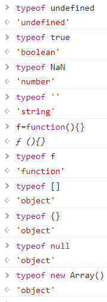
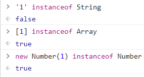
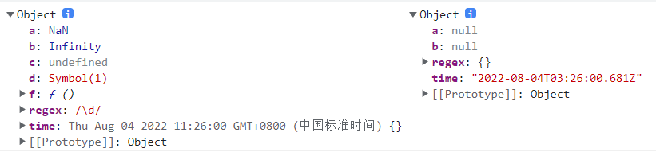
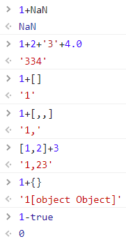
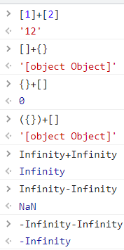
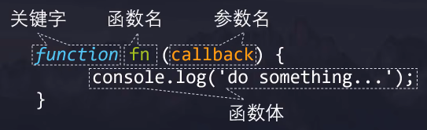

# `JavaScript`

## `HTML`中的 `js`

### 脚本执行方式

- `defer`
  - 浏览器等待页面解析
  - 脚本按照在页面中出现的顺序加载和运行
- `async`
  - 适合页面的脚本之间彼此独立，且不依赖于本页面的其它任何脚本
  - 浏览器遇到脚本时，不会阻塞页面渲染，而是直接下载然后运行
  - 脚本的运行次序无法控制
- 动态加载

---

### 跨域

- 同源策略
  - 两个`URL`的协议、域名、端口号都相同，则同源
- 跨域技术
  - 不同源的页面进行交互
  - `JSONP`
    - 利用` <script> `允许请求不同源的脚本实现跨域
    - 只支持 `GET`，不支持 `POST`


- `CORS`


---

## 语言基础

### 关键字

- `typeof 数据`
  - 检测数据类型

- `对象 instanceof 构造函数`
  - 检测对象是否由构造函数构造






---

### 变量

#### 字符串

- `字符串.length()`
  - 返回字符串长度
- `字符串.includes(子串)`
  - 返回字符串是否包含子串

- `字符串.indexOf(子串)`
  - 返回子串在字符串中首次出现的索引
- `字符串.slice(开始索引,结束索引)`
  - 返回从开始索引到结束索引(不包括结束)的子串
- `字符串.split('字符')`
  - 返回按字符分隔后的数组

```js
let str = 'a b c'
let arr = str.split(' ')

console.log(arr) // [ 'a', 'b', 'c' ]
```


- `字符串.replace(被替换字符串,替换字符串)`
  - 替换字符串
  - 只替换首个

```js
let str = 'aa'
console.log(str.replace('a', 'b')) // ba
```

- `字符串.toUpperCase()`
  - 全部字母大写
- `字符串.toLowerCase()`
  - 全部字母小写

---

#### 数组

- `数组.length()`
  - 返回数组长度

- `数组.push(元素)`
  - 在数组末尾添加元素
- `数组.pop()`
  - 移除数组末尾的元素，并将其返回
- `数组.unshift(元素)`
  - 在数组开头添加元素
- `数组.shift()`
  - 移除数组开头的元素，并将其返回

- `数组.splice(开始索引,个数,...插入元素)`
  - 从索引位置移除个数的元素和插入元素，并将移除子数组返回


```js
let arr = [1, 2, 3, 4, 5]

console.log(arr.splice(1)) // [ 2, 3, 4, 5 ]
console.log(arr)  // [ 1 ]
```

```js
let arr = [1, 2, 3, 4, 5]

console.log(arr.splice(1, 2)) // [ 2, 3 ]
console.log(arr)  // [ 1, 4, 5 ]
```

```js
let arr = [1, 2, 3, 4, 5]

console.log(arr.splice(1, 2, 6, 7)) // [ 2, 3 ]
console.log(arr)  // [ 1, 6, 7, 4, 5 ]
```

- `数组.slice(开始索引,结束索引)`
  - 返回从开始索引到结束索引(不包括结束)的元素

```js
let arr = [1, 2, 3, 4, 5]

console.log(arr.slice(1)) // [ 2, 3, 4, 5 ]
console.log(arr)  // [1, 2, 3, 4, 5]
```

```js
let arr = [1, 2, 3, 4, 5]

console.log(arr.slice(1, 3)) // [ 2, 3 ]
console.log(arr)  // [1, 2, 3, 4, 5]
```

- `数组.indexOf(元素)`
  - 返回元素在数组中首次出现的索引

```js
let arr = [1, 2, 3, 4, 5]

console.log(arr.indexOf(3)) // 2
console.log(arr.indexOf(0)) //-1
```

- `数组.concat(...元素)`
  - 拼接数组，返回拼接后的数组
- `数组.join(字符串)`
  - 用指定字符串拼接数组元素，返回拼接后的字符串
  - 不能拼接为对象的元素
- `数组.reverse()`
  - 反转数组元素次序

```js
let arr = [0]
let a = 1
let b = [2]
let c = {i: 3}
let newArr = arr.concat(a, b, c)

console.log(newArr) // [ 0, 1, 2, { i: 3 } ]

let str = newArr.join('-')

console.log(str) // 0-1-2-[object Object]

console.log(newArr.reverse()) // [ { i: 3 }, 2, 1, 0 ]
```

- `数组.sort(回调函数)`
  - 默认按`ASCII`排序
  - 回调函数返回值
    - 大于0
      - 升序
    - 小于0
      - 降序

```js
let arr = [10, 1, 2]
arr.sort()

console.log(arr) // [1, 10, 2]
```

```js
let arr = [10, 1, 2]
arr.sort((i, j) => i - j)

console.log(arr) // [ 1, 2, 10 ]
```

- `数组.forEach(回调函数(元素,索引,数组))`
  - 遍历数组元素
  - 跳过空元素
  - 不会修改数组

```js
let arr = [1, , 3]
arr.forEach(item => {
  console.log(++item) // 2 4
})
console.log(arr) // [ 1, <1 empty item>, 3 ]
```

- `数组.filter(回调函数(元素,索引,数组))`
  - 过滤数组中的元素
  - 不会修改数组

```js
let arr = [-1, 0, 3, 2]
console.log(arr.filter(i => i > 0)) // [ 3, 2 ]
console.log(arr) // [-1, 0, 3, 2]	
```

- `数组.map(回调函数(元素, 索引, 数组))`
  - 返回操作后的数组

```js
const arr = [1, 10, 100]
const result = arr.map((item, index) => item + index)
console.log(result) // [ 1, 11, 102 ]
```

- `数组.reduce(回调函数(累计器,元素,索引,数组),初始值)`
  - 返回最终迭代的结果

```js
let arr = [5, 2, 1]
let result = arr.reduce((acc, item) => acc - item, 10)

console.log(result) // 2
```

- `数组.every(回调函数(元素,索引,数组))`
  - 所有元素是否都满足条件
- `数组.some(回调函数(元素,索引,数组))`
  - 任一元素是否满足条件

```js
let arr = [0, 1, 4]

console.log(arr.every((item, index) => item === index ** 2)) // true
console.log(arr.some((item, index) => item === index)) // true
```

---

- 对调两个变量

```js
let [a, b] = [1, 2]
```

- 临时变量

```js
let c = a
a = b
b = c
```

- 解构赋值

```js
[a, b] = [b, a]
```

- 加减法

```js
a = a + b
b = a - b
a = a - b
```

- 按位异或

```js
a = a ^ b
b = a ^ b
a = a ^ b
```

---

-  `var`
  - 可重复定义
  - 声明提升
  - 不受限于块作用域
  
- `let`

  - 合乎直觉

- `const`

  - 不能修改栈上的值

---

#### 解构赋值

- 数组

```js
const arr = [1, 2, 3]
const [, ...x] = arr
console.log(x) // [ 2, 3 ]
```

- 对象

```js
const obj = {
  a: 1,
  b: 2
}
const {
  b: x,
  c: y
} = obj
console.log(x, y) // 2 undefined
```

---

#### 拷贝

- 浅拷贝
  - 只拷贝一层，更深层次对象只拷贝地址
- 深拷贝
  - 每一层都会拷贝
- 嵌套对象的扩展运算符是浅拷贝，可通过 `JSON`实现深拷贝

```js
const a = {
  i: 1
}
const b = { ...a }
b.i = 2
console.log(a, b) // { i: 1 } { i: 2 }

const x = [1]
const y = [...x]
y[0] = 2
console.log(x, y) // [ 1 ] [ 2 ]

const f = [{ i: 1 }]
const g = [...f]
g[0].i = 2
console.log(f, g) // [ { i: 2 } ] [ { i: 2 } ]

const h = JSON.parse(JSON.stringify(f))
h[0].i = 3
console.log(f, h) // [ { i: 2 } ] [ { i: 3 } ]
```

- 利用`JSON`深拷贝的问题



```js
const obj = {
  a    : NaN, // 键值转为 null
  b    : Infinity,
  c    : undefined, // 直接忽略
  d    : Symbol(1),
  f    : function () {},
  time : new Date(), // 键值转为字符串
  regex: /\d/ // 正则表达式转为空对象
}
const json = JSON.parse(JSON.stringify(obj))

console.log(obj, json)
```

- 手写深拷贝

```js
const obj = {
  a: 1,
  b: { i: 2 },
  c: [{ j: 3 }]
}

const newObj = {}

let k = 0

function deepCopy (newObj, obj) {
  for (let i in obj) {
    // 根据键值类型，执行不同操作
    if (obj[i] instanceof Array) {
      newObj[i] = []
      deepCopy(newObj[i], obj[i])
    }
    else if (obj[i] instanceof Object) {
      newObj[i] = {}
      deepCopy(newObj[i], obj[i])
    }
    // 递进终止条件：不是数组和对象
    else {
      newObj[i] = obj[i]
    }
  }
}

deepCopy(newObj, obj)

console.log(obj, newObj)
```


---

### 数据类型

- `undefined`
- `Boolean`
- `Number`
  - ``NaN`
- `String`
- `Symbol`
- `Object`
  - `null`
  - `function`
  - `Array`

---

- 类型转换
- `数字.toString(进制)`
  - 数字转化为字符串

```js
let a = 15

console.log(a.toString() + 0)// 150
console.log(a.toString(2))// 1111
console.log(a.toString(16))// f
```

- `Number(字符串)`
  - 字符串转为实数
- `parseInt(字符串，进制)`
  - 将按照进制表示的字符串，转化为十进制数字
  - 进制为 `2~36`，`0`为十进制
  - 无视末尾的其他字符
- `parstFloat(字符串)`
  - 生成实数

```js
let str = '-1a'

console.log(Number(str))// NaN
console.log(parseInt(str, 16)) // -26
console.log(parseFloat(str))// -1
```

---

### 操作符

- `==`
  - 会自动类型转换

- `===`
  - 不会

```js
let a = 1
let b = '1'
console.log(a == b, a === b) // true false
```


---

- `+`

  - 从左到右转化为基本数据类型运算

  - 经过`valueof`、`toString`方法，仍不是基本数据类型，则报错

  - `true`和`false`通过`toNumber`转为0和1

  - `{}`作为对象时，转为`[object Object]`





---

- 模板字面量
  - 用于创建复杂字符串
  - `${表达式}`
  - 支持多行字符串

```js
let a = 'a'
let b = 'b'

console.log(`a + b = ${a + b}`)
// a + b =
// ab
```

---

### 语句

#### 条件

- `if(条件){为真执行}else{为假执行}`
- `swith(表达式){case 值:相等执行} `
- `条件?为真执行:为假执行`

---

#### 循环

- `for(初始化;终止条件;计数器增加){为真执行}`

- `break`
  - 退出循环
- `continue`
  - 跳过迭代
- `while(条件){为真执行}`
- `do{为真执行}while(条件)`
  - 先执行一次

- 遍历

- `for 键值 in 集合 `
- `for 属性值 of 集合`
  - 需要迭代器

```js
let str = 'ab'
for (let i in str) {
  console.log(i) // 0 1
}
for (let i of str) {
  console.log(i) // a b
}

let arr = [1, 2]
for (let i in arr) {
  console.log(i) // 0 1
}
for (let i of arr) {
  console.log(i) // 1 2
}

let obj = {
  a: 1,
  b: 2
}
for (let i in obj) {
  console.log(i) // a b
}
// 没有迭代器 报错
// for (let i of obj) {
//   console.log(i)
// }
```

---

## 函数

### 作用域

- 函数
  - 使用到外部的全局变量 `a`


```js
var a = 1

function f () {
  console.log(a) // 1
  console.log(a++) // 1
}

f()
```

- `var`变量会提升到函数内部的最上方
- `undefined`先 `++`得到 `NaN`

```js
var a = 1

function f () {
  console.log(a) // undefined
  console.log(a++) // NaN
  var a = 'a'
}

f()
```

- 块
  - `var`变量不受块作用域限制


```js
if (true) {
  var a = 1
}

console.log(a) // 1
```

---

### 匿名函数

- 标准的函数定义
  - 关键字、函数名、参数名、函数体





- 将函数名去掉，在函数外面加`()`使得函数声明变为表达式，在最后面加 `()`执调用，便是匿名函数的自运行
- 不局限于`()`，解析到操作符会当成表达式处理，而不是函数声明
- 匿名函数的自运行好处在于，其内部形成封闭的作用域，内部变量不会对外部造成命名污染

```js
+function () {
  console.log(1) // 1
}()
```

---

- 普通函数调用两种不同方式对比

```js
f() // 函数声明会提升，顺利执行

function f () {
  console.log(1)
}
```

```js
f() // 变量未对函数进行引用，报错
var f = function () {
  console.log(1)
}
```

---

- `function(){}`
  - 声明函数表达式
  - 有原型对象
  - 有 `arguments`对象
  - `this`动态绑定，可 `call`、`apply`、`bind`修改

- `()=>{}`
  - 函数表达式
  - `this`指向包裹它的上层普通函数

---

### 递归函数

```js
function f (n) {
  // 递进终止条件
  if (n === 1) {
    return 1
  }
    
  // 本层处理  
  let result = n * f(n - 1) // 由下层结果推出本层结果 
  return result // 返回本层结果
}

console.log(f(4))
```

- 从函数的回归过程，思考代码的书写
  - 递进终止条件
  - 本层处理
    - 由下层结果推出本层结果
    - 返回本层结果

---

### 回调函数

- 同步函数
  - 按照代码编写顺序执行
- 异步函数
  - 针对不会马上完成的任务，提供暂停和恢复执行的功能
- 如果函数要使用到异步函数的执行结果，则需要在异步函数内部调用该函数

```js
let a = 1

function f1 () {
  setTimeout(function () {
    a = 'a'
  }, 1000)
}

function f2 () {
  console.log(a) // 1
}

f1()
f2()
```

```js
let a = 1

function f1 () {
  setTimeout(function () {
    a = 'a'
    f2()
  }, 1000)
}

function f2 () {
  console.log(a) // a
}

f1()
```

- 一种更好的方式将该函数作为参数传入异步函数，这便是回调函数的作用，并且可提高代码的复用率
- 回调函数存在回调深度嵌套和处理错误困难的难题

```js
let a = 1

function f1 (f) {
  setTimeout(function () {
    a = 'a'
    f()
  }, 1000)
}

function f2 () {
  console.log(a) // a
}

function f3 () {
  console.log(a.charCodeAt()) // 97
}

f1(f2)
f1(f3)
```

- `函数.call(绑定对象,参数1,参数2)`
- `函数.apply(绑定对象,参数数组)`
- `函数.bind(绑定对象,参数1,参数2)`
  - 返回函数

- 手写 `call()`

```js
let obj = {
  a: 1
}

function f (x, y) {
  return {
    a: this.a,
    x: x,
    y: y
  }
}

console.log(f.call(obj, 2, 3)) // { a: 1, x: 2, y: 3 }

Function.prototype.newCall = function () {
  // 当前的 this 指向调用的函数
  // 在对象内添加函数并执行，最后再删除
  // 避免 obj 为 null
  let obj = arguments[0] || window
  let [, ...args] = arguments
  obj.f = this
  let result = obj.f(...args)
  delete obj.f
  return result
}
console.log(f.newCall(obj, 2, 3)) // { a: 1, x: 2, y: 3 }
```

- 手写`apply()`

```js
let obj = {
  a: 1
}

function f (x, y) {
  return {
    a: this.a,
    x: x,
    y: y
  }
}

console.log(f.apply(obj, [2, 3])) // { a: 1, x: 2, y: 3 }

Function.prototype.newApply = function () {
  let obj = arguments[0] || window
  // 这里和 call() 有区别
  let [, [...args]] = arguments
  obj.f = this
  let result = obj.f(...args)
  delete obj.f
  return result
}
console.log(f.newApply(obj, [2, 3])) // { a: 1, x: 2, y: 3 }
```

- 手写 `bind()`

```js
let obj = {
  a: 1
}

function f (x, y) {
  return {
    a: this.a,
    x: x,
    y: y
  }
}

// 这里执行了
console.log(f.bind(obj, 2, 3)()) // { a: 1, x: 2, y: 3 }

Function.prototype.newBind = function () {
  let obj = arguments[0] || window
  let [, ...args] = arguments
  obj.f = this
  
  // 闭包
  return function () {
    let reult = obj.f(...args)
    delete obj.f
    return reult
  }
}
console.log(f.newBind(obj, 2, 3)())// { a: 1, x: 2, y: 3 }
```

---

### `Promise`

- 通过`Promise`链的方式，避免回调嵌套调用，并在末尾对错误进行处理
- `async`进行异步函数声明，`await`等待`Promise`完成后，返回`Promise`对象
- `Promise.all()`
  - 全部实现

- `Promise.any()`
  - 任一个实现

- `resolve`
  - 成功时调用

- `reject`
  - 失败时调用


---

- 手写`Promise`

```js
class Promise {
  // 传入执行函数
  constructor (executor) {
    // 初始化为待定状态
    this.status = 'pending'
    // 保存结果
    this.result = null
    // 用于待定状态时，保存函数
    this.resolveCallbacks = []
    this.rejectCallbacks = []

    // 生成实例时，进行检错
    try {
      // 回调函数绑定到对象
      executor(this.resolve.bind(this), this.reject.bind(this))
    }
    catch (error) {
      this.reject(error)
    }
  }

  // 两个回调函数都是异步函数
  resolve (result) {
    setTimeout(() => {
      if (this.status === 'pending') {
        this.status = 'fulfilled'
        this.result = result

        // 执行 then 放进数组的处理函数
        this.resolveCallbacks.forEach(callback => {
          callback(result)
        })
      }
    })
  }

  reject (result) {
    setTimeout(() => {
      if (this.status === 'pending') {
        this.status = 'rejected'
        this.result = result

        this.rejectCallbacks.forEach(callback => {
          callback(result)
        })
      }
    })
  }

  then (onFulfilled, onRejected) {
    // 返回新的实例，实现链式调用
    return new Promise((resolve, reject) => {
      // 判断传进来的参数是否为函数，把不是函数的参数改为空函数
      onFulfilled = typeof onFulfilled === 'function'
                    ? onFulfilled
                    : () => {}
      onRejected = typeof onRejected === 'function'
                   ? onRejected
                   : () => {}

      // 待定状态，处理函数还未获取结果，需要用数组保存函数
      if (this.status === 'pending') {
        this.resolveCallbacks.push(onFulfilled)
        this.rejectCallbacks.push(onRejected)
      }

      if (this.status === 'fulfilled') {
        setTimeout(() => {
          onFulfilled(this.result)
        })
      }

      if (this.status === 'rejected') {
        setTimeout(() => {
          onRejected(this.result)
        })
      }
    })
  }
}
```

---

### 构造函数

- 普通函数

```js
function F (a) {
  let obj = {}
  obj.a = a
  obj.f = function () {
    console.log(this.a)
  }
  return obj
}

let a = F(1)
console.log(a instanceof F) // false
console.log(a.__proto__ === Object.prototype) // true
```

- 构造函数

```js
function F (a) {
  this.a = a
    
  this.f = function () {
    console.log(this.a)
  }
  return this
}

let a = new F(1)
console.log(a instanceof F) // true
console.log(a.__proto__ === F.prototype) // true
```

- 面向对象

```js
class F {
  constructor (a) {
    this.a = a
  }

  f () {
    console.log(this.a)
  }
}

let a = new F(1)
console.log(a instanceof F) // true
console.log(a.__proto__ === F.prototype) // true
```

---

- 手写 `new`

```js
function myNew (constructor, ...args) {
  // 创建实例对象，并指向构造函数的原型对象
  const obj = Object.create(constructor.prototype)

  // 执行构造函数，this指向实例对象
  const result = constructor.apply(obj, args)

  // 判断是否为对象实例，并返回
  return result instanceof Object
         ? result
         : obj
}

function f (name) {
  this.name = name
}

const obj = myNew(f, 1)
console.log(obj) // f { name: 1 }
```

---

### 闭包函数

```js
let a = 0
let f = function () {
  ++a
  console.log(a)
}
f() // 1
f() // 2
```

- 将变量`a`封装起来
  - 函数每次执行完后，`a`会消亡

```js
let f = function () {
  let a = 0
  a++
  console.log(a)
}

f() // 1
f() // 1
```

- 内嵌函数依赖于变量`a`，`g`的存在使得`a`不能消亡

```js
function f () {
  let a = 0
  return () => {
    a++
    console.log(a)
  }
}

let g = f()
g() // 1
g() // 2
```

---

### 函数柯里化

- 传入的参数在闭包中保存

```js
function url (protocol) {
  return function (hostName) {
    return function (pathName) {
      return `${protocol}${hostName}${pathName}`
    }
  }
}

const web = url('https://')('www.a.com')
const html = web('/index.html')
const css = web('/styles/style.css')
const js = web('/scripts/main.js')

console.log(html) // https://www.a.com/index.html
console.log(css) // https://www.a.com/styles/style.css
console.log(js) // https://www.a.com/scripts/main.js
```

---

```js
function add () {
  let args = [...arguments]

  let inner = function () {
    args.push(...arguments)
    return inner
  }

  // 函数返回被 toString 隐式转换
  inner.toString = () => {
    return args.reduce((i, j) => i + j)
  }

  return inner
}

const result = add(1, 2, 3)(4, 5.1)
console.log(Number(result())) // 15.1
```

---

### 库函数

- `setTimeout(回调函数,延时)`
  - 延迟一段时间将任务加入执行队列
- `setInterval(回调函数,延时)`
  - 每间隔一段时间将任务加到任务队列中
  - 无视报错
  - 无视网络延迟

```html
<button class="setTimeout">setTimeout</button>
<button class="setInterval">setInterval</button>
<div></div>
```

```js
const mySetTimeout = document.querySelector('.setTimeout')
const mySetInterval = document.querySelector('.setInterval')
const myDiv = document.querySelector('div')

mySetTimeout.addEventListener('click', () => {
  setTimeout(() => {
    const date = new Date().toLocaleString()
    myDiv.innerHTML += `<li>${date}</li>`
  }, 1000)
})

mySetInterval.addEventListener('click', () => {
  let count = 0
  const timer = setInterval(() => {
    count++
    if (count >= 3) {
      clearInterval(timer)
    }

    const date = new Date().toLocaleString()
    myDiv.innerHTML += `<li>${date}</li>`
  }, 1000)
})
```

---

- `setTimeout()` 实现 `setInterval()`

```js
function newInterval (func, millisecond) {
  function inner () {
    func()
    setTimeout(inner, millisecond)
  }

  setTimeout(inner, millisecond)
}

let i = 0

function f () {
  console.log(i++)
}

newInterval(f, 1000)
```

---

#### 防抖

- 高频触发事件只有足够长间隔的最后一次会执行

```html
<button>提交</button>
```

```js
const button = document.querySelector('button')
let i = 0

function f () {
  console.log(i++)
}

// 绑定函数表达式
function debounce (f, delay) {
  // 点击事件共享1个定时器
  let timer
  return function () {
    // 先取消定时器
    clearTimeout(timer)
    // 设置定时器任务
    // 如果用普通函数应该绑定 this
    timer = setTimeout(() => f(), delay)
  }
}

button.addEventListener('click', debounce(f, 500))
```

---

#### 节流

- 高频触发事件，按照固定时间间隔执行

```scss
body {
  height: 10em;
}
```

```js
function f () {
  let r = Math.floor(Math.random() * 256)
  let g = Math.floor(Math.random() * 256)
  let b = Math.floor(Math.random() * 256)
  document.body.style.background = `rgb(${r},${g},${b})`
}

// 随窗口尺寸大小改变而变化背景颜色
function throttle (f, delay) {
  let timer
  return function () {
    // 任务时，取消任务
    if (timer) {
      return
    }
    timer = setTimeout(() => {
      f()
      // 在任务执行后，将任务清空
      timer = null
    }, delay)
  }
}

window.addEventListener('resize', throttle(f, 500))
```

---

#### 图片懒加载

- 滚动到页面才加载图片
- `IntersectionObserver(回调函数)`
  - 目标元素和可视窗口产生交叉区域


```js
const images = document.querySelectorAll('img')

const callback = entries => {
  entries.forEach(entry => {
    // 是否进入可视区域
    if (entry.isIntersecting) {
      // 获取图片节点
      const image = entry.target
      // 获取自定义属性
      const data_src = image.getAttribute('data-src')
      // 将资源属性改为自定义属性，加载图片
      image.setAttribute('src', data_src)
      // 取消观察
      observer.unobserve(image)
    }
  })
}

// 创建1个交叉观察者
const observer = new IntersectionObserver(callback)

// 为每张图片设置观察
images.forEach(image => {
  observer.observe(image)
})
```

---

## 面向对象

### 方法

- `对象.hasOwnProperty(键值)`
- 是否含有指定的键值
- `delete 对象.键值` 
  - 删除对象的属性
- `Object.freeze(对象)`
  - 不允许修改对象

```js
let obj = { a: 1 }
Object.freeze(obj)
obj.b = 2

console.log(obj) // { a: 1 }
```

- `Object.keys()`
  - 获取所有键值
- `Object.values()`
  - 获取所有属性值

```js
let obj = {
  a: 1,
  b: 2
}
console.log(Object.keys(obj)) // [ 'a', 'b' ]
console.log(Object.values(obj)) // [ 1, 2 ]

let arr = [1, 2]
console.log(Object.keys(arr)) // [ '0', '1' ]
console.log(Object.values(arr)) // [ 1, 2 ]
```

---


### 原型对象

- 对象具有属性
  - `__proto__`
    - 原型链
    - 沿着该属性向上查找
  - `constructor`
    - 指向对象的构造函数
    - `Funtion` 是所有构造函数的构造函数
- 函数是一种对象，且具有属性
  - `prototype`
    - 指向构造函数所创建实例的原型对象
    - 用于由构造函数所创建实例添加公共的属性和方法

```js
function F () {
  let a = 0
  // 添加到实例对象的属性
  this.b = a
}

let f = new F()
// F 是 f 的构造函数
console.log(f.constructor === F) // true
// Function 是所有构造函数的构造函数
console.log(F.constructor === Function) // true

// 判断原型
console.log(Object.getPrototypeOf(f) === F.prototype) // true
console.log(f.__proto__ === F.prototype) // true
console.log(F.prototype.isPrototypeOf(f)) // true

f.__proto__.x = function () {
  console.log('x')
}
f.y = function () {
  console.log('y')
}
// 在原型对象中添加公共的属性和方法，提高代码复用
new F().x() // x
f.y() // y
// y 是 f 实例私有的
// new F().y() 

function G () {}

// 将 F 的实例作为 G 的原型对象
// 由  g 沿着原型链能够访问 F 原型对象中的方法
G.prototype = new F()
let g = new G()
console.log(g.__proto__.__proto__ === F.prototype) // true

g.x() //x
```

---

-  `Object.create(对象)`
   -  返回以其为原型对象的对象


```js
let a = {
  x: 1
}

let a1 = Object.create(a)
console.log(a1.__proto__ === a) // true

let a2 = Object.create(a, {y: {value: 2}})
console.log(a1.y) // undefined
console.log(a2.y) // 2
```

---

- `assign(目标对象,源对象)`
  - 浅拷贝


```js
let a = {
  x: [1]
}

const a1 = Object.assign({y: 2}, a)
console.log(a1) // { y: 2, x: [ 1 ] }

console.log(a1.__proto__ === a.__proto__) // true
console.log(a1.__proto__ === Object.prototype) // true

a1.x[0] = 0
console.log(a1) // { y: 2, x: [ 0 ] }
console.log(a) // { x: [ 0 ] }
```

---

#### 原型链

- `myDate` -> `Date.prototype` -> `Object.prototype` -> null

```js
const myDate = new Date()
let obj = myDate

do {
  obj = Object.getPrototypeOf(obj)
  console.log(obj)
} while (obj)
```

---

### 继承

-  `extends`
  - 类继承声明
  - 基于原型链向上查找
- `super()`
  - 调用父类的构造函数
- `#`
  - 声明私有

---

- 使用闭包访问构造函数的私有变量

```js
function F () {
  let i = 1
  this.getI = function () {
    return i
  }
}

let obj = new F()
console.log(obj.getI()) // 
```

---

[弹跳彩球](..\project\弹跳彩球)

[增删改选项卡](..\project\增删改选项卡)

---

### 模块化

- 分隔命名空间，降低命名冲突
  - `import`
  - `export`

- 工厂模式
  - 没法标识对象的出处


---

## API

### `DOM`

- 事件流
  - 捕获
    - 进去时触发
  - 目标
  - 冒泡
    - 出来时触发
    - `stopPropagation()`
      - 多个触发事件时，可阻止冒泡
    - 事件委托
      - 把原本需要绑定在每个子元素的事件，绑定在共同的父元素上，利用冒泡机制触发监听器

- 网页渲染


---

- `document.querySelector(选择器)`	
  - 获取文档中第一个元素的引用
- `document.querySelectorAll(选择器)`	
  - 获取文档中所有元素的引用
- `creatElement(元素)`
  - 创建元素
- `creatTextNode(文本)`
  - 创建文本节点
- `父元素.appendChild(子元素)`
  - 添加子元素到父元素末尾
- `元素.remove()`
  - 删除当前元素
- `元素.parentNode.removeChild(当前元素)`
  - 删除当前元素
- `元素.style.属性`
  - 设置内联样式
- `元素.setAttribute(属性，值)`
  - 设置样式

---

- `document.write()`
  - 文档对象中的方法
  - 插入脚本所在位置
  - 文档解析完后调用，覆盖原内容
- `元素.innerHTML`
  - 元素对象的内容
  - 插入指定元素
  - 直接调用，覆盖原内容

---

### `Web API`

#### `Ajax`

- 从服务器获取数据

- 增量更新，不需刷新整个页面

- 使用`onreadystatechange`监听状态码的变化，通过 `js`对`DOM`实现局部页面刷新

- `XML`
  - 进度支持

  - 超时支持
  - 中止支持
  - 更明显的故障检测
  - 浏览器支持

- `fetch`
  - 标头、请求和响应对象

  - 缓存控制
  - CORS 控制
  - 凭证控制
  - 重定向控制
  - 数据流
  - 服务器端支持


| 响应状态码 |           意义           |
| :--------: | :----------------------: |
|     0      |       未调用`open`       |
|     1      | 调用`open`，未调用`send` |
|     2      |   发送请求，未收到响应   |
|     3      |       收到部分响应       |
|     4      |       收到全部响应       |

---

```js
const xhr = new XMLHttpRequest()
xhr.open('GET', '/service')

// 监听状态变化
xhr.onreadystatechange = () => {
  // 收到全部响应
  if (xhr.readyState !== 4) {
    return
  }

  // 请求成功
  if (xhr.status === 200) {
    console.log(JSON.parse(xhr.responseText))
  }
  else {
    console.log('HTTP error', xhr.status, xhr.statusText)
  }
}

// 发送请求
xhr.send()
```

---

#### `fetch`

```js
fetch('/service', {method: 'GET'})
  .then((res) => res.json())
  .then((json) => console.log(json))
  .catch((err) => console.error('error:', err))
```

---

#### 客户端存储

- `cookie`
  - 对会话进行跟踪和存储，辨别用户身份，以弥补 `HTTP`协议无状态性的不足

- `Web Storage`
  - 用于存储和检索较小的、由名称和相应值组成的数据项
  - `sessionStorage`
    - 关闭浏览器时数据会丢失
  - `localStorage`
    - 一直保存数据
- `IndexedDB`
  - 用于存储从完整的用户记录到甚至是复杂的数据类型
- `Cache`
  - 存储特定 HTTP 请求的响应文件而设计的
  - 存储离线网站文件


---

- `cookie`

```html
<form action="#">
    <label for="username">用户名</label>
    <input type="text" id="username">
    <label for="password">密码</label>
    <input type="password" id="password">
    <input type="checkbox" id="rememberMe">
    <label for="rememberMe">记住我</label>
    <input type="submit" value="登录">
</form>
```

```js
const username = document.querySelector('#username')
const password = document.querySelector('#password')
const rememberMe = document.querySelector('#rememberMe')
const submit = document.querySelector(`input[type='submit']`)

//将保存的 cookie 转化为数组
let arr = document.cookie.split(';')
                  .map(cookie => cookie.split('='))
// 转化为对象
let cookies = {}
for (let i of arr) {
  cookies[i[0]] = decodeURIComponent(i[1])
}

if (document.cookie) {
  username.value = cookies.username
  password.value = cookies.password
  rememberMe.checked = true
}

submit.addEventListener('click', e => {
  // 用户名 cookie
  if (rememberMe.checked && username.value != '') {
    let key = 'username'
    // URI编码
    let value = encodeURIComponent(username.value)
    // 保存1天
    let time = 1 * 24 * 60 * 60
    // 用户名的键值对
    document.cookie = `${key}=${value};max-age=${time}`
  }

  // 密码 cookie
  if (rememberMe.checked && password.value != '') {
    let key = 'password'
    // URI编码
    let value = encodeURIComponent(password.value)
    // 保存1天
    let time = 1 * 24 * 60 * 60
    // 用户名的键值对
    document.cookie = `${key}=${value};max-age=${time}`
  }
  e.preventDefault() // 阻止提交时默认刷新行为
})
```

- `localStorage`

```html
<input type="text">
<section>
    <ul class="history"></ul>
</section>
<button></button>
```

```js
const input = document.querySelector(`input[type='text']`)
const button = document.querySelector(`button`)
const history = document.querySelector('.history')

console.log(localStorage)
if (localStorage.length > 0) {
  for (let i = 0; i < localStorage.length; i++) {
    let key = localStorage.key(i)
    let li = document.createElement('li')
    let liText = document.createTextNode(localStorage.getItem(key))
    li.appendChild(liText)
    history.appendChild(li)

    // 删除记录
    let close = document.createElement('span')
    close.innerHTML = '×'
    li.append(close)
    close.addEventListener('click', () => {
      localStorage.removeItem(key)
      li.parentNode.removeChild(li)
    })
  }
}

button.addEventListener('click', () => {
  if (input.value) {
    let key = new Date().valueOf()
    let value = input.value
    localStorage.setItem(key, value)
    input.value = ''

    // 输入记录
    let li = document.createElement('li')
    let liText = document.createTextNode(localStorage.getItem(key))
    li.appendChild(liText)
    history.appendChild(li)

    // 删除记录
    let close = document.createElement('span')
    close.innerHTML = '×'
    li.append(close)
    close.addEventListener('click', () => {
      localStorage.removeItem(key)
      li.parentNode.removeChild(li)
    })
  }
})
```

---

- 内容分发网络 `CDN`

  - 帮服务器近距离给用户分发网页内容

  - 静态内容：长期固定不变的内容

  - 动态内容：经常发生变更的内容

---

### `JSON`

- `js`对象语法的结构化字符串
  - 字符串与原生`js`对象转换
    - `JSON.parse(JSON字符串)`
    - `JSON.stringify(JSON对象)`
  - 只有属性，没有方法
  - 双引号键名字符串
  - 最后一个键值不能有 `,`
  - 有 `null`

---

### 工作者线程

- 多线程工作
- 变量彼此独立，只通过消息交互
- `dedicated workers`
  - 单个脚本完成
- `shared workers`
  - 多个不同脚本共享
- `service workers`
  - 离线时工作

---

- 同步任务
- 异步任务
  - 微任务
    - `Promise.then().catch().finally()`
    - `MutationObserver`
    - `Object.observe`
  - 宏任务
    - 脚本或控制台程序执行
    - 事件的回调函数
    - `setTimeout()`和`setInterval()`
- 脚本 -> 微任务 -> 渲染 -> 宏任务

```js
setTimeout(function () {
  console.log('异步宏任务')
}, 0)

Promise.resolve().then(() => {
  console.log('异步微任务')
})

console.log('同步任务')

// 同步任务
// 异步微任务
// 异步宏任务
```

---

### 正则表达式

- 默认从左到右找到首个匹配停止

- 方法

  - `正则表达式.test(字符串)`
    - 字符串是否有匹配的子串

  - `字符串.match(正则表达式)`
    - 返回匹配的子串

  - `字符串.search(正则表达式)`
    - 返回匹配子串的起始位置

  - `字符串.replace(正则表达式,替换字符串)`
    - 替换匹配子串
  - `字符串.trim()`
    - 删除字符串开头和末尾的空格

```js
let str = 'ababb'
let regex = /b/

console.log(regex.test(str)) // true
console.log(str.match(regex)) // b
console.log(str.search(regex)) // 1
console.log(str.replace(regex, 'c')) // acabb
```

---

- 修饰符
  - `i`
    - 不区分大小写
  - `g`
    - 将匹配首个改为匹配所有

---

|  符号  |                      作用                      |
| :----: | :--------------------------------------------: |
|  `^`   |                    开始位置                    |
|  `$`   |                    结束位置                    |
|  `*`   |                   0次到多次                    |
|  `+`   |                   1次到多次                    |
|  `?`   |                    0次或1次                    |
|  `.`   |                    任意字符                    |
|  `|`   |                       或                       |
|  `-`   |                       到                       |
|  `()`  |                     字符组                     |
| `(?=)` |                      存在                      |
| `(?!)` |                     不存在                     |
|  `[]`  |                     字符集                     |
| `[^]`  |                   否定字符集                   |
|  `{}`  |                      次数                      |
|  `\w`  |                 `[A-Za-z0-9_]`                 |
|  `\W`  |                `[^A-Za-z0-9_]`                 |
|  `\d`  |                      数字                      |
|  `\D`  |                     非数字                     |
|  `\s`  | 空白<br />空格、回车符、制表符、换页符、换行符 |
|  `\S`  |                     非空白                     |

---

## 设计模式
