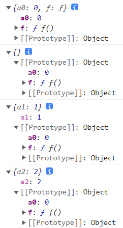
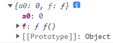

# `JavaScript`


## `HTML`中的 `js`

### 脚本执行方式

- `defer`推迟
  - 浏览器等待页面解析
  - 脚本按照在页面中出现的顺序加载和运行
- `async`异步
  - 适合页面的脚本之间彼此独立，且不依赖于本页面的其它任何脚本
  - 浏览器遇到脚本时，不会阻塞页面渲染，而是直接下载然后运行
  - 脚本的运行次序无法控制
- 动态加载

[增删改选项卡](..\project\增删改选项卡)

---

## 语言基础

### 关键字

- `typeof`：检测数据类型
- `instanceof`：检测左侧对象是否由右侧的构造函数实例化


---

### 变量

- 对调两个变量

```js
let [a, b] = [1, 2]
```

---

- 临时变量

```js
let c = a
a = b
b = c
```

---

- 解构赋值

```js
[a, b]=[b, a]
```

------

- 加减法

```js
a = a + b
b = a - b
a = a - b
```

---

- 按位异或

```js
a = a ^ b
b = a ^ b
a = a ^ b
```

---

-  `var`
  - 可重复定义
  - 声明提升
  - 不受限于块作用域
  
- `let`

  - 合乎直觉

- `const`

  - 除数组和对象外不能修改值

---

#### 解构赋值

- 数组

```js
const arr = [1, 2, 3]
const [, ...x] = arr
console.log(x) // [ 2, 3 ]
```

---

- 对象

```js
const obj = {
  a: 1,
  b: 2
}
const {
  b: x,
  c: y
} = obj
console.log(x, y) // 2 undefined
```

---

### 数据类型

- `undefined`
- `Boolean`
- `Number`
  - ``NaN`
- `String`
- `Symbol`
- `object`
  - `null`
  - `function`
  - `Array`

---

### 操作符

- `==`会自动类型转换，`===`不会

---

- `+`
  - 从左到右转化为基本数据类型运算
  - 经过`valueof`、`toString`方法，仍不是基本数据类型，则报错
  - `true`和`false`通过`toNumber`转化为0和1
  - `{}`作为对象时，转化为`[object Object]`


---

### 语句

---

## 函数

### 作用域

- 函数

```js
var a = 1

function f () {
  console.log(a) // 1
  console.log(a++) // 1
}

f()
```

- 函数使用到外部的全局变量 `a`

---

```js
var a = 1

function f () {
  console.log(a) // undefined
  console.log(a++) // NaN
  var a = 'a'
}

f()
```

- `var`变量会提升到函数内部的最上方
- `undefined`先 `++`得到 `NaN`

```js
var a = 1

function f () {
  var a
  console.log(a) // undefined
  console.log(a++) // NaN
  a = 'a'
}

f()
```

---

- 块

```js
if (true) {
  var a = 1
}
console.log(a) // 1
```

- `var`变量不受块作用域限制

---

### 匿名函数

- 标准的函数定义应该包括关键字、函数名、参数名、函数体


- 如果将函数名去掉，在函数外面加`()`将函数声明变为表达式（不局限于`()`，解析到符号会当成表达式处理，而不是函数声明），在最后面加 `()`执调用，便是匿名函数的自运行

```js
+function () {
  console.log(1)
}()
```

- 匿名函数的自运行，在函数创建时，便会立即执行；与直接书写函数体的执行效果的是一样的，好处在于，匿名函数在内部形成封闭的作用域，内部变量不会对外部造成命名污染

---

```js
f() // 函数声明会提升，顺利执行

function f () {
  console.log(1)
}
```

```js
f() // 变量未对函数进行引用，报错
var f = function () {
  console.log(1)
}
```

---

- `function(){}`
  - 声明函数表达式
  - 有原型对象
  - 有 `arguments`对象
  - `this`动态绑定，可 `call`、`apply`、`bind`修改

- `()=>{}`

  - 函数表达式
  - `this`指向包裹它的上层普通函数

  

---

### 递归函数

```js
function f (n) {
  if (n === 1) { // 递进终止条件
    return 1
  }
    
  // 本层处理  
  let result = n * f(n - 1) // 由下层结果推出本层结果 
  return result // 返回本层结果
}

console.log(f(4))
```

- 从函数的回归过程，思考代码的书写
  - 递进终止条件
  - 本层处理
    - 由下层结果推出本层结果
    - 返回本层结果

---

### 回调函数

- 同步函数
  - 按照代码编写顺序执行
- 异步函数
  - 针对不会马上完成的任务，提供暂停和恢复执行的功能
- 如果函数要使用到异步函数的执行结果，则需要在异步函数内部调用该函数

```js
let a = 1

function f1 () {
  setTimeout(function () {
    a = 'a'
  }, 1000)
}

function f2 () {
  console.log(a) // 1
}

f1()
f2()
```

```js
let a = 1

function f1 () {
  setTimeout(function () {
    a = 'a'
    f2()
  }, 1000)
}

function f2 () {
  console.log(a) // a
}

f1()
```

- 一种更好的方式将该函数作为参数传入异步函数，这便是回调函数的作用，并且可提高代码的复用性
- 回调函数存在回调深度嵌套和处理错误困难的难题

```js
let a = 1

function f1 (f) {
  setTimeout(function () {
    a = 'a'
    f()
  }, 1000)
}

function f2 () {
  console.log(a) // a
}

function f3 () {
  console.log(a.charCodeAt()) // 97
}

f1(f2)
f1(f3)
```

---

### `Promise`

[Promise](..\project\Promise)

---

- 通过`Promise`链的方式，避免回调嵌套调用，并在末尾对错误进行处理
- `async`进行异步函数声明，`await`等待`Promise`完成，返回`Promise`对象
- `Promise.all()`：全部实现
- `Promise.any()`：任一个实现
- `resolve`：成功时调用
- `reject`：失败时调用


---

### 构造函数

```js
function myNew (constructor, ...args) {
  // i创建实例对象，并指向构造函数原型
  const obj = Object.create(constructor.prototype)

  // 执行构造函数，this指向实例对象
  const result = constructor.apply(obj, args)

  // 判断是否为对象实例，并返回
  return result instanceof Object
         ? result
         : obj
}

function f (name) {
  this.name = name
}

const obj = myNew(f, 1)
console.log(obj) // f { name: 1 }
```

---

### 闭包函数

```js
function f () {
  let a = 1
  return function g () {
    console.log(a)
  }
}

const f1 = f()
f1() // 1
```

- 外部函数 `f1`通过闭包函数 `g`访问到闭包 `f`里的变量 `a`

---

### 函数柯里化

```js
function url (protocol) {
  return function (hostName) {
    return function (pathName) {
      return `${protocol}${hostName}${pathName}`
    }
  }
}

const web = url('https://')('www.a.com')
const html = web('/index.html')
const css = web('/styles/style.css')
const js = web('/scripts/main.js')

console.log(html) // https://www.a.com/index.html
console.log(css) // https://www.a.com/styles/style.css
console.log(js) // https://www.a.com/scripts/main.js
```

---

```js
function add () {
  let args = [...arguments]

  let inner = function () {
    args.push(...arguments)
    return inner
  }

  // 函数返回被 toString 隐式转换
  inner.toString = function () {
    return args.reduce((i, j) => i + j)
  }

  return inner
}

const result = add(1, 2, 3)(4, 5.1)
console.log(Number(result())) // 15.1
```

---

### 库函数

- `map()`

- `数组.map(函数(元素, 索引, 数组))`

```js
const arr = [1, 10, 100]
const result = arr.map((item, index) => item + index)
console.log(result) // [ 1, 11, 102 ]
```

---

```js
const arr = [1, 10, 100]
arr.map(console.log)
// 1 0 [ 1, 10, 100 ]
// 10 1 [ 1, 10, 100 ]
// 100 2 [ 1, 10, 100 ]

const result = arr.map(parseInt)
// parseInt(1, 0)
// parseInt(10, 1)
// parseInt(100, 2)
console.log(result)
// [ 1, NaN, 4 ]
```

- `parseInt(字符串，进制)`
  - 将按照进制表示的字符串，转化为十进制数字
  - 进制为 `2~36`，`0`为十进制

---

## 面向对象

### 原型对象

```js
const a = {
  a0: 0,
  f () {
    console.log(this)
  }
}

const a0 = Object.create(a)
const a1 = Object.create(a, { 'a1': { value: 1 } })
const a2 = Object.create(a, { 'a2': { value: 2 } })

a.f()
a0.f()
a1.f()
a2.f()
```



- `a`为对象自身，`a0`为以`a`作为原型对象的空对象
- `a1`和`a2`以`a`作为原型对象，并添加了自己的属性

---

```js
const a = {
  a0: 0,
  f () {
    console.log(this)
  }
}

const a0 = Object.assign({}, a)
a0.f()
```



- 将`a`的所有可枚举属性复制到 目标对象`{}`中，并返回目标对象

---

### 继承

-  `extends`
  - 类继承声明
  - 基于原型链向上查找
- `super()`
  - 调用父类的构造函数
- `#`
  - 声明私有

---

[弹跳彩球](..\project\弹跳彩球)

---

### 模块化

- 分隔命名空间，降低命名冲突
- `import`
- `export`

---

## API

### `DOM`

- 事件流
  - 捕获
    - 进去时触发
  - 目标
  - 冒泡
    - 出来时触发
    - 多个触发事件时，可阻止冒泡`stopPropagation()`
    - 事件委托：把原本需要绑定在每个子元素的事件，绑定在共同的父元素上，利用冒泡机制触发监听器

---

- `document.write()`
  - 文档对象中的方法
  - 插入脚本所在位置
  - 文档解析完后调用，覆盖原内容

- `innerHTML`
  - 元素对象的内容
  - 插入指定元素
  - 直接调用，覆盖原内容

---

### `Web API`

#### `Ajax`

- 从服务器获取数据

- 增量更新，不需刷新整个页面

---

#### 客户端存储

- `Web Storage`
  - 用于存储和检索较小的、由名称和相应值组成的数据项
- `sessionStorage`
  - 关闭浏览器时数据会丢失
- `localStorage`
  - 一直保存数据
- `IndexedDB`
  - 用于存储从完整的用户记录到甚至是复杂的数据类型
- `Cache`
  - 存储特定 HTTP 请求的响应文件而设计的
  - 存储离线网站文件

---

### `JSON`

- `js`对象语法的结构化字符串
  - 字符串与原生`js`对象转换
    - `parse()`
    - `stringify`()
  - 只有属性，没有方法

---

### 工作者线程

- 多线程工作
- 变量彼此独立，只通过消息交互
- `dedicated workers`
  - 单个脚本完成
- `shared workers`
  - 多个不同脚本共享
- `service workers`
  - 离线时工作

---

## 设计模式

