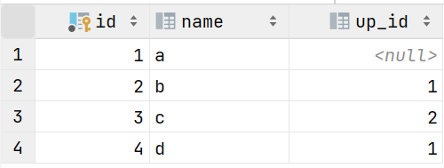

# MySQL

## 语法

### 定义表结构

```sql
# 创建表
create table if not exists t
(
    id int primary key auto_increment,
    c int
);

# 查询所有表
show tables ;

# 查询建表语句
show create  table t;

# 查询表结构
desc t;

# 添加列
alter table t add c int;

# 修改列数据类型
alter table t modify c char;

# 修改列
alter table t change c newc char;

# 删除列
alter table t drop c;

# 删除表
drop table t;
```

- 执行顺序
    - from -> where -> group by/having -> select -> order by -> limit

### 数据处理

```sql
# 插入行
insert into t (c)
values (0);

# 修改行
update t
set c = 1
where c = 0;

# 删除行
delete
from t
where c = 0;

# 查询
select *
from t;

# 去重查询
select distinct *
from t;
```

### 条件运算符

|  描述  |     示例      |
|:----:|:-----------:|
|  过滤  |    where    |
|  之间  | between and |
|  之中  |    in()     |
| 模糊匹配 |    like     |
| 单个字符 |      _      |
| 任意字符 |      %      |
|  为空  |   is null   |
|  并且  |     and     |
|  或者  |     or      |
|  非   |     not     |

### 聚合函数

| 描述  |  示例   |
|:---:|:-----:|
| 最大值 |  max  |
| 最小值 |  min  |
| 数量  | count |
| 求和  |  sum  |
| 平均值 |  avg  |

### 分组

| 描述 | 示例 |
| :--: | :------: |
| 分组 | group by |
| 过滤 | having |
| 排序 | order by |
| 降序 | desc |

## 函数

### 字符串

|   描述   |    示例     |
|:------:|:---------:|
|   拼接   |  concat   |
|   小写   |   lower   |
|   大写   |   upper   |
|  左填充   |   lpad    |
|  右填充   |   rpad    |
| 去掉头尾空格 |   trim    |
|  返回子串  | substring |

```sql
select lpad('1',2,0); # 01

select substring('123',1,2); # 12
```

### 数值

|  描述  |  示例   |
|:----:|:-----:|
|  模   |  mod  |
| 随机数  | rand  |
| 向上取整 | ceil  |
| 向下取整 | floor |
| 四舍五入 | round |

```sql
# 生成随机四位数
select lpad(round(rand()*1e4,0),4,'0');
```

### 日期

|   描述    |    示例    |
|:-------:|:--------:|
| 当前日期和时间 |   now    |
|  当前日期   | curdate  |
|  当前时间   | curtime  |
|    年    |   year   |
|    月    |  month   |
|    日    |   day    |
| 增加间隔时间  | date_add |
|  相差天数   | datediff |

```sql
select date_add(now(),interval 1 day);

select datediff(now(),'2023-01-01');
```

### 流程

```sql
select if(false, 1, 2); # 2

select ifnull(null, 1); # 1

select case when age >= 18 then '成年' else '未成年' end
from t;

select case city when '深圳' then '一线' else '二线' end
from t;
```

## 约束

| 描述 | 示例 |
| :--: | :---------: |
| 主键 | primary key |
| 唯一 | unique |
| 非空 | not null |
| 默认 | default |
| 外键 | foreign key |
| 检查 | check |

|     描述     |    示例     |
|:----------:|:---------:|
| 不允许更新 / 删除 | no action |
|    同样操作    |  cascade  |
|    断开关联    | set null  |

```sql
create table t
(
    id     int primary key auto_increment,
    name   varchar(10) not null unique,
    age    int check ( age > 0 ),
    gender char(1) default '男',
    f_id   int,
    foreign key (f_id) references f (id) on update cascade on delete set null
)
```

### 外键行为

#### 一对一


```sql
/* 讲学生的信息拆分为，个人信息和教育背景
   在一方创建唯一的外键关联另一方的主键 */
create table person
(
    id int primary key auto_increment,
    age int
);

create table education
(
    id    int primary key auto_increment,
    degree char(2),
    person_id int unique ,
    foreign key (person_id) references person(id)
);
```

#### 一对多


```sql
/* 一个班级有多名学生
   多的一方建立外键，关联一的主键 */
create table class
(
    id int primary key auto_increment
);

create table student
(
    id       int primary key auto_increment,
    class_id int not null,
    foreign key (class_id) references class (id)
);
```

#### 多对多


```sql
/* 多个学生各自选择多门课程
   建立中间表维护多对多关系 */
create table student
(
    id   int primary key auto_increment,
    name varchar(4) 
);

create table course
(
    id int primary key auto_increment,
    name varchar(4)
);

create table student_course
(
    id         int primary key auto_increment,
    student_id int,
    course_id  int,
    foreign key (student_id) references student (id),
    foreign key (course_id) references course (id)
)
```

## 多表查询

### 外连接


```sql
create table if not exists l
(
    id    int primary key auto_increment,
    up_id int
);
create table if not exists r
(
    id  int primary key auto_increment,
    age int
);
```


```sql
# 内连接 
select l.id,r.age
from l
         join r on l.up_id = r.id;

# 左连接
select l.id,r.age
from l
         left join r on l.up_id = r.id;

# 右连接
select l.id,r.age
from l
         right join r on l.up_id = r.id;
```

### 自连接




```sql
# 内连接
select a.name 下, b.name 上
from t a
         join t b on a.up_id = b.id;

# 左连接
select a.name 下, b.name 上
from t a
         left join t b on a.up_id = b.id;

# 右连接
select a.name 下, b.name 上
from t a
         right join t b on a.up_id = b.id;
```
