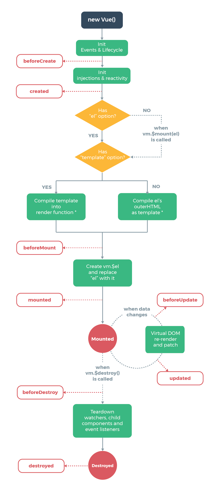
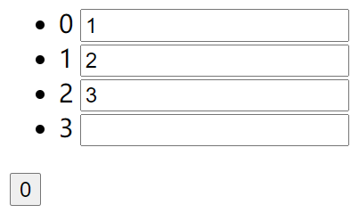

# Vue

## 配置

|    描述    |        示例        |
| :--------: | :----------------: |
| 安装脚手架 | cnpm i -g @vue/cli |
|  创建项目  |     vue create     |
|  启动项目  |   npm run serve    |
|  安装 id   |  cnpm i nanoid -g  |
|            |                    |
|            |                    |
|            |                    |
|            |                    |

## 概念

|    特性    |                             描述                             |
| :--------: | :----------------------------------------------------------: |
|    模块    |                  向外提供特定功能的 js 文件                  |
|    组件    |              实现应用中局部功能代码和资源的集合              |
| 单文件组件 | 一个组件的逻辑 js 、模板 HTML 、样式 CSS 封装在同一个文件里  |
| 选项式 API |         由多个选项的对象组成，以组件实例的概念为中心         |
| 组合式 API | 使用导入的 API 函数，直接在函数作用域内定义响应式状态变量，<br />并将从多个函数中得到的状态组合起来处理复杂问题 |
| 声明式渲染 |                   标准 HTML 拓展的模板语法                   |
|   渐进式   |                         自底向上集成                         |
|   响应性   |    自动跟踪 js 状态改变，并在发生改变时，响应式地更新 DOM    |
|  数据代理  |               一个对象代理另一个对象属性的读写               |
|  状态提升  |              多个子组件共享相同父组件的数据状态              |

## 模型


| DOM Listeners | 监测页面上 DOM 元素的改变，来更改 Model 中的数据 |
| :-----------: | :----------------------------------------------: |
| Data Bindings |    更新 Model 中数据时，更新页面上的 DOM 元素    |

## 选项

|    描述    |     示例     |
|:--------:|:----------:|
| 实例挂载的根元素 |     el     |
|   模板标识   |  template  |
|  响应式属性   |    data    |
|    方法    |  methods   |
|   计算属性   |  computed  |
|  监听属性改变  |   watch    |
|    组件    | components |
| 接收父组件数据  |   props    |
|  自定义指令   | directives |
|   混入组件   |   mixins   |

|          |    [computed](vue2/计算属性/index.html)     |                [watch](vue2/监听/index.html)                 |
| :------: | :-----------------------------------------: | :----------------------------------------------------------: |
| 适用情形 | 依赖数据改变，重新计算<br />结果依赖多个值  |          数据改变，执行操作<br />值的改变影响多个值          |
| 支持缓存 |                      1                      |                              0                               |
| 支持异步 |                      0                      |                              1                               |
|   描述   | 默认通过 get 返回值<br />修改值，需添加 set | 接收新值和旧值作为参数<br />immediate 在加载时立即执行<br />deep 监听对象内部属性改变 |

### 生命周期钩子



|                             描述                             |     示例      |
| :----------------------------------------------------------: | :-----------: |
|                   完成初始化生命周期和事件                   | beforeCreate  |
|          完成初始化数据监测和代理，可访问属性和方法          |    created    |
|            解析 el 或 template 模板，生成虚拟 DOM            |  beforeMount  |
| 用新创建的 $el 替换 el ，挂载到页面，<br />初始化操作：开启定时器 / 发送网络请求 / 订阅消息 / 绑定自定义事件 |    mounted    |
|                  数据发生更新，未响应到页面                  | beforeUpdate  |
|         虚拟 DOM 比较，更新页面，页面和数据保持同步          |    updated    |
| 销毁指令被调用，能访问属性和方法，不触发数据更新 <br />收尾操作： 关闭定时器 / 取消订阅消息 / 解绑自定义事件 | beforeDestroy |
|           实例销毁，移除属性监听、事件监听、子组件           |   Destroyed   |

## 方法

### 构造器

|                          描述                           |   示例    |
| :-----------------------------------------------------: | :-------: |
|                        扩展组件                         |  extend   |
|                        使用插件                         |    use    |
|                      注册全局组件                       | component |
|                      注册全局混入                       |   mixin   |
|                      注册全局指令                       | directive |
| 为响应式对象添加属性<br />无法用于 Vue 实例或根数据对象 |    set    |

### 实例

|                          描述                           |    示例    |
| :-----------------------------------------------------: | :--------: |
|                      实例的根元素                       |    $el     |
|                        实例属性                         |   $data    |
|                         根实例                          |   $root    |
|                         父实例                          |  $parent   |
|                       所有子实例                        | $children  |
|                      接收组件属性                       |   $props   |
|                          插槽                           |   $slots   |
|            父作用域不 prop 被获取的绑定属性             |   $attrs   |
|                父作用域绑定的事件监听器                 | $listeners |
|                     实例初始化选项                      |  $options  |
|                       挂载根元素                        |   $mount   |
|                      监听属性改变                       |   $watch   |
|               获取已注册的元素或组件实例                |   $refs    |
| 为响应式对象添加属性<br />无法用于 Vue 实例或根数据对象 |    $set    |
|               触发事件，传递参数给监听器                |   $emit    |
|                     解绑自定义事件                      |    $off    |
|             监听触发会自动移除的自定义事件              |   $once    |
|                      销毁组件实例                       |  $destory  |
|              下次更新 DOM ，再执行回调函数              | $nextTick  |

## 指令

|              描述              |  示例   |
| :----------------------------: | :-----: |
|            文本插值            |  {{}}   |
|          组件绑定模板          |    :    |
|       表单与组件双向绑定       | v-model |
|    虚拟 DOM 节点的唯一标识     |  :key   |
|            条件渲染            |  v-if   |
|            条件显示            | v-show  |
|              遍历              |  v-for  |
|              文档              | v-html  |
|              文本              | v-text  |
|  模板完成解析后，自动删除属性  | v-cloak |
|  动态渲染一次后，转为静态内容  | v-once  |
|          跳过节点编译          |  v-pre  |
|          对象参数占位          | $event  |
|            绑定事件            |    @    |
| 为元素节点或子组件注册引用信息 |   ref   |

### 事件类型

|    描述    |         示例          |
|:--------:|:-------------------:|
|    单击    |        click        |
|    双击    |      dblclick       |
|   按键抬起   |        keyup        |
|  按键生成字符  |      keypress       |
|   按键按下   |       keydown       |
|   获取焦点   |        focus        |
|   失去焦点   |        blur         |
|   内容改变   |       change        |
|  内容被选中   |       select        |
|   鼠标按下   |      mousedown      |
|   鼠标弹起   |       mouseup       |
|   鼠标移动   |      mousemove      |
|   鼠标进入   |     mouseenter      |
|   鼠标离开   |     mouseleave      |
| 鼠标进入（冒泡） |      mouseover      |
| 鼠标离开（冒泡） |      mouseout       |
|   触屏开始   |     touchstart      |
|   触屏移动   |      touchmove      |
|   触屏结束   |      touchend       |
|   屏幕旋转   | onorientationchange |

- tab / ctrl / shift / alt / meta 使用 keydown

### 事件修饰符

|      描述      |   示例    |
|:------------:|:-------:|
|    阻止默认行为    | prevent |
|     阻止冒泡     |  stop   |
|    只触发一次     |  once   |
|    使用捕获模式    | capture |
| 只有操作的目标元素触发  |  self   |
| 立即执行，不等待回调函数 | passive |

### [数据代理](vue2/数据代理/index.html)

```html
<div id='root'>
    <ul>
        <li v-for='(item,index) of arr' :key='item.id'>
            {{ item }}
            <button @click='zero(index)'>0</button>
        </li>
    </ul>
</div>
```

```js
new Vue({
    el : '#root',
    data() {
        return {
            arr : [ 1, 2 ],
        }
    },
    methods : {
        zero(i) {
            // Vue.set(this.arr, i, 0)
            this.arr.splice(i, 1, 0)
        },
    },
})
```

- 数组元素没有响应式
- 通过对 pop / push / shift / unshift / sort / splice / reverse 7个修改数组的方法进行封装，实现对数组的监听

```js
const data = { a : 1, b : 2 }
const vm = {}
vm._data = data
for (let i in vm._data) {
    Object.defineProperty(vm, i, {
        get() {
            return this._data[i]
        },
        set(v) {
            this._data[i] = v
        },
    })
}

vm.a = 0
console.log(vm.a) // 0
```

### [绑定样式](vue2/绑定样式/index.html)

```js
new Vue({
    el : '#root',
    data() {
        return {
            // 在数组中挑一个样式使用
            colors : [ 'red', 'yellow', 'blue' ],
            color  : '',

            // 增删数组元素，改变样式
            border : [ 'border', 'border-radius' ],

            // 通过对象的属性值决定样式是否使用
            style : {
                red             : true,
                border          : true,
                'border-radius' : true,
            },
        }
    },
    methods : {
        changeColor() {
            this.color = this.colors[Math.floor(Math.random() * 3)]
        },
    },
})
```

### [列表渲染](vue2/列表渲染/index.html)

- 默认使用 index 作为 key
  - 效率低，且打乱顺序会出错
- 如果 key 相同，则内容相同的部分直接复用



```html
<div id='root'>
    <ul>
        <li v-for='item of arr'>
            {{ item }} <input>
        </li>
    </ul>
    <button @click='prepend'>0</button>
</div>
```

```js
new Vue({
    el : '#root',
    data() {
        return {
            arr : [ 1, 2, 3 ],
        }
    },
    methods : {
        prepend() {
            this.arr.unshift(0)
        },
    },
})
```

### [列表过滤与排序](vue2/列表过滤与排序/index.html)

```html
<div id='root'>
    <input type='text' v-model='keyWord' placeholder='请输入关键字'>
    <ul>
        <li v-for='index of res' :key='item.id'>
            {{ item.name + item.age }}
        </li>
    </ul>
</div>
```

- [watch](vue2/列表过滤与排序/watch.js)

```js
new Vue({
    el : '#root',
    data() {
        return {
            lists   : [
                { id : 1, name : '马冬梅', age : 18 },
                { id : 2, name : '周冬雨', age : 17 },
                { id : 3, name : '周杰伦', age : 16 },
                { id : 4, name : '温兆伦', age : 15 },
            ],
            keyWord : '',
            res     : [],
        }
    },
    watch : {
        keyWord : {
            immediate : true,
            handler(val) {
                this.res = this.lists.filter(i =>
                    i.name.includes(val),
                )
            },
        },
    },
})
```

- [computed](vue2/列表过滤与排序/computed.js)

```js
new Vue({
    el : '#root',
    data() {
        return {
            lists   : [
                { id : 1, name : '马冬梅', age : 18 },
                { id : 2, name : '周冬雨', age : 17 },
                { id : 3, name : '周杰伦', age : 16 },
                { id : 4, name : '温兆伦', age : 15 },
            ],
            keyWord : '',
        }
    },
    computed : {
        res() {
            return this.lists.filter(i =>
                i.name.includes(this.keyWord),
            )
        },
    },
})
```

- [排序](vue2/列表过滤与排序/index.html)

```html
<div id='root'>
    <input type='text' v-model='keyWord' placeholder='请输入关键字'>
    <button @click='sortType=2'>升序</button>
    <button @click='sortType=1'>降序</button>
    <button @click='sortType=0'>原序</button>
    <ul>
        <li v-for='item of res' :key='item.id'>
            {{ item.name + item.age }}
        </li>
    </ul>
</div>
```

```js
new Vue({
    el : '#root',
    data() {
        return {
            lists    : [
                { id : 1, name : '马冬梅', age : 18 },
                { id : 2, name : '周冬雨', age : 16 },
                { id : 3, name : '周杰伦', age : 17 },
                { id : 4, name : '温兆伦', age : 15 },
            ],
            keyWord  : '',
            sortType : 0,
        }
    },
    /* 先依据名字里是否含有关键字过滤
     * 再根据排序的值，进行相应排序 */
    computed : {
        res() {
            let arr = this.lists.filter(i =>
                i.name.includes(this.keyWord))

            if (this.sortType) {
                arr.sort((a, b) =>
                    this.sortType === 2
                    ? a.age - b.age
                    : b.age - a.age)
            }
            return arr
        },
    },
})
```


## 组件传值

### [父传子](vue2/父传子/App.vue)

```vue
<template>
  <div id='app'>
    <!-- 父组件的 A 流向子组件的 a -->
    <Son :a='A' />
  </div>
</template>

<script>
import Son from '@/components/Son.vue'

export default {
  name       : 'App',
  components : { Son },
  data() {
    return {
      A : 1,
    }
  },
}
</script>
```

```vue
<template>
  <div>
    {{ a }}
  </div>
</template>

<script>
export default {
  name  : "Son",
  props : [ 'a' ],
}
</script>
```

### [子传父](vue2/子传父/App.vue)

```vue
<template>
  <div id='app'>
    <!-- 事件 e 触发方法 H -->
    <!-- H 接收子组件传递的数据 a 赋值给 A -->
    <Son @E='H' />
    {{ A }}
  </div>
</template>

<script>
import Son from '@/components/Son.vue'

export default {
  name       : 'App',
  components : { Son },
  data() {
    return {
      A : undefined,
    }
  },
  methods : {
    H(a) {
      this.A = a
    },
  },
}
</script>
```

```vue
<template>
  <div>
    <!-- 点击触发方法 h -->
    <!-- h 触发父组件的 E 并将 a 传递 -->
    <button @click='h'>a</button>
  </div>
</template>

<script>
export default {
  name : "Son",
  data() {
    return {
      a : 1,
    }
  },
  methods : {
    h() {
      this.$emit('E', this.a)
    },
  },
}
</script>
```

### 通用

#### [共享状态](vue2/共享状态/App.vue)

```js
export default {
    state : {
        a : 0,
    },
    seta(value) {
        this.state.a = value
    },
}
```

```vue

<template>
  <div id='app'>
    <One />
    <Two />
  </div>
</template>

<script>

import One from '@/components/One.vue'
import Two from '@/components/Two.vue'

export default {
  name       : 'App',
  components : { Two, One },
}
</script>
```

```vue
<template>
  <div>
    {{ state.a }}
    <button @click='One'>1</button>
  </div>
</template>

<script>
import store from '@/store.js'

export default {
  name : "One",
  data() {
    return {
      state : store.state,
    }
  },
  methods : {
    One() {
      store.seta(1)
    },
  },
}
</script>
```

```vue
<template>
  <div>
    {{ state.a }}
    <button @click='Two'>2</button>
  </div>
</template>

<script>
import store from '@/store.js'

export default {
  name : "Two",
  data() {
    return {
      state : store.state,
    }
  },
  methods : {
    Two() {
      store.seta(2)
    },
  },
}
</script>
```

## [插槽](vue2/插槽/App.vue)

```vue
<template>
  <div id='app'>
    <Son>
      <template v-slot:footer>
        <button>footer</button>
      </template>
      <template v-slot:header>
        <button>header</button>
      </template>
    </Son>
  </div>
</template>

<script>
import Son from '@/components/Son.vue'

export default {
  name       : 'App',
  components : { Son },
}
</script>
```

```vue
<template>
  <div>
    <!-- 按照插槽的位置渲染 -->
    <slot name='header' />
    <slot name='footer' />
  </div>
</template>

<script>
export default {
  name : "Son",
}
</script>
```

## [提交表单](vue2/提交表单/App.vue)

```vue
<!-- 前端页面 -->
<template>
  <div id='app'>
    <form @submit.prevent='postData'>
      <input v-model='str' />
      <button>提交</button>
    </form>
    <ul>
      <li v-for='(item,index) of arr'>
        {{ item }}
        <button @click='deleteData'>删除</button>
      </li>
    </ul>
  </div>
</template>

<script>
import axios from 'axios'

export default {
  name    : 'App',
  methods : {
    /* 读取数据 */
    getData() {
      axios.get('http://127.0.0.1:8080').then((res) => {
        this.arr = res.data
      })
    },

    /* 提交数据 */
    postData() {
      axios.post('http://127.0.0.1:8080', { str : this.str }).then(() => {
        this.getData()
      })
    },

    /* 删除数据 */
    deleteData(index) {
      axios.delete(`http://127.0.0.1:8080/${ index }`).then(() => {
            this.getData()
          }
      )
    },
  },
  data() {
    return {
      str : '',
      arr : [],
    }
  }
  ,
  created() {
    this.getData()
  }
  ,
}
</script>
```

```js
/* koa 搭建后台服务器 */
const koa = require('koa')
const app = new koa()
const router = require('koa-router')()
const cors = require('koa2-cors')
const parser = require('koa-parser')

app.use(cors()) // 跨域
app.use(parser()) // 解析请求体
app.use(router.routes()) // 路由

const arr = [ 1, 2 ]

router.get('/', async ctx => {
    ctx.body = arr
})

router.post('/', async ctx => {
    arr.push(ctx.request.body.str)
    ctx.body = true
})

router.delete('/:id', async ctx => {
    arr.splice(ctx.params.id, 1)
    ctx.body = true
})

app.listen(8080, () => {
    console.log('http://127.0.0.1:8080')
})
```

## 路由

```vue
<template>
  <div id='app'>
    <!-- 导航栏 -->
    <nav>
      <router-link to='/'>首页</router-link>
      |
      <router-link to='/login'>登录</router-link>
      <span v-if='username'>
        <span> || 欢迎：{{ username }} </span>
        <button @click='logout'>注销</button>
      </span>
    </nav>
    <!-- 展示页面内容 -->
    <router-view />
  </div>
</template>

<script>
export default {
  data() {
    return {
      username : '',
    }
  },
  watch   : {
    // 监听路由切换
    '$route.path'() {
      this.username = localStorage.getItem('username')
    },
  },
  methods : {
    logout() {
      localStorage.clear()
      this.$router.push('/login')
    },
  },
}
</script>
```

```js
/* index.js */
import Vue from 'vue'
import VueRouter from 'vue-router'
import Home from '@/views/Home.vue'
import Login from '@/views/Login.vue'

Vue.use(VueRouter)

const routes = [
    {
        path      : '/',
        name      : 'Home',
        component : Home,
    },
    {
        path      : '/login',
        name      : 'Login',
        component : Login,
    },
]

const router = new VueRouter({
    mode : 'history',
    base : process.env.BASE_URL,
    routes,
})
// 导航守卫
// 不登录不显示页面内容
router.beforeEach((to, from, next) => {
    if (to.path !== '/login') {
        if (localStorage.getItem('username')) {
            next()
        } else {
            next('/login')
        }
    } else {
        next()
    }
})
export default router
```

```vue
<template>
  <div>Home</div>
</template>

<script>
export default {
  name : 'Home',
}
</script>
```

```vue
<template>
  <div>
    <form @submit.prevent='myLogin'>
      <input type='text' placeholder='用户名' v-model='username'>
      <input type='password' placeholder='密码' v-model='password'>
      <button>提交</button>
    </form>
  </div>
</template>

<script>
export default {
  name    : 'Login',
  methods : {
    myLogin() {
      localStorage.setItem('username', this.username)
      localStorage.setItem('password', this.password)
      // 跳转页面
      this.$router.push('/')
    },
  },
  data() {
    return {
      username : '',
      password : '',
    }
  },
}
</script>
```

## UI

```js
import Vue from 'vue'
import App from './App.vue'
import ElementUI from 'element-ui'
import 'element-ui/lib/theme-chalk/index.css'

Vue.config.productionTip = false
Vue.use(ElementUI)

new Vue({
    render : h => h(App),
}).$mount('#app')
```

#### 自定义指令

- 自定义指令(元素节点,组件属性)

- 模板被重新解析，指令会被调用

|   回调函数   |    调用     |
|:--------:|:---------:|
|   bind   |    绑定     |
| inserted |  元素被插入页面  |
|  update  | 模板结构被重新解析 |

#### 全局事件总线

```js
new Vue({
    beforeCreate() {
        Vue.prototype.$bus = this
    },
})
```

### Ajax

### vuex

### vue-router

### UI组件库
