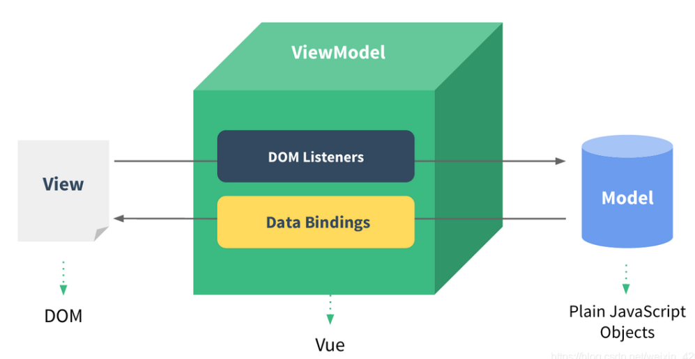

# `Vue`

## 概念

|     特性     |                             描述                             |
| :----------: | :----------------------------------------------------------: |
|     模块     |                 向外提供特定功能的 `js`文件                  |
|     组件     |              实现应用中局部功能代码和资源的集合              |
|  单文件组件  | 一个组件的逻辑`js`、模板 `HTML`、样式`CSS` 封装在同一个文件里 |
| 选项式 `API` |         由多个选项的对象组成，以组件实例的概念为中心         |
| 组合式 `API` | 使用导入的 `API` 函数，直接在函数作用域内定义响应式状态变量，<br />并将从多个函数中得到的状态组合起来处理复杂问题 |
|  声明式渲染  |                  标准 `HTML` 拓展的模板语法                  |
|    渐进式    |                         自底向上集成                         |
|    响应性    |   自动跟踪`js`状态变化，并在发生改变时，响应式地更新 `DOM`   |
|   数据代理   |               一个对象代理另一个对象属性的读写               |
|   状态提升   |              多个子组件共享相同父组件的数据状态              |

## 模型



| `DOM Listeners` | 监测页面上`DOM`元素的变化，来更改`Model`中的数据 |
| :-------------: | :----------------------------------------------: |
| `Data Bindings` |    更新`Model`中数据时，更新页面上的`DOM`元素    |

## 选项


|     选项     |                             描述                             |
| :----------: | :----------------------------------------------------------: |
|     `el`     |                            根容器                            |
|  `template`  |                      挂载元素节点的模板                      |
|    `data`    |                   更新自动响应到模板的属性                   |
|  `methods`   |                             方法                             |
|  `computed`  | 响应式依赖发生改变才更新的计算属性<br />  默认只有 `getter` <br />通过修改所依赖的属性修改<br />无法实现异步 |
|   `watch`    |                        侦听属性的改变                        |
| `components` |                             组件                             |
| `directives` |                          自定义指令                          |
|  `mounted`   |                             挂载                             |
|   `props`    |                         接收外部数据                         |
|   `mixins`   |                             混入                             |

## 指令

|                 语法                  |            描述            |
| :-----------------------------------: | :------------------------: |
|             `{{表达式}}`              |       文本插值       |
| `:属性` | 组件流向模板 |
|               `v-model`               | 表单输入与模板属性双向绑定 |
|                `:key`                 |用于虚拟`DOM`节点唯一标识<br />未找到相同`key`或`key`相同内容改变，生成新的真实`DOM`<br />`key`和内容都相同，直接复用|
|                `v-if`/`v-else`/`v-else-if`                |          条件渲染          |
|               `v-show`                |          条件显示          |
|                `v-for`                |            遍历            |
| `v-html` | 文档结构解析<br />导致`xss`攻击 |
| `v-text` | 节点文本 |
| `v-cloak` |完成模板解析后删除该属性<br />未解析的模板不显示|
| `v-once` |动态渲染一次后为静态内容|
| `v-pre` |跳过节点编译|
| `$event` | 对象参数占位 |
| `@事件` | 元素事件绑定组件方法 |
| `@click` | 点击事件 |
| `@keyup` | 按键抬起 |
| `@keydown` | 按键按下 |
| `ref` | 为元素节点或子组件注册引用信息 |

## 方法

|                       方法                        |                           描述                            |
| :-----------------------------------------------: | :-------------------------------------------------------: |
|                `Vue.extend(组件)`                 |       创建组件实例<br />调用 `VueComponent`构造函数       |
|                  `Vue.use(对象)`                  |                         使用插件                          |
|           `Vue.component(组件名,组件)`            |                           注册                            |
|                   `Vue.mixin()`                   |                           混入                            |
|                 `Vue.directive()`                 |                           指令                            |
| `Vue.set(响应式对象,属性名,属性值)`/`对象.$set()` | 为响应式对象添加属性  <br />无法用于`Vue`实例或根数据对象 |
|              `对象.$mount('#root')`               |                        绑定根容器                         |
|                `对象.$watch(属性)`                |                         侦听属性                          |
|                   `对象.$refs`                    |                    获取元素或组件实例                     |
|                 `rend:h=>h(App)`                  |                    将`App`组件放入模板                    |
|                     `$emit()`                     |                  子组件向父组件暴露方法                   |
|                     `$off()`                      |                      解绑自定义事件                       |
|                   `$destory()`                    |                       销毁组件实例                        |
|               `$nextTick(回调函数)`               |               下次更新`DOM`，再执行回调函数               |

### 事件修饰符

| 事件修饰符 |           描述           |
| :--------: | :----------------------: |
| `prevent`  |       阻止默认行为       |
|   `stop`   |         阻止冒泡         |
|   `once`   |        只触发一次        |
| `capture`  |       使用捕获模式       |
|   `self`   |  只有操作的目标元素触发  |
| `passive`  | 立即执行，不等待回调函数 |

## 组件传值

### 父组件向子组件传递属性

```vue
<!-- 父组件向子组件传递属性 -->
<template>
  <div>
    <!-- 父组件的 a 流向子组件的 A -->
    <Child :A="a" />
  </div>
</template>

<script>

import Child from '@/components/Child.vue'

export default {
  name      : 'App',
  components: {Child},
  data () {
    return {
      a: 1,
    }
  },
}
</script>

<style>

</style>
```

```vue
<template>
  <div>
    <h1>{{ A }}</h1>
  </div>
</template>

<script>
export default {
  name: 'Child',
  // 接收父组件的属性
  props: ['A'],
}
</script>

<style scoped>

</style>
```

### 子组件向父组件传递属性

```vue
<!-- 子组件向父组件传递属性 -->
<template>
  <div>
    <h1>{{ a }}</h1>
    <!-- 通过 事件 e 触发方法 h -->
    <!-- h 接收子组件传递的数据 A 给父组件的 a 赋值 -->
    <Child @e="h" />
  </div>
</template>

<script>

import Child from '@/components/Child.vue'

export default {
  name      : 'App',
  components: {Child},
  methods   : {
    // 接收接收子组件传递的数据 A 给父组件的 a 赋值
    h (A) {
      this.a = A
    },
  },
  data () {
    return {
      a: '',
    }
  },
}
</script>

<style>

</style>
```

```vue
<template>
  <div>
    <!-- 点击触发方法 H -->
    <!-- H 触发父组件的 e 并将 A 传递 -->
    <button @click="H">子传父</button>
  </div>
</template>

<script>
export default {
  name: 'Child',
  data () {
    return {
      A: 1,
    }
  },
  // 触发父组件的 e 并将 A 传递
  methods: {
    H () {
      this.$emit('e', this.A)
    },
  },
}
</script>

<style scoped>

</style>
```

### 非父子组件传递属性

#### 状态提升

```vue
<!-- 非父子组件传递属性 -->
<!-- 状态提升 -->
<template>
  <div>
    <!-- a 为两个子组件共享的数据  -->
    <!-- 两个子组件都能通过触发 e 事件触发方法 h -->
    <!-- h 接收子组件传递的数据对 a 赋值 -->
    <Brother @e="h" :A="a" />
    <Sister @e="h" :A="a" />
  </div>
</template>

<script>

import Brother from '@/components/Brother.vue'
import Sister from '@/components/Sister.vue'

export default {
  name      : 'App',
  components: {Sister, Brother},
  data () {
    return {
      // 父组件需维护属性 a
      a: 'A',
    }
  },
  methods: {
    // 接收子组件传递的数据对 a 赋值
    h (a) {
      this.a = a
    },
  },
}
</script>

<style>

</style>
```

```vue
<template>
  <div>
    <h1>{{ A }}</h1>
    <!-- 点击触发方法 H -->
    <!-- H 触发父组件的 e 并将 B 传递 -->
    <button @click="H">B</button>
  </div>
</template>

<script>
export default {
  name: 'Brother',
  // 接收数据
  props  : ['A'],
  methods: {
    H () {
      // 触发父组件的 e 并将 B 传递
      this.$emit('e', this.B)
    },
  },
  data () {
    return {
      B: 'B',
    }
  },
}
</script>

<style scoped>

</style>
```

```vue
<template>
  <div>
    <h1>{{ A }}</h1>
    <!-- 点击触发方法 H -->
    <!-- H 触发父组件的 e 并将 S 传递 -->
    <button @click="H">S</button>
  </div>
</template>

<script>
export default {
  name: 'Sister',
  // 接收数据
  props  : ['A'],
  methods: {
    // 触发父组件的 e 并将 S 传递
    H () {
      this.$emit('e', this.S)
    },
  },
  data () {
    return {
      S: 'S',
    }
  },
}
</script>

<style scoped>

</style>
```

#### 共享状态

```vue
<template>
  <div>
    <Brother />
    <Sister />
  </div>
</template>

<script>

import Brother from '@/components/Brother.vue'
import Sister from '@/components/Sister.vue'

export default {
  name      : 'App',
  components: {Sister, Brother},
}
</script>

<style>

</style>
```

```js
// store.js
export default {
  state: {
    a: 'A',
  },
  // 提供修改共享值的 set 方法
  setA (value) {
    this.state.a = value
  },
}
```

```vue
<template>
  <div>
    <h1>{{ state.a }}</h1>
    <!-- 点击触发修改 -->
    <button @click="h">B</button>
  </div>

</template>

<script>
import store from '@/components/store.js'

export default {
  name: 'Brother',
  data () {
    return {
      state: store.state,
    }
  },
  methods: {
    h () {
      store.setA('B')
    },
  },
}
</script>

<style scoped>

</style>
```

```vue
<template>
  <div>
    <h1>{{ state.a }}</h1>
    <!-- 点击触发修改 -->
    <button @click="h">S</button>
  </div>
</template>

<script>
import store from '@/components/store.js'

export default {
  name: 'Sister',
  data () {
    return {
      state: store.state,
    }
  },
  methods: {
    h () {
      store.setA('S')
    },
  },
}
</script>

<style scoped>

</style>
```

#### 总线


#### 插槽

```vue
<template>
  <div>
    <Child>
      <template v-slot:footer>
        <button>footer</button>
      </template>
      <template v-slot:header>
        <button>header</button>
      </template>
    </Child>
  </div>
</template>

<script>

import Child from '@/components/Child.vue'

export default {
  name      : 'App',
  components: {Child},

}
</script>

<style>

</style>
```

```vue
<template>
  <div>
    <!-- 按照插槽的位置渲染 -->
    <slot name="header" />
    <slot name="footer" />
  </div>
</template>

<script>
export default {
  name: 'Child',
}
</script>

<style scoped>

</style>
```

## 提交表单

```js
// 后台服务器
const koa = require('koa')
const app = new koa()
const router = require('koa-router')()
const cors = require('koa2-cors')
const parser = require('koa-parser')

app.use(cors())
app.use(parser())
app.use(router.routes())

// 模拟数据库
const arr = [1, 2, 3]

router.get('/arr', async ctx => {
  ctx.body = arr
})
router.post('/arr', async ctx => {
  let num = ctx.request.body.num
  arr.push(num)
  ctx.body = true
})

router.delete('/arr/:id', async ctx => {
  let id = ctx.params.id
  arr.splice(id, 1)
  ctx.body = true
})

app.listen(3000, () => {
  console.log('http://127.0.0.1:3000')
})
```

```vue
<!-- 前端服务器 -->
<template>
  <div>
    <form @submit.prevent="postItem">
      <input type="text" v-model="item" placeholder="请输入数字">
      <button @click="postItem">添加</button>
    </form>
    <ul>
      <li v-for="(item,index) of arr">{{ item }}
        <button @click="deleteItem">删除</button>
      </li>
    </ul>
  </div>
</template>

<script>
import axios from 'axios'

export default {
  name: 'App',
  data () {
    return {
      item: '',
      arr : [],
    }
  },
  methods: {
    // 从后端获取数据
    getArr () {
      axios.get('http://127.0.0.1:3000/arr').then(result => {
        this.arr = result.data
      })
    },
    // 添加元素，并刷新
    postItem () {
      axios.post('http://127.0.0.1:3000/arr', {num: this.item}).then(result => {
        this.getArr()
      })
    },
    // 删除元素，并刷新
    deleteItem (index) {
      axios.delete(`http://127.0.0.1:3000/arr/${index}`).then(result => {
        this.getArr()
      })
    },
  },
  created () {
    this.getArr()
  },
}
</script>

<style>

</style>
```

## 路由

```vue
<template>
  <div id="app">
    <!-- 导航栏 -->
    <nav>
      <router-link to="/">首页</router-link>
      |
      <router-link to="/login">登录</router-link>
      <span v-if="username">
        <span> || 欢迎：{{ username }} </span>
        <button @click="logout">注销</button>
      </span>
    </nav>
    <!-- 展示页面内容 -->
    <router-view />
  </div>
</template>

<script>
export default {
  data () {
    return {
      username: '',
    }
  },
  watch  : {
    // 监听路由切换
    '$route.path' () {
      this.username = localStorage.getItem('username')
    },
  },
  methods: {
    logout () {
      localStorage.clear()
      this.$router.push('/login')
    },
  },
}
</script>

<style>

</style>
```

```js
/* index.js */
import Vue from 'vue'
import VueRouter from 'vue-router'
import Home from '@/views/Home.vue'
import Login from '@/views/Login.vue'

Vue.use(VueRouter)

const routes = [
  {
    path     : '/',
    name     : 'Home',
    component: Home,
  },
  {
    path     : '/login',
    name     : 'Login',
    component: Login,
  },
]

const router = new VueRouter({
  mode: 'history',
  base: process.env.BASE_URL,
  routes,
})
// 导航守卫
// 不登录不显示页面内容
router.beforeEach((to, from, next) => {
  if (to.path !== '/login') {
    if (localStorage.getItem('username')) {
      next()
    }
    else {
      next('/login')
    }
  }
  else {
    next()
  }
})
export default router
```

```vue
<template>
  <div>你好啊</div>
</template>

<script>
export default {
  name: 'Home',
}
</script>

<style scoped>

</style>
```

```vue
<template>
  <div>
    <form @submit.prevent="myLogin">
      <input type="text" placeholder="用户名" v-model="username">
      <input type="password" placeholder="密码" v-model="password">
      <button>提交</button>
    </form>
  </div>
</template>

<script>

export default {
  name   : 'Login',
  methods: {
    myLogin () {
      localStorage.setItem('username', this.username)
      localStorage.setItem('password', this.password)
      // 跳转页面
      this.$router.push('/')
    },
  },
  data () {
    return {
      username: '',
      password: '',
    }
  },
}
</script>

<style scoped>

</style>
```

## `UI`

```js
import Vue from 'vue'
import App from './App.vue'
import ElementUI from 'element-ui'
import 'element-ui/lib/theme-chalk/index.css'

Vue.config.productionTip = false
Vue.use(ElementUI)

new Vue({
  render: h => h(App),
}).$mount('#app')
```

## 数据代理

- `Object.definedProperty(对象,属性名,配置项)`

|     配置项     |    描述    |
| :------------: | :--------: |
|    `value`     |     值     |
|  `enumerable`  | 是否可枚举 |
|   `writable`   | 是否可修改 |
| `configurable` | 是否可删除 |
|    `getter`    |  访问数据  |
|    `setter`    |  修改数据  |

```js
// const vm = new Vue({
//   el  : '#app',
//   data: {
//     a: 0,
//     b: 1,
//   },
// })

const data = {a: 0, b: 1}
const vm = {}
vm._data = data
for (let k in vm._data) {
  Object.defineProperty(vm, k, {
    get () {
      return vm._data[k]
    },
    set (value) {
      vm.data[k] = value
    },
  })
}

console.log(vm.a) // 0
```

#### 绑定样式

|  写法  |   描述   |
| :----: | :------: |
| 字符串 | 类名未定 |
|  数组  | 个数未定 |
|  对象  | 使用未定 |

#### 侦听

|        配置项        |    描述    |
| :------------------: | :--------: |
|     `deep:true`      |  深度侦听  |
|   `immediate:true`   | 初始化调用 |
| `handler(新值,旧值)` |  处理方法  |

#### 自定义指令

- `自定义指令(元素节点,组件属性)`

- 模板被重新解析，指令会被调用

|  回调函数  |        调用        |
| :--------: | :----------------: |
|   `bind`   |        绑定        |
| `inserted` |   元素被插入页面   |
|  `update`  | 模板结构被重新解析 |

---

#### 生命周期


|                             操作                             |  生命周期钩子   |                             描述                             |
| :----------------------------------------------------------: | :-------------: | :----------------------------------------------------------: |
|                     初始化生命周期和事件                     | `beforeCreate`  |                      未能访问属性和方法                      |
|                     初始化数据监测和代理                     |    `created`    |                       可访问属性和方法                       |
| 解析模板，生成虚拟`DOM`<br />  `el`或`$mount{el}`<br />`template`或 `el`作为模板 |  `beforeMount`  |                   未挂载，修改`DOM`会无效                    |
|           将`$el`的虚拟`DOM`挂载到页面成真实`DOM`            |    `mounted`    | 初始化操作：<br />  开启定时器 发送网络请求 订阅消息 绑定自定义事件 |
|                         数据发生更新                         | `beforeUpdate`  |                          页面是旧的                          |
|                   虚拟`DOM`比较，更新页面                    |    `updated`    |                      页面和数据保持同步                      |
|                        销毁指令被调用                        | `beforeDestroy` | 能访问属性和方法，但不触发数据更新<br />收尾操作<br />  关闭定时器 取消订阅消息 解绑自定义事件 |
|                  移除侦听、监听事件、子组件                  |   `Destroyed`   |                             销毁                             |

#### 全局事件总线

```js
new Vue({
  beforeCreate () {
    Vue.prototype.$bus = this
  },
})
```


### `Ajax`


### `vuex`

### `vue-router`

### `UI`组件库
