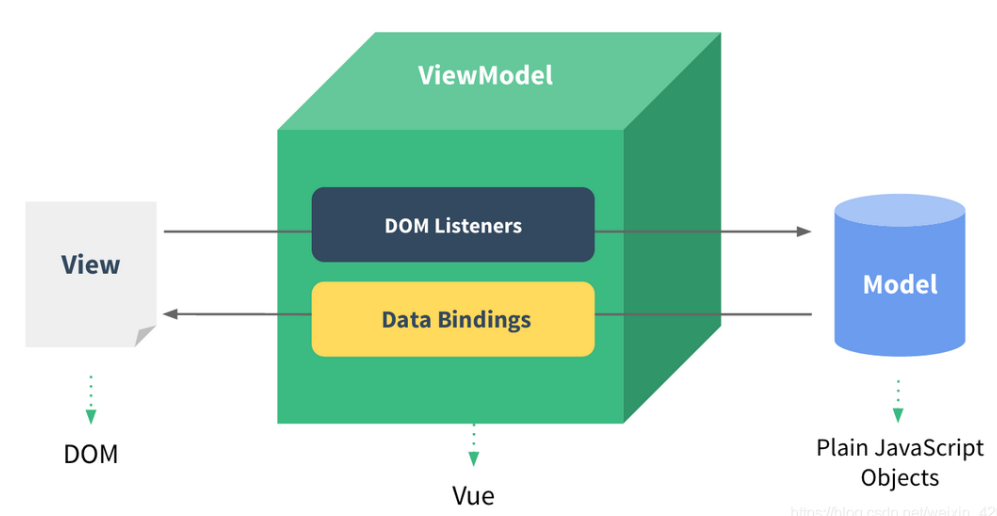
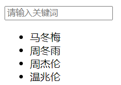
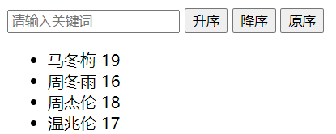

# 开发工具


## `Git`

### 命令行终端

|     命令     |        描述        |
| :----------: | :----------------: |
|     `cd`     |      移动目录      |
|     `ls`     | 列出所在目录的内容 |
|   `mkdir`    |      创建目录      |
| `rmdir` `-r` |      删除目录      |
|   `touch`    |      创建文件      |
|     `rm`     |      删除文件      |
|     `mv`     | 移动文件到指定位置 |
|     `cp`     | 复制文件到指定位置 |

---

### `Git`命令


|   指令   |                 描述                 |
| :------: | :----------------------------------: |
|  `init`  |         初始化，跟踪现有目录         |
| `clone`  |        创建远程项目的本地副本        |
|  `add`   |             代码更改跟踪             |
| `commit` |          保存到项目历史记录          |
|  `push`  |       从本地仓库推送到远程仓库       |
| `fetch`  |         从远程拉取到本地仓库         |
|  `diff`  |       比较暂存区和工作区的差异       |
|  `pull`  |    从远程仓库拉取并合并到本地仓库    |
| `branch` |        显示正在本地处理的分支        |
| `merge`  |         合并在同分支上的更改         |
| `status` | 上次提交之后是否有对文件进行再次修改 |

---

## `Vue`

### 基础

|     特性     |                             描述                             |
| :----------: | :----------------------------------------------------------: |
|  声明式渲染  |                  标准 `HTML` 拓展的模板语法                  |
|    响应性    |   自动跟踪`js`状态变化，并在发生改变时，响应式地更新 `DOM`   |
|  单文件组件  | 一个组件的逻辑`js`、模板 `HTML`、样式`CSS` 封装在同一个文件里 |
| 选项式 `API` |         由多个选项的对象组成，以组件实例的概念为中心         |
| 组合式 `API` | 使用导入的 `API` 函数，直接在函数作用域内定义响应式状态变量，<br />并将从多个函数中得到的状态组合起来处理复杂问题 |
|     模块     |                 向外提供特定功能的 `js`文件                  |
|     组件     |              实现应用中局部功能代码和资源的集合              |
|              |                                                              |


|     选项     |    描述    |
| :----------: | :--------: |
|     `el`     |     根     |
|    `data`    |    属性    |
|  `methods`   |    方法    |
|  `computed`  |  计算属性  |
|   `watch`    |    监视    |
| `directives` | 自定义指令 |
|  `mounted`   |    挂载    |

|                 语法                  |            描述            |
| :-----------------------------------: | :------------------------: |
|             `{{表达式}}`              |       文本插值       |
| `:元素属性'` | 元素属性绑定组件属性 |
| `@事件` | 元素事件绑定组件方法 |
|               `v-model`               | 表单输入与模板属性双向绑定 |
|                `v-if`/`v-else`/`v-else-if`                |          条件渲染          |
|                `v-for`                |            遍历            |
|                `:key`                 |用于虚拟`DOM`节点唯一标识|
| `v-html` | 文档结构解析 |
| `v-text` | 纯文本 |
|               `v-show`                |          条件显示          |
| `v-cloak` |完成模板解析后删除该属性|
| `v-once` |动态渲染一次后为静态内容|
| `v-pre` |跳过节点编译|
|              `template`               |  用于包裹元素，不会被渲染  |

---

#### `MVVM`模型



|      名词       |                       描述                       |
| :-------------: | :----------------------------------------------: |
| `DOM Listeners` | 监测页面上`DOM`元素的变化，来更改`Model`中的数据 |
| `Data Bindings` |    更新`Model`中数据时，更新页面上的`DOM`元素    |
|    数据代理     |         一个对象代理另一个对象属性的读写         |
|                 |                                                  |

---

#### 事件处理

|    语法    |     描述     |
| :--------: | :----------: |
|  `$event`  | 对象参数占位 |
|  `@click`  |   点击事件   |
|  `@keyup`  |   按键抬起   |
| `@keydown` |   按键按下   |

- `tab`/`ctrl`/`alt`/`shift`/`meta`使用`@keydown`

| 事件修饰符 |           描述           |
| :--------: | :----------------------: |
| `prevent`  |       阻止默认行为       |
|   `stop`   |         阻止冒泡         |
|   `once`   |        只触发一次        |
| `capture`  |       使用捕获模式       |
|   `self`   |    只有目标元素才触发    |
| `passive`  | 立即执行，不等待回调函数 |

#### 计算属性

- `computed`自动调用 `get` 方法，并缓存返回对象
- 只有所依赖的属性变化，才会重新调用
- 通过修改所依赖的属性，修改计算属性
- 计算属性无法实现异步

```html
<div id="root">
    姓：<input type="text" v-model="firstName"><br>
    名：<input type="text" v-model="lastName"><br>
    全名：<span>{{fullName}}</span>
</div>
```

```js
const vm = new Vue({
  el      : '#root',
  data    : {
    firstName: 'L',
    lastName : 'cc'
  },
  computed: {
    fullName: {
      get () {
        return this.firstName + ' ' + this.lastName
      },
      set (value) {
        let arr = value.split(' ')
        this.firstName = arr[0]
        this.lastName = arr[1]
      }
    }
  }
})
vm.fullName = 'Z dd'
```

- 只有`get`方法时，可进行简化

```js
fullName () {
  return this.firstName + ' ' + this.lastName
}
```

#### 监视属性

- `watch`
  - 默认不监视对象内部值的改变
  - `deep:true`
    - 深度监视
- `Vue.set(响应式对象,属性名,属性值)`
  - 无法用于`Vue`实例或根数据对象
  - `Vue`对监听数组的变更方法并进行包裹，能够触发视图更新

```html
<div id="root">
    <h3>a = {{numbers.a}}</h3>
    <button @click="numbers.a++">a++</button>
    <h3>b = {{numbers.b}}</h3>
    <button @click="numbers.b++">b++</button>
</div>
```

```js
const vm = new Vue({
  el   : '#root',
  data : {
    numbers: {
      a: 0,
      b: 0
    }
  },
  watch: {
    numbers: {
      deep: true,
      handler () {
        console.log('numbers改变了')
      }
    }
  }
})
```

---

- 模糊搜索



```html
<div id="root">
    <input type="text" v-model="keyWord" placeholder="请输入关键词">
    <ul>
        <li v-for="item in result" :key="item.id">{{item.name}}</li>
    </ul>
</div>
```

- `watch`实现

```js
const vm = new Vue({
  el   : '#root',
  data : {
    persons: [
      {id: '1', name: '马冬梅'},
      {id: '2', name: '周冬雨'},
      {id: '3', name: '周杰伦'},
      {id: '4', name: '温兆伦'},
    ],
    keyWord: '',
    result : [],
  },
  watch: {
    keyWord: {
      immediate: true,
      handler () {
        {
          this.result =
            this.persons.filter(item => item.name.indexOf(this.keyWord) !== -1)
        }
      },
    },
  },
})
```

- `computed`实现

```js
computed: {
  result () {
    return this.persons.filter(item => item.name.indexOf(this.keyWord) !== -1)
  },
}
```

- 排序功能



```html
<div id="root">
    <input type="text" v-model="keyWord" placeholder="请输入关键词">
    <button @click="sortType = 2">升序</button>
    <button @click="sortType = 1">降序</button>
    <button @click="sortType = 0">原序</button>
    <ul>
        <li v-for="item in result" :key="item.id">{{item.name}} {{item.age}}
        </li>
    </ul>
</div>
```

```js
const vm = new Vue({
  el      : '#root',
  data    : {
    persons : [
      {id: '1', name: '马冬梅', age: 19},
      {id: '2', name: '周冬雨', age: 16},
      {id: '3', name: '周杰伦', age: 18},
      {id: '4', name: '温兆伦', age: 17}
    ],
    keyWord : '',
    sortType: 0
  },
  computed: {
    result () {
      const arr = this.persons.filter(
        item => item.name.indexOf(this.keyWord) !== -1)
      if (this.sortType) {
        arr.sort((a, b) => this.sortType === 1
                           ? b.age - a.age
                           : a.age - b.age)
      }
      return arr
    }
  }
})
```

---

#### 自定义指令

- `this`指向`window`
- 指令调用加 `v-`
- 指令名用 `-`连接

|  回调函数  |        调用        |
| :--------: | :----------------: |
|   `bind`   |        绑定        |
| `inserted` |   元素被插入页面   |
|  `update`  | 模板结构被重新解析 |

---

#### 生命周期

- `new`
- 初始化生命周期和事件
- `beforeCreate`
- 初始化数据监测和代理
- `created`
  - 可访问属性和方法
- 解析模板，生成虚拟`DOM`
  - `el`或`$mount{el}`
  - `template`或 `el`作为模板
- `beforeMount`
- 将`$el`的虚拟`DOM`挂载到页面成真实`DOM`
- `mounted`
  - 初始化操作
    - 开启定时器
    - 发送网络请求
    - 订阅消息
    - 绑定自定义事件
- 数据发生更新
  - `beforeUpdate`
    - 页面是旧的
  - 虚拟`DOM`比较，更新页面
  - `updated`
  - 页面和数据保持同步
- `beforeDestroy`
  - 能访问属性和方法，但不触发数据更新
  - 收尾操作
    - 关闭定时器
    - 取消订阅消息
    - 解绑自定义事件
- 移除监视、监听事件、子组件


#### 脚手架

- `$refs`
  - `ref`
    - 为元素或子组件注册引用信息
  - 获取`DOM`元素
  - 获取组件实例对象

- `props`
  - 子组件接收父组件数据

- `mixins`
  - 多个组件共用的配置

- `use`

  - 使用插件

- `scoped`

  - 样式作用域
- `emit`
  - 子组向父组件触发事件

- `slots`
  - 父组件模板片段传递给子组件


|   `API`    |             描述             |
| :--------: | :--------------------------: |
| `reactive` |        创建响应式对象        |
|   `ref`    | 包裹对象，`.value`访问内部值 |
|            |                              |
|            |                              |

```vue
<script setup>
import { ref } from 'vue'

let id = 0

const newTodo = ref('')
const hideCompleted = ref(false)
const todos = ref([
  { id: id++, text: 'Learn HTML', done: true },
  { id: id++, text: 'Learn JavaScript', done: true },
  { id: id++, text: 'Learn Vue', done: false }
])

function addTodo() {
  todos.value.push({ id: id++, text: newTodo.value, done: false })
  newTodo.value = ''
}

function removeTodo(todo) {
  todos.value = todos.value.filter((t) => t !== todo)
}
</script>

<template>
  <form @submit.prevent="addTodo">
    <input v-model="newTodo" />
    <button>Add Todo</button>
  </form>
  <ul>
    <li v-for="todo in todos" :key="todo.id">
      <input type="checkbox" v-model="todo.done">
      <span :class="{ done: todo.done }">{{ todo.text }}</span>
      <button @click="removeTodo(todo)">X</button>
    </li>
  </ul>
  <button @click="hideCompleted = !hideCompleted">
    {{ hideCompleted ? 'Show all' : 'Hide completed' }}
  </button>
</template>

<style>
.done {
  text-decoration: line-through;
}
</style>
```


### `Ajax`

### `vuex`

### `vue-router`

### `UI`组件库

---

## `React`

---

## `JQuery`

---

## `Bootstrap`

---

## `Tailwind CSS`

---

## `CSS Modules`

---

## `Sass`

---

## `Node.js`

---

## `Webpack`

---

## `gulp`

---

## `TypeScript`

---

