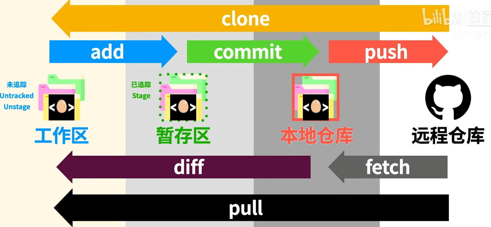

# 开发工具

## `Git`

#### 命令行终端

|     命令     |        功能        |
| :----------: | :----------------: |
|     `cd`     |      移动目录      |
|     `ls`     | 列出所在目录的内容 |
|   `mkdir`    |      创建目录      |
| `rmdir` `-r` |      删除目录      |
|   `touch`    |      创建文件      |
|     `mv`     | 移动文件到指定位置 |
|     `cp`     | 复制文件到指定位置 |
|     `rm`     |   永久性删除文件   |

---

## `Vue`

- 采用组件化模式
  - 提高代码复用率和可维护性
- 声明式编码
  - 无需操作`DOM`，提高开发效率
- 虚拟`DOM`和 `Diff`算法
  - 复用 `DOM`节点

---

## `React`

---

## `JQuery`

---

## `Bootstrap`

---

## `Tailwind CSS`

---

## `CSS Modules`

---

## `Sass`

---

## `Node.js`

---

## `Webpack`

---

## `gulp`

---

## `TypeScript`

---

