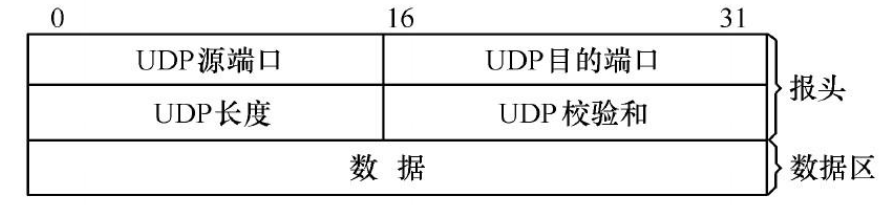
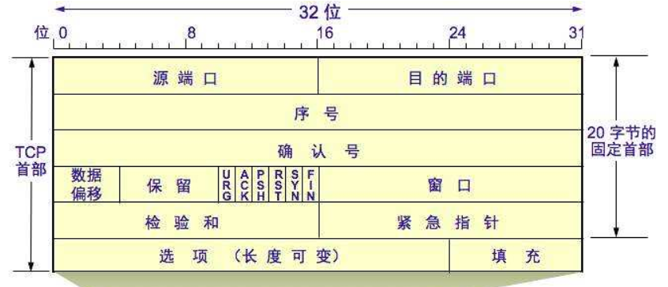
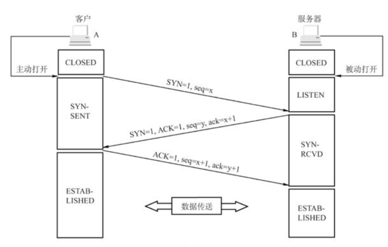
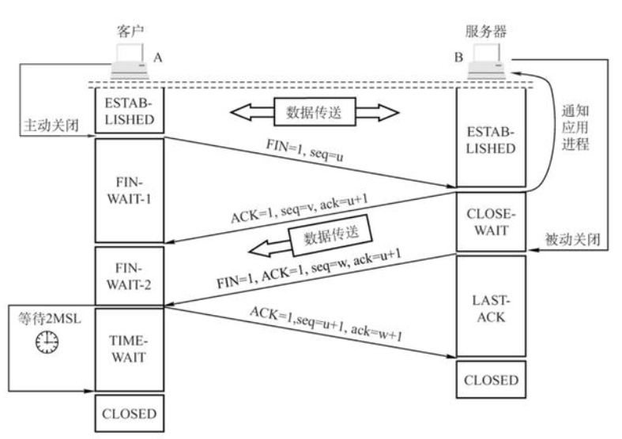
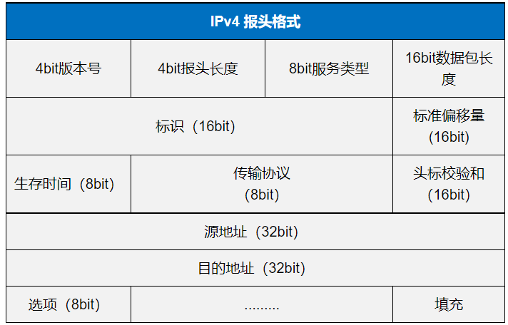

# 计算机网络

## 各层功能

|  分层  |                         功能                         |
| :----: | :--------------------------------------------------: |
| 应用层 |                为应用程序提供网络服务                |
| 传输层 |    为两个主机之间进程的通信提供多路复用与分解服务    |
| 网络层 |   通过转发和路由选择，将数据报从源主机传到目的主机   |
| 链路层 | 将数据封装成帧并实现多节点共享链路和提供差错控制服务 |
| 物理层 |           在物理线路上传输原始的二进制数据           |

---

## 协议

|                    协议                    |                             描述                             | 所在层 |
| :----------------------------------------: | :----------------------------------------------------------: | :----: |
|               域名系统 `DNS`               | 将方便记忆的域名转换为计算机处理的 IP 地址 由 `.` 分隔成几部分，从右到左将域名结构层次化 | 应用层 |
|           超文本传输协议 `HTTP`            |                  客户端与服务器间的请求响应                  | 应用层 |
|            用户数据报协议 `UDP`            |                   无连接、不可靠的传输服务                   | 传输层 |
|             传输控制协议 `TCP`             |             面向连接、可靠、基于字节流的传输服务             | 传输层 |
|                  停等协议                  | 每发送一个报文段，等待对方确认  收到确认报文，继续发送 收到否认报文，重发 | 传输层 |
|                滑动窗口协议                | 发送方通过增加分组序号范围，连续发送多个分组  收发双方须开辟缓存资源 | 传输层 |
|          动态主机配置协议 `DHCP`           |            服务器为网络内的主机分配动态`IP` 地址             | 网络层 |
|             网络地址转换 `NAT`             |                内网和公网`IP` 地址的相互转换                 | 网络层 |
|         互联网控制报文协议 `ICMP`          |                    主机和路由器的差错报告                    | 网络层 |
|             内部网关协议 `IGP`             |                         自治系统内部                         | 网络层 |
|             边界网关协议 `BGP`             |                         自治系统外部                         | 网络层 |
|        开放路径最短优先协议 `OSPF`         | 每个路由器从其他路由器得到链路状态信息，构造整个网络的拓扑图 | 网络层 |
|             路由信息协议 `RIP`             | 基于与邻居节点的链路距离和距离向量，更新到目的节点的最短距离 | 网络层 |
|           多路访问控制协议 `MAC`           |              用于广播信道协调各个节点的数据发送              | 链路层 |
| 带碰撞检测的载波监听多路访问协议 `CSMA/CD` |             先监听再发送，碰撞检测，等待随机时间             | 链路层 |
|             地址解析协议 `ARP`             |                通过 `IP` 地址广播查询物理地址                | 链路层 |

---

|     词汇     |                             描述                             |
| :----------: | :----------------------------------------------------------: |
|   `cookie`   | 对会话进行跟踪和存储，辨别用户身份，以弥补 `HTTP`协议无状态性的不足 |
|   `HTTPS`    | 在 `HTTP` 基础上加了安全套接层 `SSL`进行传输加密和身份认证，以保证传输过程的安全性 |
|  数据报网络  |           每个分组独立传送，路径不同，会乱序和丢失           |
|  虚电路网络  |      根据虚电路号沿虚电路路径按需发送分组，无须独占资源      |
| 虚拟互连网络 |   不同协议的网络基于共同支持 `IP` 协议，通过路由器实现互连   |
|    `MAC`     |               识别局域网节点唯一标识的物理地址               |
|   对称密钥   |            加密和解密密钥相同，安全性依靠密钥保密            |
|  非对称密钥  |       加密和解密成对但不同，用公钥加密，必须用私钥解密       |
|   散列函数   | 将任意长度的消息压缩到固定长度的消息摘要的函数 散列值不同，原始输入必然不同 |
|   数字签名   | 不可否认：只有持有私钥才能产生加密报文摘要 身份认证：用公钥进行解密，核实持有私钥的对方 完整性：解密的摘要和报文压缩后的摘相同 |
|   密钥分发   |          通过数字证书分发公钥，将公钥与特定实体绑定          |

---

## 超文本传输协议 `HTTP`

|          |         请求报文          |        响应报文        |
| :------: | :-----------------------: | :--------------------: |
| 首行组成 | 请求方法、`URL`、协议版本 | 协议版本、状态码、短语 |

| 请求方法 |      描述      |
| :------: | :------------: |
|  `GET`   | 检索和获取资源 |
|  `POST`  | 创建和更新内容 |
| `DELETE` |    删除资源    |
|  `PUT`   |    上传文件    |
|  `HEAD`  |    获取头部    |

| 响应状态码 |            描述            |
| :--------: | :------------------------: |
|    1xx     | 请求已被接受，需要继续处理 |
|    2xx     |     已成功被服务器接收     |
|    3xx     |           重定向           |
|    4xx     |         客户端错误         |
|    5xx     |         服务端错误         |

---

### 用户数据报协议 `UDP`

- 无连接、不可靠的传输服务

- 适用强调流量而不是完整性的多媒体数据流

### 传输控制协议 `TCP`

- 面向连接、可靠、基于字节流的传输服务

  - 校验和差错检测
  - 序号和确认应答
  - 超时重传

  - 通过滑动窗口进行流量控制

  - 通过算法进行拥塞控制

- 适用强调完整性的文件传输、网络数据库、分布式系统

#### 三次握手

- 双方确认自己与对方的发送与接收正常

  - 服务器确认对方发送正常，自己接收正常

  - 客户端确认自己发送、接收正常，对方发送、接收正常

  - 服务器确认自己发送，对方接收正常

- 三次握手可否携带数据

  - 第三次握手可携带数据，前两次不行

  - 第三次客户端已经确认自己和服务端的发送和接受能力都正常，而前两次携带数据会浪费服务器资源

- `SYN` 泛洪攻击
  - 客户端短时间内伪造大量不存在的IP地址，并向服务器不断发送请求连接包
  - 服务器回发确认包，并等待客户端确认；半连接队列长时间被占用，导致正常的请求被丢弃

#### 四次挥手

- 半关闭
  - 一端结束发送但还能接收数据的状态

- 为何等待一个报文的来回时间后关闭
  - 确定对方收到自己发的确认报文；如果对方没有收到自己的确认报文，会重发关闭请求报文

---

## IPv4

| 分片重组 |            描述            |
| :------: | :------------------------: |
|   标识   | 判断是否属于同个`IP`数据报 |
|   标志   |   判断是否为最后一个分片   |
|  片偏移  |     判断分片的先后顺序     |

|   编址   |                             描述                             |
| :------: | :----------------------------------------------------------: |
|   组成   |                       网络号 + 主机号                        |
| 子网划分 | 子网掩码指定网络前缀长度  `IP` 地址与子网掩码相与，得到子网地址 |
| 路由聚合 | 将相同路由的连续子网合并，减少匹配路由表的时间  遵循最长前缀匹配原则 |
|  `IPv6`  |               解决`IPv4`网络地址资源不足的问题               |

---

## 以太网

|       技术        |                             描述                             |
| :---------------: | :----------------------------------------------------------: |
|     共享介质      |                      `CSMA/CD` 访问控制                      |
|      交换机       |    以目的物理地址为键值，查找交换表，进行数据的转发和过滤    |
| 虚拟局域网 `VLAN` | 基于交换机的不受物理限制的逻辑分割广播域的局域网  以软件的方式划分的局域网的工作组 |
