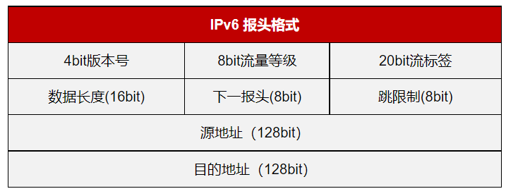

# 计算机网络

---

[TOC]

## 应用层

### 域名系统 `DNS`

- 将人们方便记忆的域名转换为计算机容易处理的 IP 地址

- 由 `.` 分隔成几部分，从右到左将域名结构层次化

---

### 超文本传输协议 `HTTP`

#### 请求报文

-  请求行由请求方法、`URL`、协议版本组成

-  `URL`里不允许出现的字符采用 `%`编码

|  方法名  |      作用      |                     备注                     |
| :------: | :------------: | :------------------------------------------: |
|  `GET`   | 检索和获取资源 | 在 `URL`上表明请求的内容， 可被缓存和收藏 |
|  `POST`  | 创建和更新内容 |             在请求主体里携带内容             |
| `DELETE` |    删除资源    |                                              |
|  `PUT`   |    上传文件    |                                              |
|  `HEAD`  |    获取头部    |                                              |

---

#### 响应报文

- 响应行由协议版本、状态码、短语组成

| 状态码 |            功能            |
| :----: | :------------------------: |
|  1xx   | 请求已被接受，需要继续处理 |
|  2xx   |     已成功被服务器接收     |
|  3xx   |           重定向           |
|  4xx   |         客户端错误         |
|  5xx   |         服务端错误         |

---

#### `cookie`

- 对会话进行跟踪和存储，辨别用户身份，以弥补 `HTTP`协议无状态性的不足

---

#### `HTTPS`

- 在 `HTTP` 基础上加了安全套接层 `SSL`进行传输加密和身份认证，以保证传输过程的安全性

---

## 传输层

### 功能

- 为应用进程提供端到端的逻辑通信服务

- 面向应用层的多路复用与分解

- 应用层报文的分段和重组

---

### 用户数据报协议 `UDP`

- 无连接、不可靠的传输服务

- 强调流量而不是完整性的多媒体数据流

---

### 传输控制协议 `TCP`

- 面向连接、可靠、基于字节流的传输服务

  - 校验和差错检测
  - 序号和确认应答
  - 超时重传

  - 通过滑动窗口进行流量控制

  - 通过算法进行拥塞控制

- 强调完整性的文件传输、网络数据库、分布式系统

---

#### 三次握手

- 双方确认自己与对方的发送与接收正常

  - 服务器确认对方发送正常，自己接收正常

  - 客户端确认自己发送、接收正常，对方发送、接收正常

  - 服务器确认自己发送，对方接收正常

- 三次握手可否携带数据

  - 第三次握手可携带数据，前两次不行

  - 第三次客户端已经确认自己和服务端的发送和接受能力都正常，而前两次携带数据会浪费服务器资源

- `SYN` 泛洪攻击：客户端短时间内伪造大量不存在的IP地址，并向服务器不断发送请求连接包；服务器回发确认包，并等待客户端确认；半连接队列长时间被占用，导致正常的请求被丢弃

---

#### 四次挥手

- 半关闭：一端结束发送但还能接收数据的状态
- 为何等待一个报文的来回时间后关闭：确定对方收到自己发的确认报文；如果对方没有收到自己的确认报文，会重发关闭请求报文

---

### 停等协议

- 每发送一个报文段，等待对方确认
- 收到确认报文，继续发送；收到否认报文，重发
- 缺点：信道利用率低

---

### 滑动窗口协议

- 发送方通过增加分组序号范围，连续发送多个分组
- 收发双方须开辟缓存资源

---

## 网络层

#### 功能

- 通过转发和路由选择，将数据报从源主机传到目的主机

---

### 数据报网络

- 无连接
- 每个分组独立传送，路径不同
- 分组会乱序和丢失

---

### 虚电路网络

- 建立网络层逻辑连接
- 根据虚电路号沿虚电路路径按需发送分组，无须独占资源

---

### 虚拟互连网络

- 不同协议的网络基于共同支持 `IP` 协议，通过路由器实现互连

---

### IPv4

- 标识：标识判断是否属于同个IP数据报
- 标志：判断是否为最后一个分片
- 片偏移：判断分片的先后顺序

---

#### 编址

- 组成：网络号+主机号
- 子网划分
  - 子网掩码指定网络前缀长度
  - `IP` 地址与子网掩码相与，得到子网地址

- 路由聚合
  - 将相同路由的连续子网合并，减少匹配路由表的时间
  - 遵循最长前缀匹配原则

---

#### 动态主机配置协议 `DHCP`

- 服务器为网络内的主机分配动态`IP` 地址

---

#### 网络地址转换 `NAT`

- 内网和公网`IP` 地址的相互转换

---

#### 互联网控制报文协议 `ICMP`

- 主机和路由器的差错报告

---

#### `IPv6`

- 解决`IPv4`网络地址资源不足的问题

---

### 路由

#### 层次化路由

- 自治系统内采用内部网关协议 `IGP`
- 自治系统间的边界路由器使用边界网关协议 `BGP`

---

#### 路由算法

- 链路状态路由选择算法

  - 每个路由器从其他路由器得到链路状态信息构造整个网络的拓扑图

  - 开放路径最短优先协议 `OSPF`

- 距离向量路由选择算法

  - 基于与邻居节点的直接链路距离和距离向量，更新到目的节点的最短距离

  - 路由信息协议 `RIP`
    - 跳数作为距离度量
      - 超过15跳视为不可达

---

## 链路层

### 功能

- 成帧
- 链路接入：多节点共享一条链路
- 差错控制
  - 奇偶校验码
  - 循环冗余码
  - 汉明码

---

### 多路访问控制协议 `MAC`

- 用于广播信道协调各个节点的数据发送
- 信道划分
- 随机访问

  - 带碰撞检测的载波监听多路访问协议 `CSMA/CD`

    - 先监听再发送

    - 碰撞检测

    - 等待随机时间

---

### 局域网

#### 物理地址 `MAC`

- 唯一
- 48位

---

#### 地址解析协议 `ARP`

- 作用：通过 `IP` 地址查询物理地址

- 方式：通过广播查询响应

---

#### 以太网

- `CSMA/CD` 访问控制
- 交换机
  - 转发和过滤
  - 以目的物理地址为键值，查找交换表
  - 自学习构建交换表
- 虚拟局域网 `VLAN`
  - 基于交换机的逻辑分割广播域的局域网
  - 不受物理限制，以软件的方式划分的局域网的工作组
  - 抑制广播风暴
  

---

## 物理层

### 功能

- 将物理信息转化为比特流

---

### 传输介质

- 同轴电缆
- 光纤

---

## 网络安全

### 机密性

- 对称密钥
  - 加密和解密密钥相同
  - 安全性依靠密钥保密

- 非对称密钥

  - 加密和解密成对但不同

  - 用公钥加密，须用私钥解密

---

### 完整性

#### 散列函数

- 将任意长度的消息压缩到固定长度的消息摘要的函数
- 散列值不同，原始输入必然不同

---

#### 数字签名

- 不可否认： ​只有持有私钥才能产生加密报文摘要

- 身份认证：用公钥进行解密，核实持有私钥的对方

- 完整性：解密的摘要和报文压缩后的摘要相同

---

#### 密钥分发

- 数字证书分发公钥
- 将公钥与特定实体绑定

